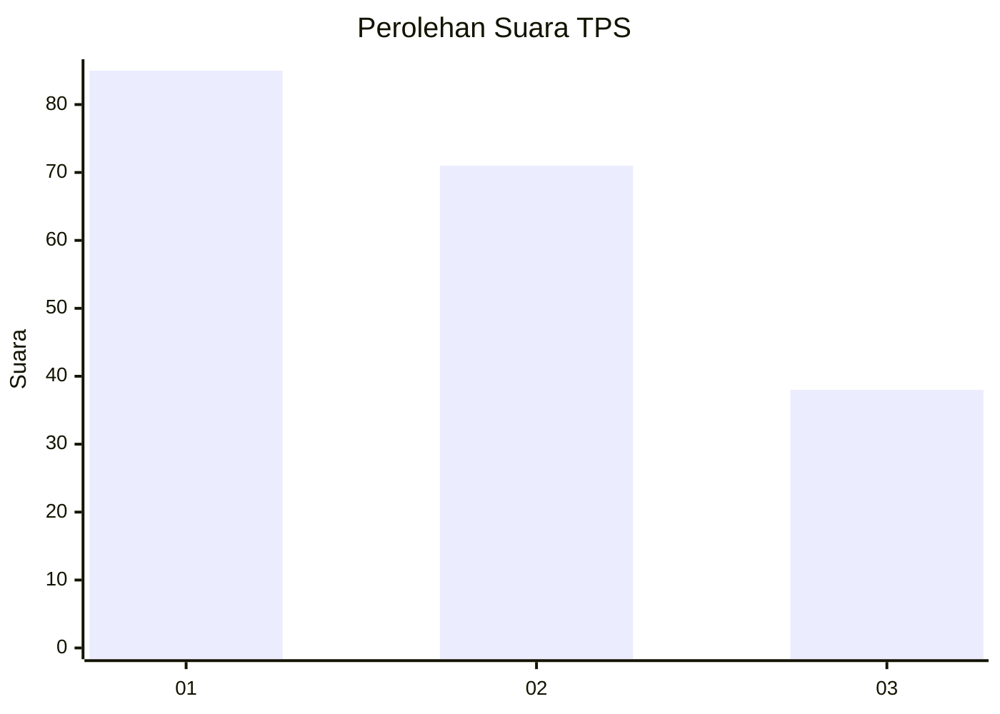
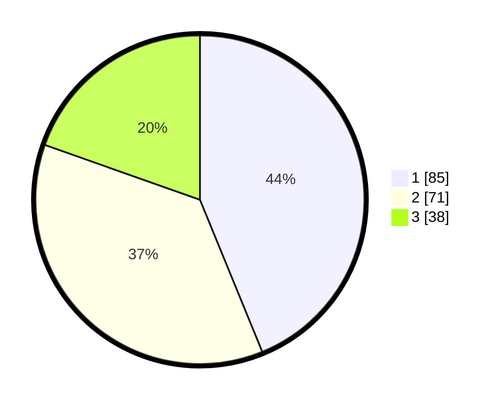

# Hasil

## Grafik

## Tabel

| No. | Nama Paslon    | Suara | Suara (raw) | Persentase |
|:--- |:-------------- | -----:| -----------:| ----------:|
| 1   | ANIES MUHAIMIN | 85    | [85][p-1]   | 43,81      |
| 2   | PRABOWO GIBRAN | 71    | [71][p-2]   | 36,60      |
| 3   | GANJAR MAHFUD  | 38    | [38][p-3]   | 19,59      |

[p-1]: https://github.com/gigit-pemilu/pemilu-2024/blob/main/pilpres/hitung-suara/sub/33-jawa-tengah/sub/04-banjarnegara/sub/10-wanadadi/sub/2003-karangjambe/sub/002-tps/sub/paslon-1.txt
[p-2]: https://github.com/gigit-pemilu/pemilu-2024/blob/main/pilpres/hitung-suara/sub/33-jawa-tengah/sub/04-banjarnegara/sub/10-wanadadi/sub/2003-karangjambe/sub/002-tps/sub/paslon-2.txt
[p-3]: https://github.com/gigit-pemilu/pemilu-2024/blob/main/pilpres/hitung-suara/sub/33-jawa-tengah/sub/04-banjarnegara/sub/10-wanadadi/sub/2003-karangjambe/sub/002-tps/sub/paslon-3.txt

## Foto C Plano

https://sirekap-obj-formc.kpu.go.id/e19b/pemilu/ppwp/33/04/10/20/03/3304102003002-20240217-150510--85fdec07-00fb-4c40-a95e-a7cb2129261a.jpg

https://sirekap-obj-formc.kpu.go.id/e19b/pemilu/ppwp/33/04/10/20/03/3304102003002-20240215-010048--470267a9-d8f9-4e54-88ad-882d8f84e999.jpg

https://sirekap-obj-formc.kpu.go.id/e19b/pemilu/ppwp/33/04/10/20/03/3304102003002-20240215-010200--0bcd7c27-b939-47f0-987e-3dab62376e60.jpg

## Metadata

| Key        | Value               |
| ---------- | ------------------- |
| Time Stamp | 2024-02-17 16:00:02 |

