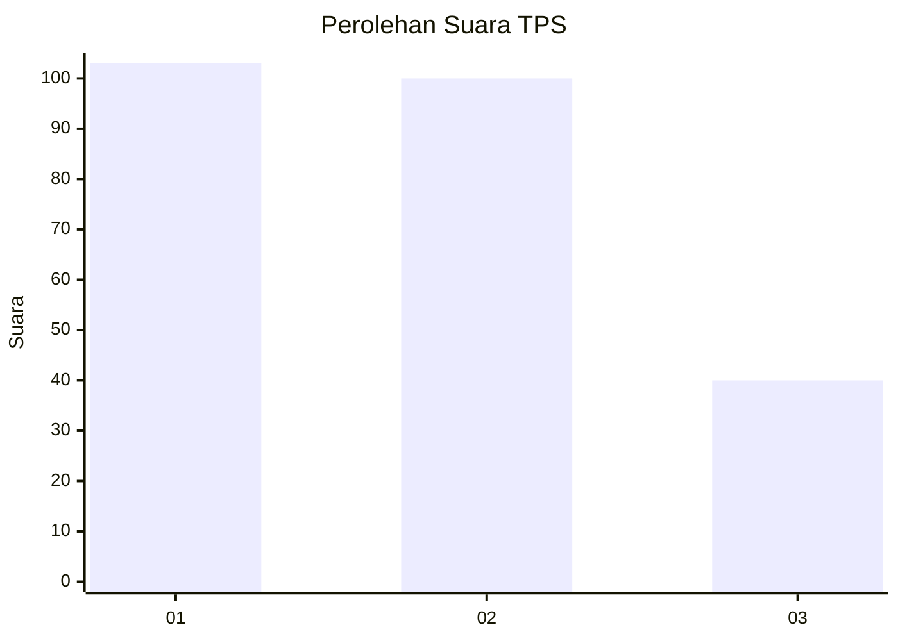
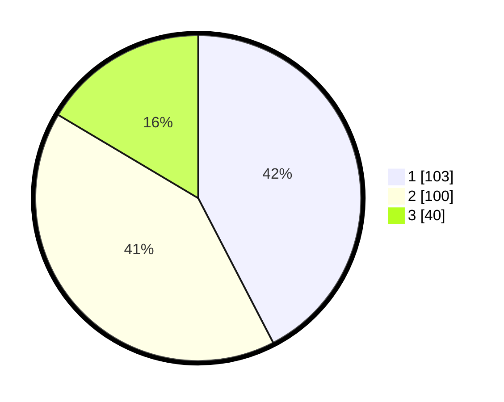

# Hasil

## Grafik

## Tabel

| No. | Nama Paslon    | Suara | Suara (raw) | Persentase |
|:--- |:-------------- | -----:| -----------:| ----------:|
| 1   | ANIES MUHAIMIN | 103   | [103][p-1]  | 42,39      |
| 2   | PRABOWO GIBRAN | 100   | [100][p-2]  | 41,15      |
| 3   | GANJAR MAHFUD  | 40    | [40][p-3]   | 16,46      |

[p-1]: https://github.com/gigit-pemilu/pemilu-2024/blob/main/pilpres/hitung-suara/sub/33-jawa-tengah/sub/04-banjarnegara/sub/10-wanadadi/sub/2004-wanadadi/sub/003-tps/sub/paslon-1.txt
[p-2]: https://github.com/gigit-pemilu/pemilu-2024/blob/main/pilpres/hitung-suara/sub/33-jawa-tengah/sub/04-banjarnegara/sub/10-wanadadi/sub/2004-wanadadi/sub/003-tps/sub/paslon-2.txt
[p-3]: https://github.com/gigit-pemilu/pemilu-2024/blob/main/pilpres/hitung-suara/sub/33-jawa-tengah/sub/04-banjarnegara/sub/10-wanadadi/sub/2004-wanadadi/sub/003-tps/sub/paslon-3.txt

## Foto C Plano

https://sirekap-obj-formc.kpu.go.id/f3a6/pemilu/ppwp/33/04/10/20/04/3304102004003-20240214-202632--c77a8934-8f26-4ddd-a519-90e11b8e3867.jpg

https://sirekap-obj-formc.kpu.go.id/f3a6/pemilu/ppwp/33/04/10/20/04/3304102004003-20240214-204656--e9912bf0-6d5e-4733-aa4e-776934fb1c70.jpg

https://sirekap-obj-formc.kpu.go.id/f3a6/pemilu/ppwp/33/04/10/20/04/3304102004003-20240214-204711--52379340-6c14-4dd2-92e0-a5590c010331.jpg

## Metadata

| Key        | Value               |
| ---------- | ------------------- |
| Time Stamp | 2024-02-15 16:00:26 |

