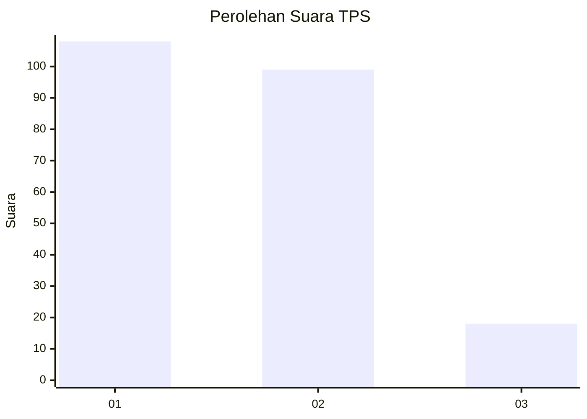
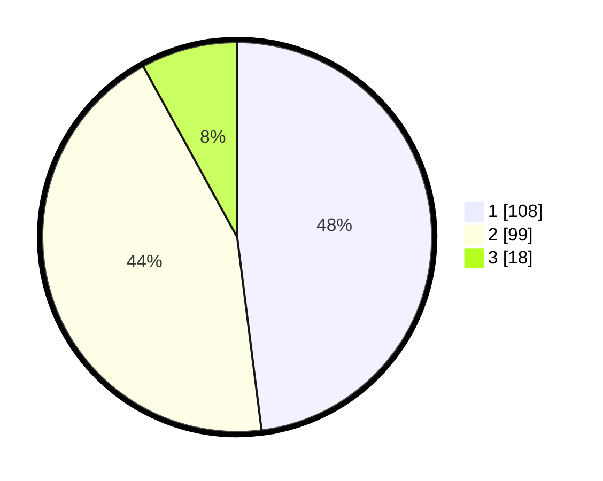

# Hasil

## Grafik

## Tabel

| No. | Nama Paslon    | Suara | Suara (raw) | Persentase |
|:--- |:-------------- | -----:| -----------:| ----------:|
| 1   | ANIES MUHAIMIN | 108   | [108][p-1]  | 48,00      |
| 2   | PRABOWO GIBRAN | 99    | [99][p-2]   | 44,00      |
| 3   | GANJAR MAHFUD  | 18    | [18][p-3]   | 8,00       |

[p-1]: https://github.com/gigit-pemilu/pemilu-2024/blob/main/pilpres/hitung-suara/sub/33-jawa-tengah/sub/04-banjarnegara/sub/11-rakit/sub/2004-rakit/sub/007-tps/sub/paslon-1.txt
[p-2]: https://github.com/gigit-pemilu/pemilu-2024/blob/main/pilpres/hitung-suara/sub/33-jawa-tengah/sub/04-banjarnegara/sub/11-rakit/sub/2004-rakit/sub/007-tps/sub/paslon-2.txt
[p-3]: https://github.com/gigit-pemilu/pemilu-2024/blob/main/pilpres/hitung-suara/sub/33-jawa-tengah/sub/04-banjarnegara/sub/11-rakit/sub/2004-rakit/sub/007-tps/sub/paslon-3.txt

## Foto C Plano

https://sirekap-obj-formc.kpu.go.id/82b7/pemilu/ppwp/33/04/11/20/04/3304112004007-20240215-001249--a9f31540-d225-4f29-a6bf-70843023b1a0.jpg

https://sirekap-obj-formc.kpu.go.id/82b7/pemilu/ppwp/33/04/11/20/04/3304112004007-20240215-001503--f41807a5-0c36-40df-bfba-1a96d1f31979.jpg

https://sirekap-obj-formc.kpu.go.id/82b7/pemilu/ppwp/33/04/11/20/04/3304112004007-20240215-001919--6e61f15d-3332-40c7-af93-e13ca11a9c41.jpg

## Metadata

| Key        | Value               |
| ---------- | ------------------- |
| Time Stamp | 2024-02-15 20:00:44 |

