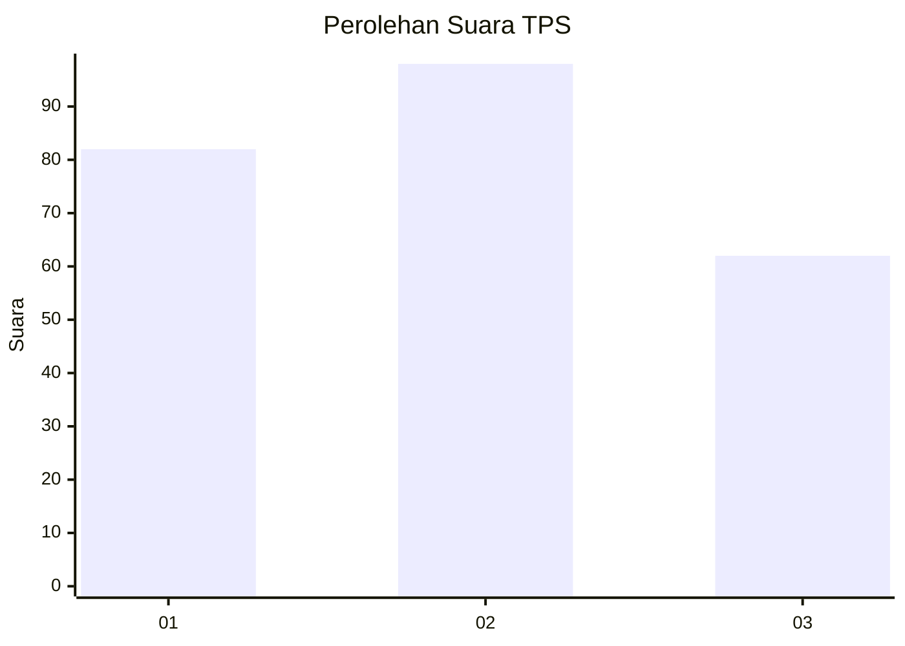
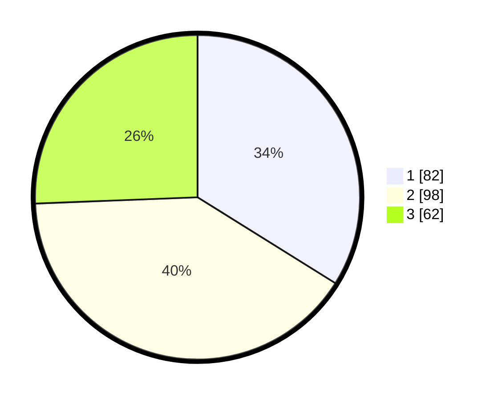

# Hasil

## Grafik

## Tabel

| No. | Nama Paslon    | Suara | Suara (raw) | Persentase |
|:--- |:-------------- | -----:| -----------:| ----------:|
| 1   | ANIES MUHAIMIN | 82    | [82][p-1]   | 33,88      |
| 2   | PRABOWO GIBRAN | 98    | [98][p-2]   | 40,50      |
| 3   | GANJAR MAHFUD  | 62    | [62][p-3]   | 25,62      |

[p-1]: https://github.com/gigit-pemilu/pemilu-2024-33-jawa-tengah/blob/main/pilpres/hitung-suara/sub/33-jawa-tengah/sub/04-banjarnegara/sub/11-rakit/sub/2011-lengkong/sub/015-tps/sub/paslon-1.txt
[p-2]: https://github.com/gigit-pemilu/pemilu-2024-33-jawa-tengah/blob/main/pilpres/hitung-suara/sub/33-jawa-tengah/sub/04-banjarnegara/sub/11-rakit/sub/2011-lengkong/sub/015-tps/sub/paslon-2.txt
[p-3]: https://github.com/gigit-pemilu/pemilu-2024-33-jawa-tengah/blob/main/pilpres/hitung-suara/sub/33-jawa-tengah/sub/04-banjarnegara/sub/11-rakit/sub/2011-lengkong/sub/015-tps/sub/paslon-3.txt

## Foto C Plano

https://sirekap-obj-formc.kpu.go.id/055a/pemilu/ppwp/33/04/11/20/11/3304112011015-20240214-225610--700c7ad6-6093-4447-a876-24c357d9946e.jpg

https://sirekap-obj-formc.kpu.go.id/055a/pemilu/ppwp/33/04/11/20/11/3304112011015-20240215-081152--d214d2b7-64ae-4e70-84ba-d6a72cb2ad7a.jpg

https://sirekap-obj-formc.kpu.go.id/055a/pemilu/ppwp/33/04/11/20/11/3304112011015-20240215-081157--bf743ed3-f159-4c31-ba51-d3410b658241.jpg

## Metadata

| Key        | Value               |
| ---------- | ------------------- |
| Time Stamp | 2024-02-24 22:31:28 |

