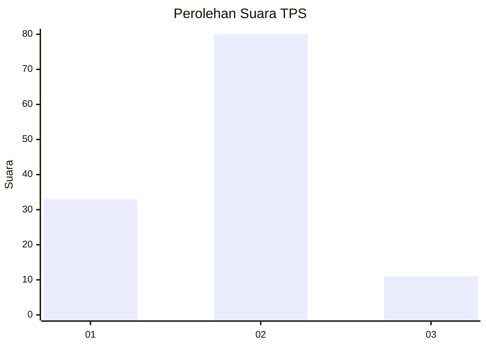
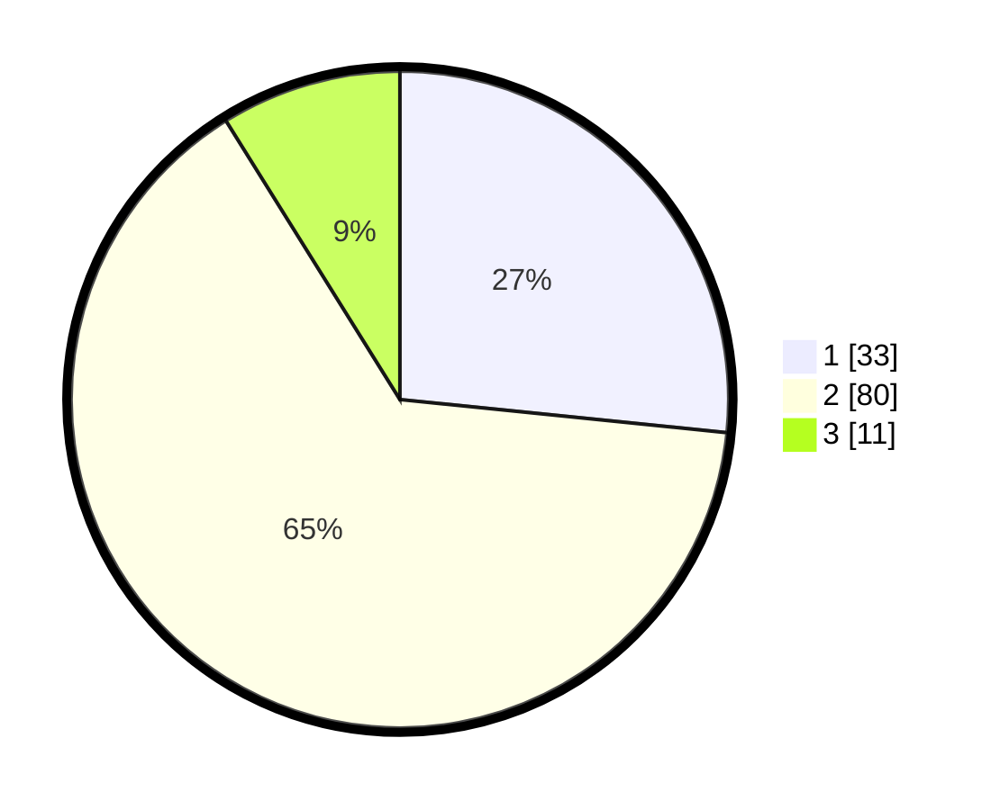

# Hasil

## Grafik

## Tabel

| No. | Nama Paslon    | Suara | Suara (raw) | Persentase |
|:--- |:-------------- | -----:| -----------:| ----------:|
| 1   | ANIES MUHAIMIN | 33    | [33][p-1]   | 26,61      |
| 2   | PRABOWO GIBRAN | 80    | [80][p-2]   | 64,52      |
| 3   | GANJAR MAHFUD  | 11    | [11][p-3]   | 8,87       |

[p-1]: https://github.com/gigit-pemilu/pemilu-2024-33-jawa-tengah/blob/main/pilpres/hitung-suara/sub/33-jawa-tengah/sub/04-banjarnegara/sub/12-punggelan/sub/2002-danakerta/sub/011-tps/sub/paslon-1.txt
[p-2]: https://github.com/gigit-pemilu/pemilu-2024-33-jawa-tengah/blob/main/pilpres/hitung-suara/sub/33-jawa-tengah/sub/04-banjarnegara/sub/12-punggelan/sub/2002-danakerta/sub/011-tps/sub/paslon-2.txt
[p-3]: https://github.com/gigit-pemilu/pemilu-2024-33-jawa-tengah/blob/main/pilpres/hitung-suara/sub/33-jawa-tengah/sub/04-banjarnegara/sub/12-punggelan/sub/2002-danakerta/sub/011-tps/sub/paslon-3.txt

## Foto C Plano

https://sirekap-obj-formc.kpu.go.id/b164/pemilu/ppwp/33/04/12/20/02/3304122002011-20240214-223416--7fe573d1-d764-49fe-8a96-3f3b8badc7a5.jpg

https://sirekap-obj-formc.kpu.go.id/b164/pemilu/ppwp/33/04/12/20/02/3304122002011-20240214-223509--d195a485-50a3-4f07-bb27-8ff8ed28797f.jpg

https://sirekap-obj-formc.kpu.go.id/b164/pemilu/ppwp/33/04/12/20/02/3304122002011-20240214-223529--1b371964-e03c-47be-92a9-ade19c8fb55b.jpg

## Metadata

| Key        | Value               |
| ---------- | ------------------- |
| Time Stamp | 2024-02-15 22:00:27 |

