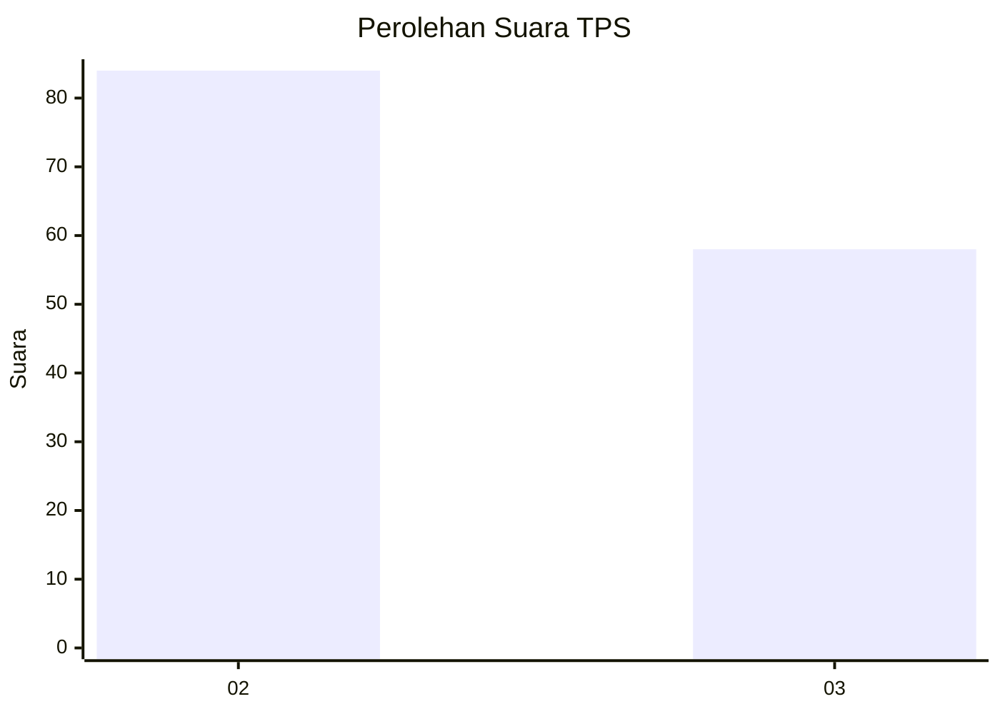
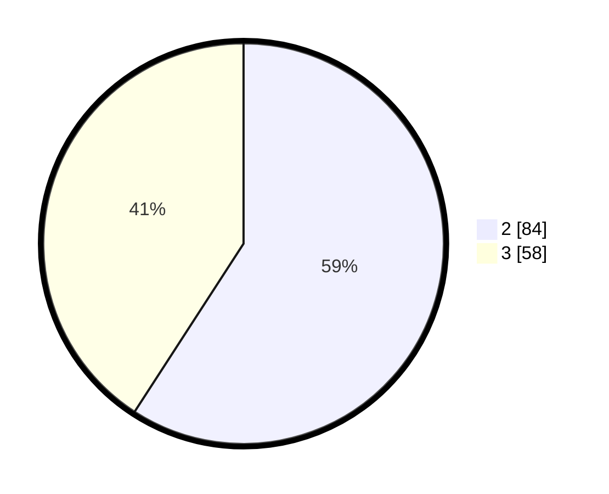

# Hasil

## Grafik

## Tabel

| No. | Nama Paslon    | Suara | Suara (raw) | Persentase |
|:--- |:-------------- | -----:| -----------:| ----------:|
| 2   | PRABOWO GIBRAN | 84    | [84][p-2]   | 59,15      |
| 3   | GANJAR MAHFUD  | 58    | [58][p-3]   | 40,85      |

[p-1]: https://github.com/gigit-pemilu/pemilu-2024/blob/main/pilpres/hitung-suara/sub/33-jawa-tengah/sub/04-banjarnegara/sub/12-punggelan/sub/2006-tribuana/sub/013-tps/sub/paslon-1.txt
[p-2]: https://github.com/gigit-pemilu/pemilu-2024/blob/main/pilpres/hitung-suara/sub/33-jawa-tengah/sub/04-banjarnegara/sub/12-punggelan/sub/2006-tribuana/sub/013-tps/sub/paslon-2.txt
[p-3]: https://github.com/gigit-pemilu/pemilu-2024/blob/main/pilpres/hitung-suara/sub/33-jawa-tengah/sub/04-banjarnegara/sub/12-punggelan/sub/2006-tribuana/sub/013-tps/sub/paslon-3.txt

## Foto C Plano

https://sirekap-obj-formc.kpu.go.id/491a/pemilu/ppwp/33/04/12/20/06/3304122006013-20240214-211130--5cb29ed0-b84e-45b6-9c9b-c9d41a14a878.jpg

https://sirekap-obj-formc.kpu.go.id/491a/pemilu/ppwp/33/04/12/20/06/3304122006013-20240214-214001--1e2a7226-fcc7-4c67-ae1a-3607c5ea2381.jpg

https://sirekap-obj-formc.kpu.go.id/491a/pemilu/ppwp/33/04/12/20/06/3304122006013-20240214-213947--2003e2c5-76d1-41ed-b5b7-4eb2ab391ff0.jpg

## Metadata

| Key        | Value               |
| ---------- | ------------------- |
| Time Stamp | 2024-02-24 22:31:28 |

