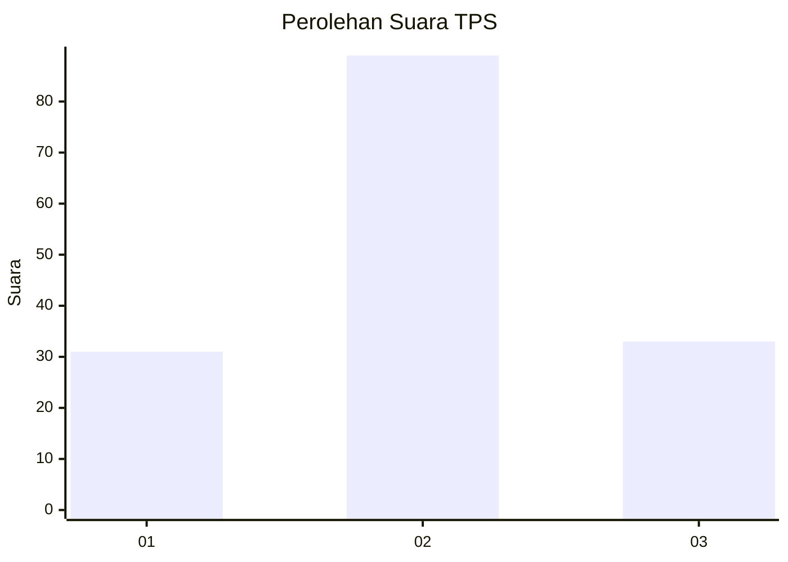
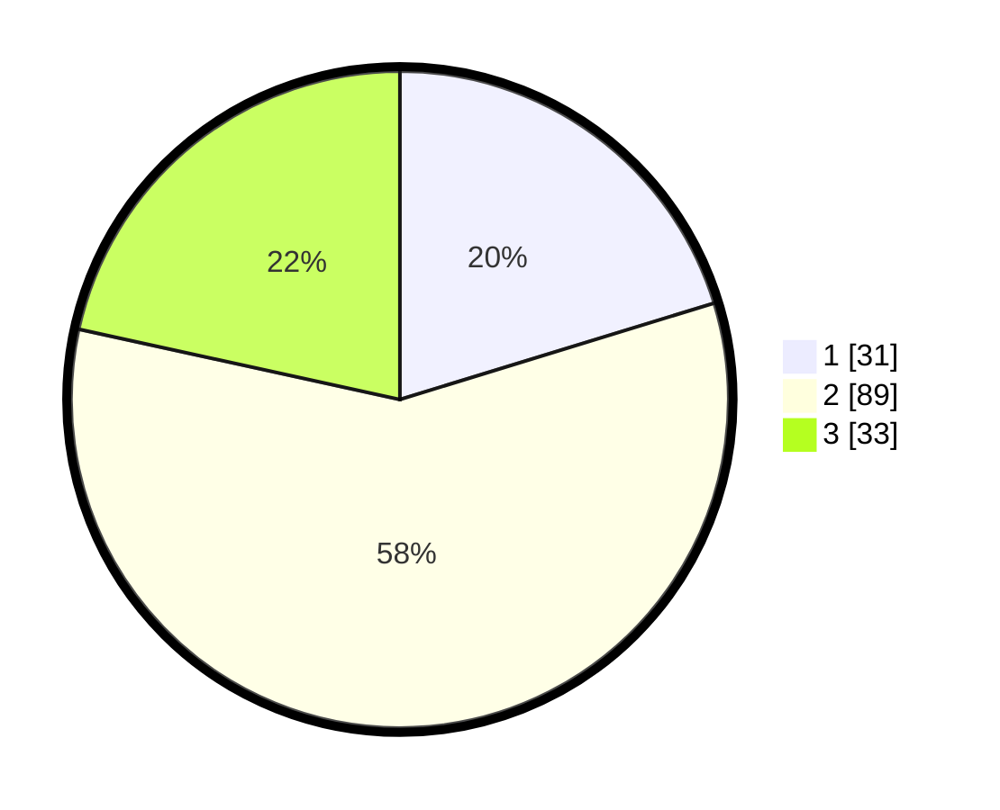

# Hasil

## Grafik

## Tabel

| No. | Nama Paslon    | Suara | Suara (raw) | Persentase |
|:--- |:-------------- | -----:| -----------:| ----------:|
| 1   | ANIES MUHAIMIN | 31    | [31][p-1]   | 20,26      |
| 2   | PRABOWO GIBRAN | 89    | [89][p-2]   | 58,17      |
| 3   | GANJAR MAHFUD  | 33    | [33][p-3]   | 21,57      |

[p-1]: https://github.com/gigit-pemilu/pemilu-2024/blob/main/pilpres/hitung-suara/sub/33-jawa-tengah/sub/04-banjarnegara/sub/12-punggelan/sub/2008-sidarata/sub/007-tps/sub/paslon-1.txt
[p-2]: https://github.com/gigit-pemilu/pemilu-2024/blob/main/pilpres/hitung-suara/sub/33-jawa-tengah/sub/04-banjarnegara/sub/12-punggelan/sub/2008-sidarata/sub/007-tps/sub/paslon-2.txt
[p-3]: https://github.com/gigit-pemilu/pemilu-2024/blob/main/pilpres/hitung-suara/sub/33-jawa-tengah/sub/04-banjarnegara/sub/12-punggelan/sub/2008-sidarata/sub/007-tps/sub/paslon-3.txt

## Foto C Plano

https://sirekap-obj-formc.kpu.go.id/52c1/pemilu/ppwp/33/04/12/20/08/3304122008007-20240214-210640--79e38cf3-8a36-402d-9fe2-e885567880eb.jpg

https://sirekap-obj-formc.kpu.go.id/52c1/pemilu/ppwp/33/04/12/20/08/3304122008007-20240215-012330--a4492c2f-391f-4fca-ac71-9c1023ca0c54.jpg

https://sirekap-obj-formc.kpu.go.id/52c1/pemilu/ppwp/33/04/12/20/08/3304122008007-20240215-012536--5ba9eec6-0a8f-404c-b215-4f474e752a6d.jpg

## Metadata

| Key        | Value               |
| ---------- | ------------------- |
| Time Stamp | 2024-02-15 23:29:50 |

