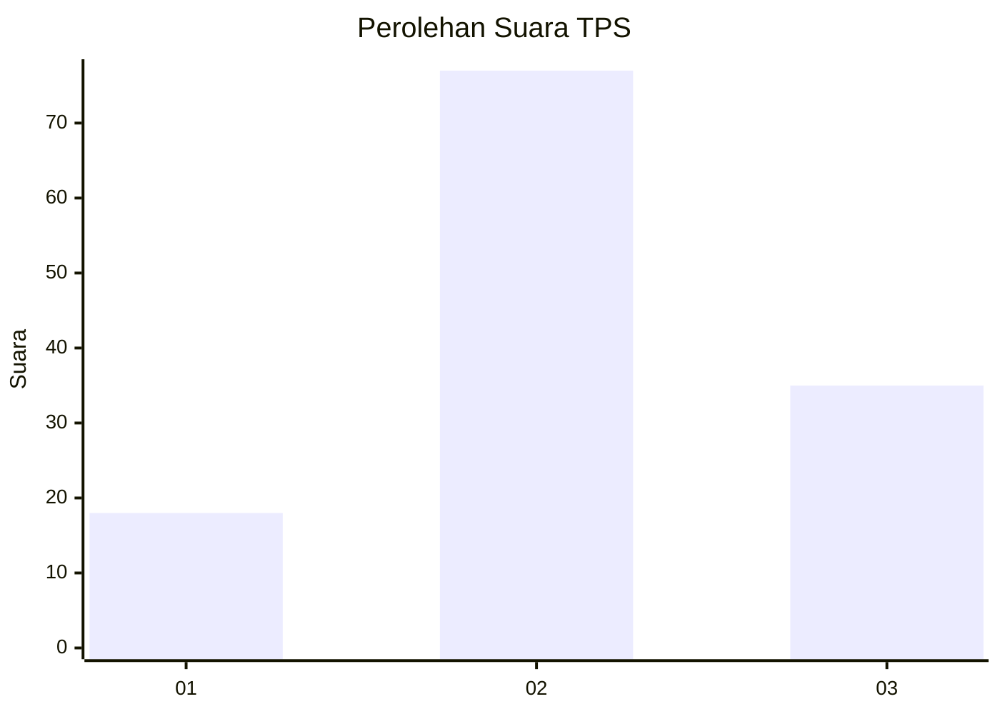
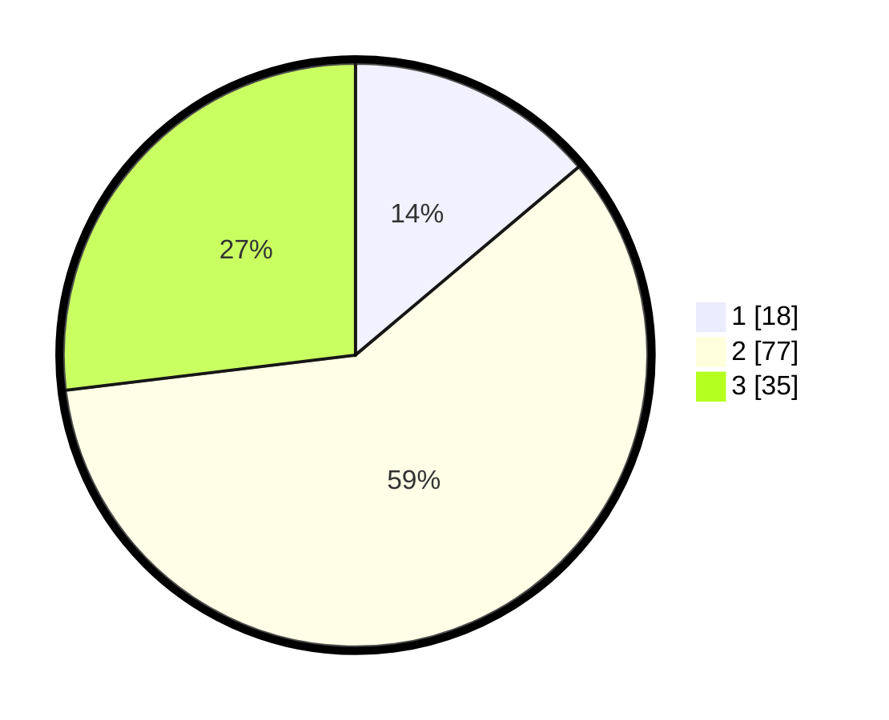

# Hasil

## Grafik

## Tabel

| No. | Nama Paslon    | Suara | Suara (raw) | Persentase |
|:--- |:-------------- | -----:| -----------:| ----------:|
| 1   | ANIES MUHAIMIN | 18    | [18][p-1]   | 13,85      |
| 2   | PRABOWO GIBRAN | 77    | [77][p-2]   | 59,23      |
| 3   | GANJAR MAHFUD  | 35    | [35][p-3]   | 26,92      |

[p-1]: https://github.com/gigit-pemilu/pemilu-2024-33-jawa-tengah/blob/main/pilpres/hitung-suara/sub/33-jawa-tengah/sub/04-banjarnegara/sub/12-punggelan/sub/2010-punggelan/sub/016-tps/sub/paslon-1.txt
[p-2]: https://github.com/gigit-pemilu/pemilu-2024-33-jawa-tengah/blob/main/pilpres/hitung-suara/sub/33-jawa-tengah/sub/04-banjarnegara/sub/12-punggelan/sub/2010-punggelan/sub/016-tps/sub/paslon-2.txt
[p-3]: https://github.com/gigit-pemilu/pemilu-2024-33-jawa-tengah/blob/main/pilpres/hitung-suara/sub/33-jawa-tengah/sub/04-banjarnegara/sub/12-punggelan/sub/2010-punggelan/sub/016-tps/sub/paslon-3.txt

## Foto C Plano

https://sirekap-obj-formc.kpu.go.id/b070/pemilu/ppwp/33/04/12/20/10/3304122010016-20240215-065104--1235d9d4-ffac-4145-8005-eddb4a0bdafe.jpg

https://sirekap-obj-formc.kpu.go.id/b070/pemilu/ppwp/33/04/12/20/10/3304122010016-20240215-065243--1635f161-e456-4be2-b2e3-6a6c65d405b9.jpg

https://sirekap-obj-formc.kpu.go.id/b070/pemilu/ppwp/33/04/12/20/10/3304122010016-20240215-065348--38aaae4f-9f47-4137-8d50-4742375d9539.jpg

## Metadata

| Key        | Value               |
| ---------- | ------------------- |
| Time Stamp | 2024-02-15 16:30:25 |

