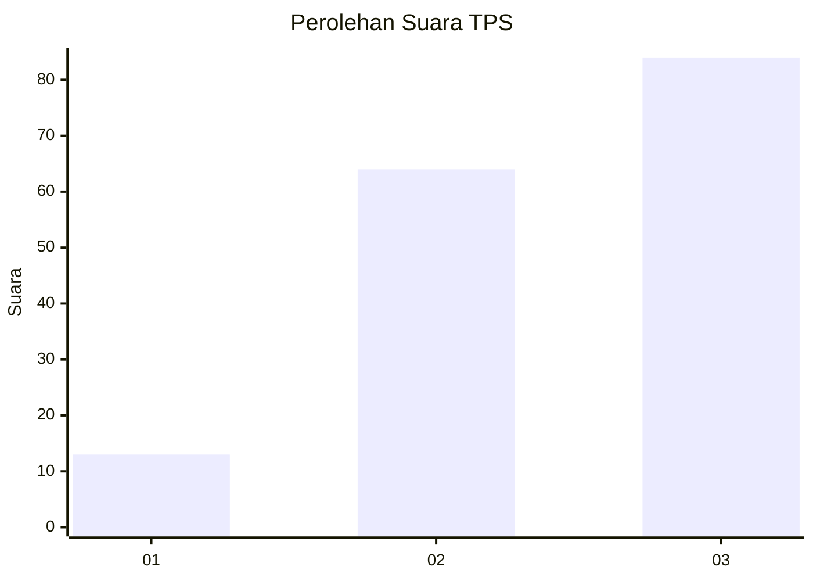
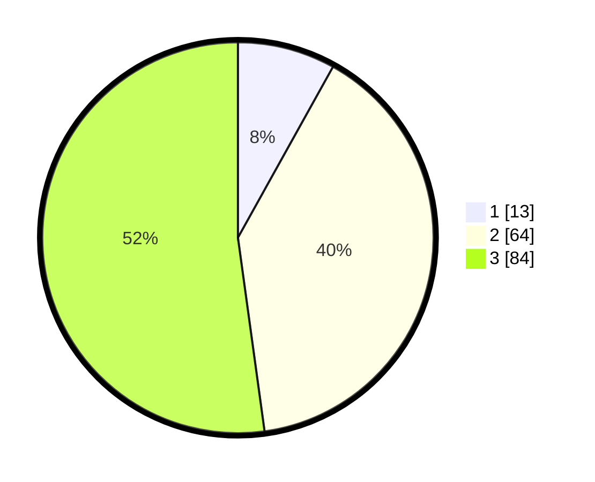

# Hasil

## Grafik

## Tabel

| No. | Nama Paslon    | Suara | Suara (raw) | Persentase |
|:--- |:-------------- | -----:| -----------:| ----------:|
| 1   | ANIES MUHAIMIN | 13    | [13][p-1]   | 8,07       |
| 2   | PRABOWO GIBRAN | 64    | [64][p-2]   | 39,75      |
| 3   | GANJAR MAHFUD  | 84    | [84][p-3]   | 52,17      |

[p-1]: https://github.com/gigit-pemilu/pemilu-2024-33-jawa-tengah/blob/main/pilpres/hitung-suara/sub/33-jawa-tengah/sub/04-banjarnegara/sub/12-punggelan/sub/2011-jembangan/sub/002-tps/sub/paslon-1.txt
[p-2]: https://github.com/gigit-pemilu/pemilu-2024-33-jawa-tengah/blob/main/pilpres/hitung-suara/sub/33-jawa-tengah/sub/04-banjarnegara/sub/12-punggelan/sub/2011-jembangan/sub/002-tps/sub/paslon-2.txt
[p-3]: https://github.com/gigit-pemilu/pemilu-2024-33-jawa-tengah/blob/main/pilpres/hitung-suara/sub/33-jawa-tengah/sub/04-banjarnegara/sub/12-punggelan/sub/2011-jembangan/sub/002-tps/sub/paslon-3.txt

## Foto C Plano

https://sirekap-obj-formc.kpu.go.id/6e46/pemilu/ppwp/33/04/12/20/11/3304122011002-20240214-231201--7a81ae9e-72ab-4d4c-9cab-be67726c716e.jpg

https://sirekap-obj-formc.kpu.go.id/6e46/pemilu/ppwp/33/04/12/20/11/3304122011002-20240215-112003--3b6238d4-a68a-4ded-be26-13c04134fa26.jpg

https://sirekap-obj-formc.kpu.go.id/6e46/pemilu/ppwp/33/04/12/20/11/3304122011002-20240214-231238--9ac171ee-0f63-45fb-9f8a-9e47a0a92095.jpg

## Metadata

| Key        | Value               |
| ---------- | ------------------- |
| Time Stamp | 2024-02-15 23:29:50 |

