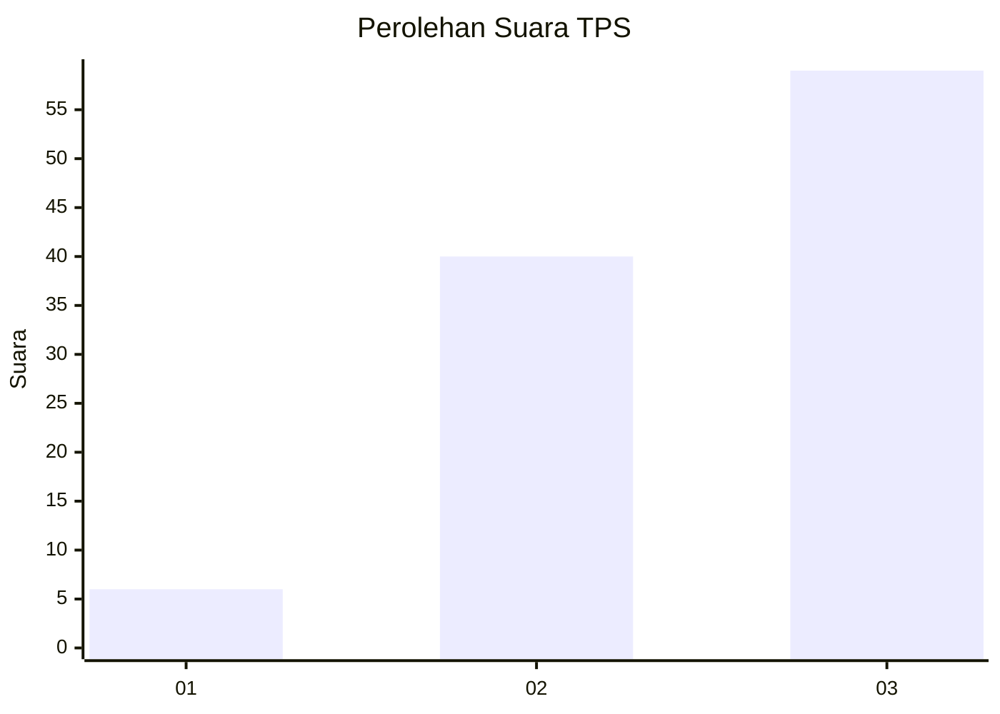
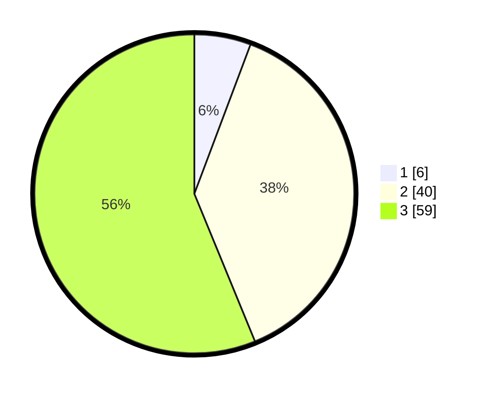

# Hasil

## Grafik

## Tabel

| No. | Nama Paslon    | Suara | Suara (raw) | Persentase |
|:--- |:-------------- | -----:| -----------:| ----------:|
| 1   | ANIES MUHAIMIN | 6     | [6][p-1]    | 5,71       |
| 2   | PRABOWO GIBRAN | 40    | [40][p-2]   | 38,10      |
| 3   | GANJAR MAHFUD  | 59    | [59][p-3]   | 56,19      |

[p-1]: https://github.com/gigit-pemilu/pemilu-2024-33-jawa-tengah/blob/main/pilpres/hitung-suara/sub/33-jawa-tengah/sub/04-banjarnegara/sub/12-punggelan/sub/2011-jembangan/sub/005-tps/sub/paslon-1.txt
[p-2]: https://github.com/gigit-pemilu/pemilu-2024-33-jawa-tengah/blob/main/pilpres/hitung-suara/sub/33-jawa-tengah/sub/04-banjarnegara/sub/12-punggelan/sub/2011-jembangan/sub/005-tps/sub/paslon-2.txt
[p-3]: https://github.com/gigit-pemilu/pemilu-2024-33-jawa-tengah/blob/main/pilpres/hitung-suara/sub/33-jawa-tengah/sub/04-banjarnegara/sub/12-punggelan/sub/2011-jembangan/sub/005-tps/sub/paslon-3.txt

## Foto C Plano

https://sirekap-obj-formc.kpu.go.id/ba26/pemilu/ppwp/33/04/12/20/11/3304122011005-20240215-091833--75a2c585-2fa0-4c0d-827c-4002e75f99ed.jpg

https://sirekap-obj-formc.kpu.go.id/ba26/pemilu/ppwp/33/04/12/20/11/3304122011005-20240215-091928--14a029ee-bf94-4dd0-b606-7783f12f45c4.jpg

https://sirekap-obj-formc.kpu.go.id/ba26/pemilu/ppwp/33/04/12/20/11/3304122011005-20240215-092204--129bc433-1c53-4ecb-8055-f904f0edbaf7.jpg

## Metadata

| Key        | Value               |
| ---------- | ------------------- |
| Time Stamp | 2024-02-15 16:30:25 |

