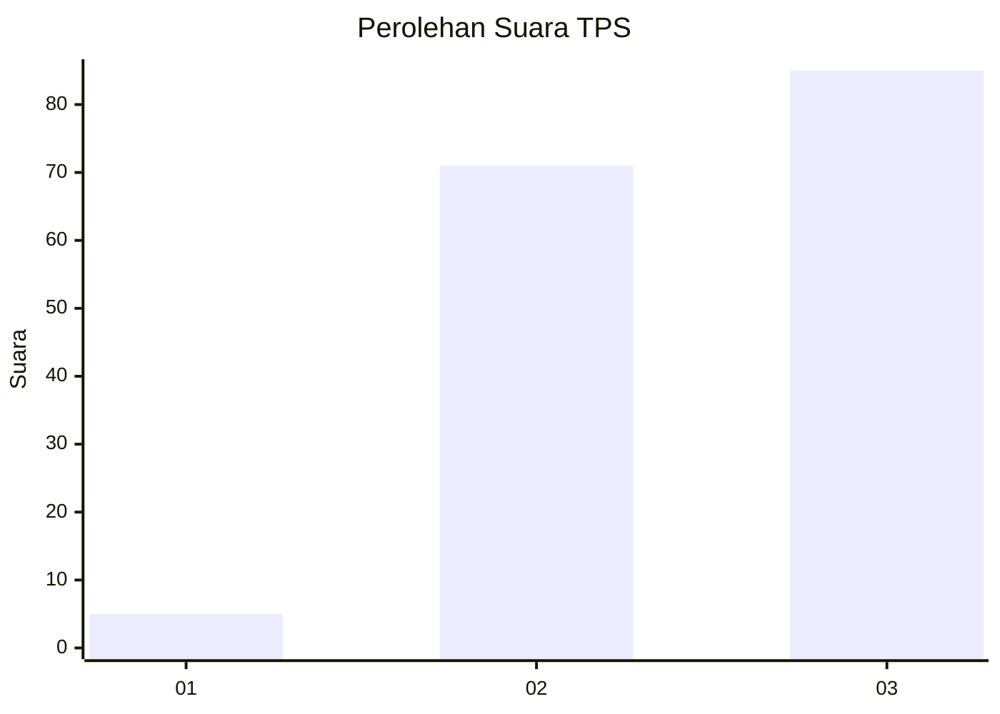
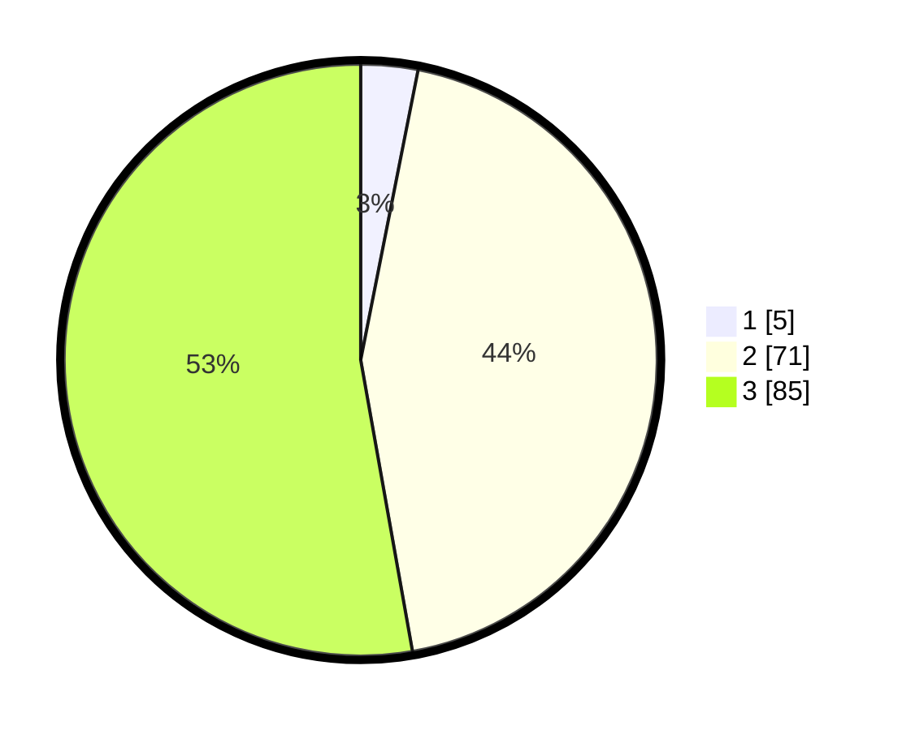

# Hasil

## Grafik

## Tabel

| No. | Nama Paslon    | Suara | Suara (raw) | Persentase |
|:--- |:-------------- | -----:| -----------:| ----------:|
| 1   | ANIES MUHAIMIN | 5     | [5][p-1]    | 3,11       |
| 2   | PRABOWO GIBRAN | 71    | [71][p-2]   | 44,10      |
| 3   | GANJAR MAHFUD  | 85    | [85][p-3]   | 52,80      |

[p-1]: https://github.com/gigit-pemilu/pemilu-2024-33-jawa-tengah/blob/main/pilpres/hitung-suara/sub/33-jawa-tengah/sub/04-banjarnegara/sub/12-punggelan/sub/2011-jembangan/sub/015-tps/sub/paslon-1.txt
[p-2]: https://github.com/gigit-pemilu/pemilu-2024-33-jawa-tengah/blob/main/pilpres/hitung-suara/sub/33-jawa-tengah/sub/04-banjarnegara/sub/12-punggelan/sub/2011-jembangan/sub/015-tps/sub/paslon-2.txt
[p-3]: https://github.com/gigit-pemilu/pemilu-2024-33-jawa-tengah/blob/main/pilpres/hitung-suara/sub/33-jawa-tengah/sub/04-banjarnegara/sub/12-punggelan/sub/2011-jembangan/sub/015-tps/sub/paslon-3.txt

## Foto C Plano

https://sirekap-obj-formc.kpu.go.id/2895/pemilu/ppwp/33/04/12/20/11/3304122011015-20240215-110900--e471482c-7706-4333-8f68-5ae8349fb34b.jpg

https://sirekap-obj-formc.kpu.go.id/2895/pemilu/ppwp/33/04/12/20/11/3304122011015-20240215-110920--ed17c6d8-a2bb-4cd2-a1a4-c74bc9376358.jpg

https://sirekap-obj-formc.kpu.go.id/2895/pemilu/ppwp/33/04/12/20/11/3304122011015-20240215-110943--cb18a4c8-3890-4cbc-9459-81fc00788c56.jpg

## Metadata

| Key        | Value               |
| ---------- | ------------------- |
| Time Stamp | 2024-02-15 23:29:50 |

