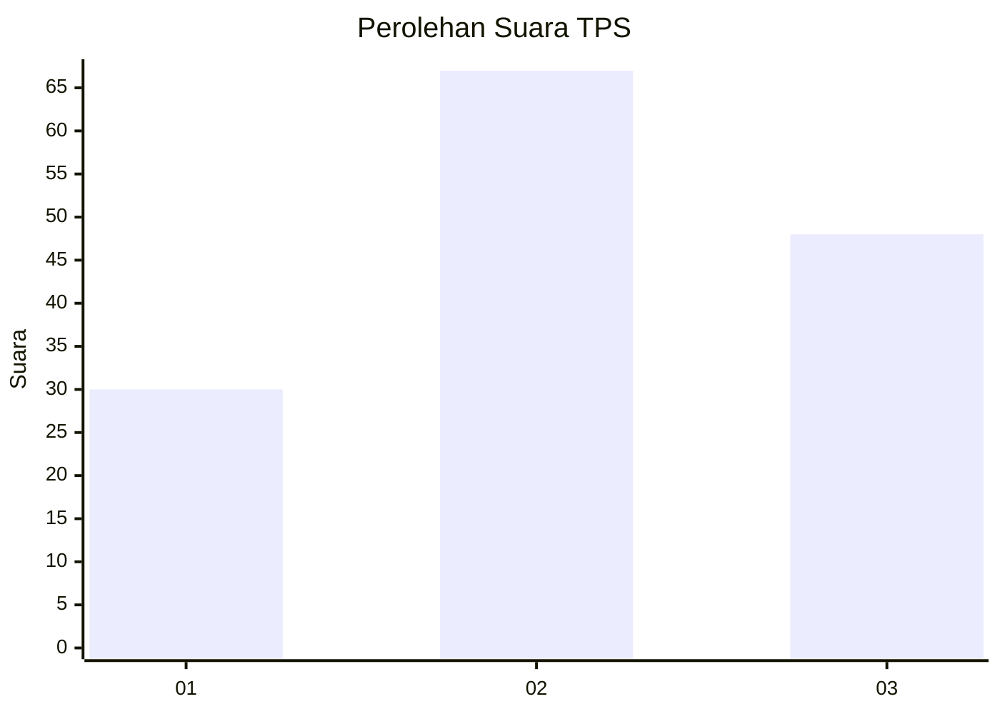
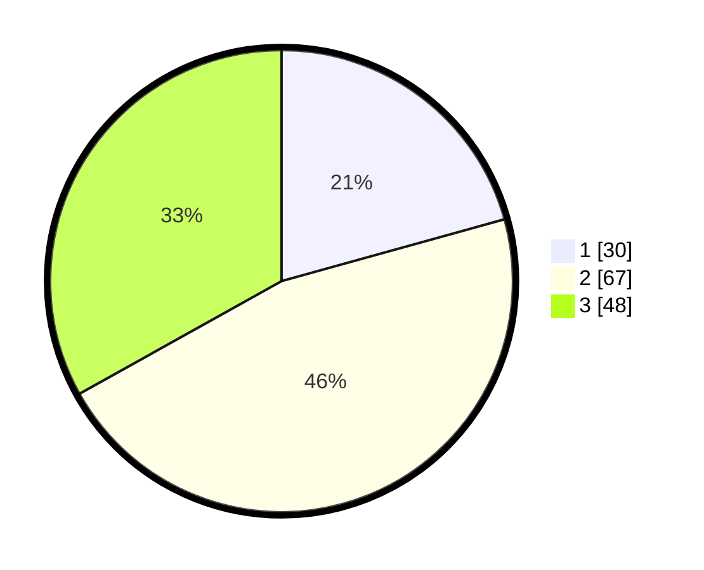

# Hasil

## Grafik

## Tabel

| No. | Nama Paslon    | Suara | Suara (raw) | Persentase |
|:--- |:-------------- | -----:| -----------:| ----------:|
| 1   | ANIES MUHAIMIN | 30    | [30][p-1]   | 20,69      |
| 2   | PRABOWO GIBRAN | 67    | [67][p-2]   | 46,21      |
| 3   | GANJAR MAHFUD  | 48    | [48][p-3]   | 33,10      |

[p-1]: https://github.com/gigit-pemilu/pemilu-2024/blob/main/pilpres/hitung-suara/sub/33-jawa-tengah/sub/04-banjarnegara/sub/12-punggelan/sub/2011-jembangan/sub/019-tps/sub/paslon-1.txt
[p-2]: https://github.com/gigit-pemilu/pemilu-2024/blob/main/pilpres/hitung-suara/sub/33-jawa-tengah/sub/04-banjarnegara/sub/12-punggelan/sub/2011-jembangan/sub/019-tps/sub/paslon-2.txt
[p-3]: https://github.com/gigit-pemilu/pemilu-2024/blob/main/pilpres/hitung-suara/sub/33-jawa-tengah/sub/04-banjarnegara/sub/12-punggelan/sub/2011-jembangan/sub/019-tps/sub/paslon-3.txt

## Foto C Plano

https://sirekap-obj-formc.kpu.go.id/192f/pemilu/ppwp/33/04/12/20/11/3304122011019-20240214-230455--429d483b-3e4a-442f-ba6b-c5b07cb6cdb8.jpg

https://sirekap-obj-formc.kpu.go.id/192f/pemilu/ppwp/33/04/12/20/11/3304122011019-20240214-230516--66511d37-e00f-423c-bfb6-fea4bd4ad71e.jpg

https://sirekap-obj-formc.kpu.go.id/192f/pemilu/ppwp/33/04/12/20/11/3304122011019-20240214-230529--f0b8ba5e-d3e9-49b6-8d69-6988fb73dda6.jpg

## Metadata

| Key        | Value               |
| ---------- | ------------------- |
| Time Stamp | 2024-02-15 23:29:50 |

