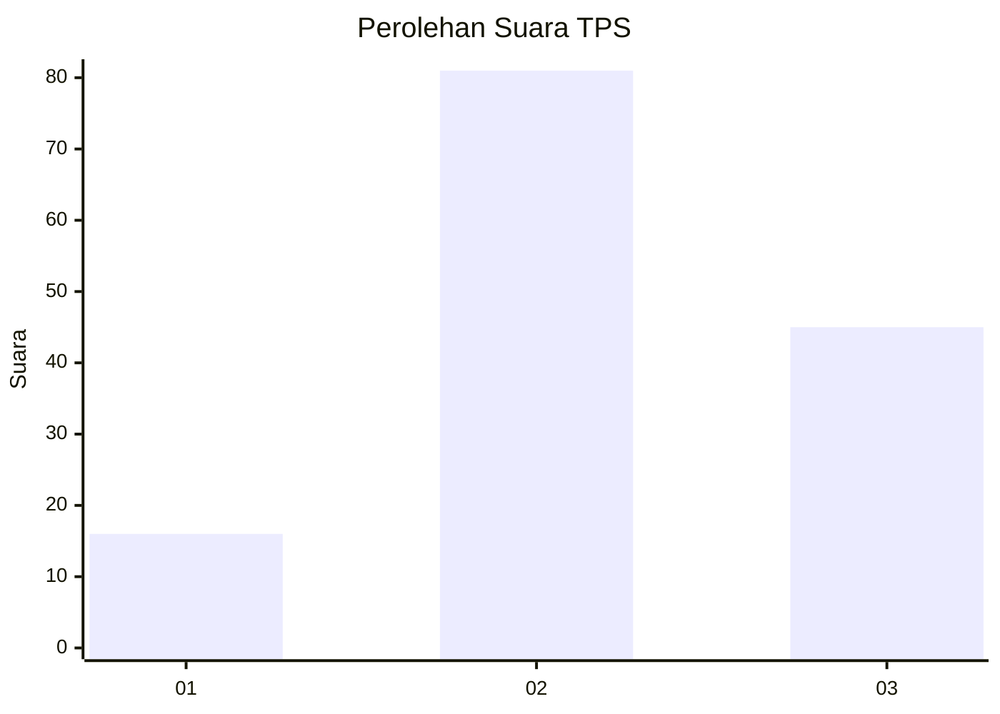
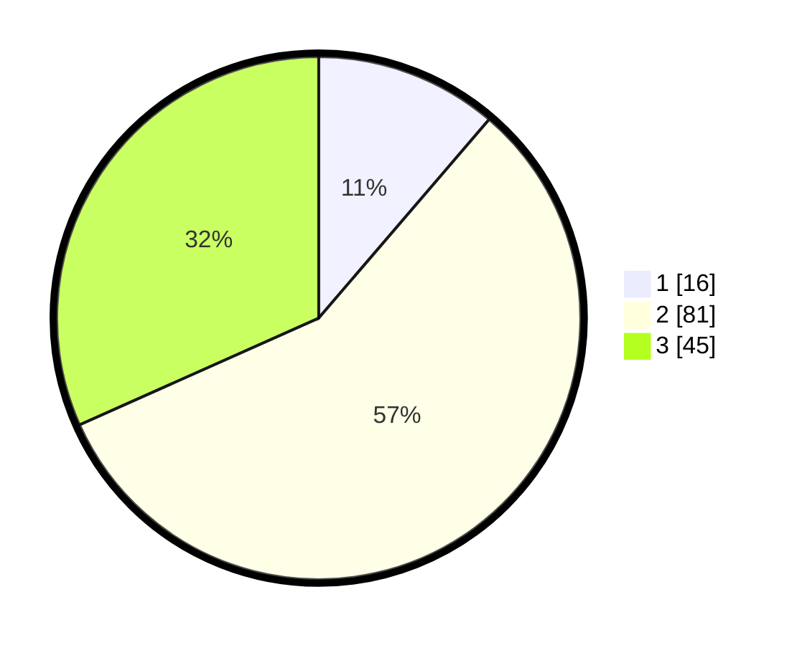

# Hasil

## Grafik

## Tabel

| No. | Nama Paslon    | Suara | Suara (raw) | Persentase |
|:--- |:-------------- | -----:| -----------:| ----------:|
| 1   | ANIES MUHAIMIN | 16    | [16][p-1]   | 11,27      |
| 2   | PRABOWO GIBRAN | 81    | [81][p-2]   | 57,04      |
| 3   | GANJAR MAHFUD  | 45    | [45][p-3]   | 31,69      |

[p-1]: https://github.com/gigit-pemilu/pemilu-2024/blob/main/pilpres/hitung-suara/sub/33-jawa-tengah/sub/04-banjarnegara/sub/12-punggelan/sub/2011-jembangan/sub/020-tps/sub/paslon-1.txt
[p-2]: https://github.com/gigit-pemilu/pemilu-2024/blob/main/pilpres/hitung-suara/sub/33-jawa-tengah/sub/04-banjarnegara/sub/12-punggelan/sub/2011-jembangan/sub/020-tps/sub/paslon-2.txt
[p-3]: https://github.com/gigit-pemilu/pemilu-2024/blob/main/pilpres/hitung-suara/sub/33-jawa-tengah/sub/04-banjarnegara/sub/12-punggelan/sub/2011-jembangan/sub/020-tps/sub/paslon-3.txt

## Foto C Plano

https://sirekap-obj-formc.kpu.go.id/e69e/pemilu/ppwp/33/04/12/20/11/3304122011020-20240214-191800--40e718cd-4142-480e-9f9e-d85ac49e7a4d.jpg

https://sirekap-obj-formc.kpu.go.id/e69e/pemilu/ppwp/33/04/12/20/11/3304122011020-20240214-191807--50ee4ed8-57d5-468d-a9c1-d096f3f3eb78.jpg

https://sirekap-obj-formc.kpu.go.id/e69e/pemilu/ppwp/33/04/12/20/11/3304122011020-20240214-191811--2a9c9a8f-ab64-4a45-937f-3e42392f93e9.jpg

## Metadata

| Key        | Value               |
| ---------- | ------------------- |
| Time Stamp | 2024-02-15 00:41:44 |

