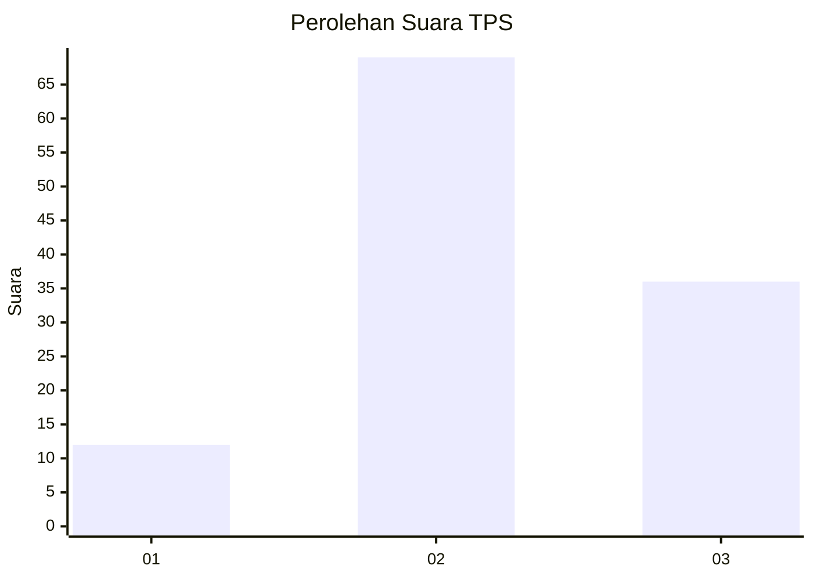
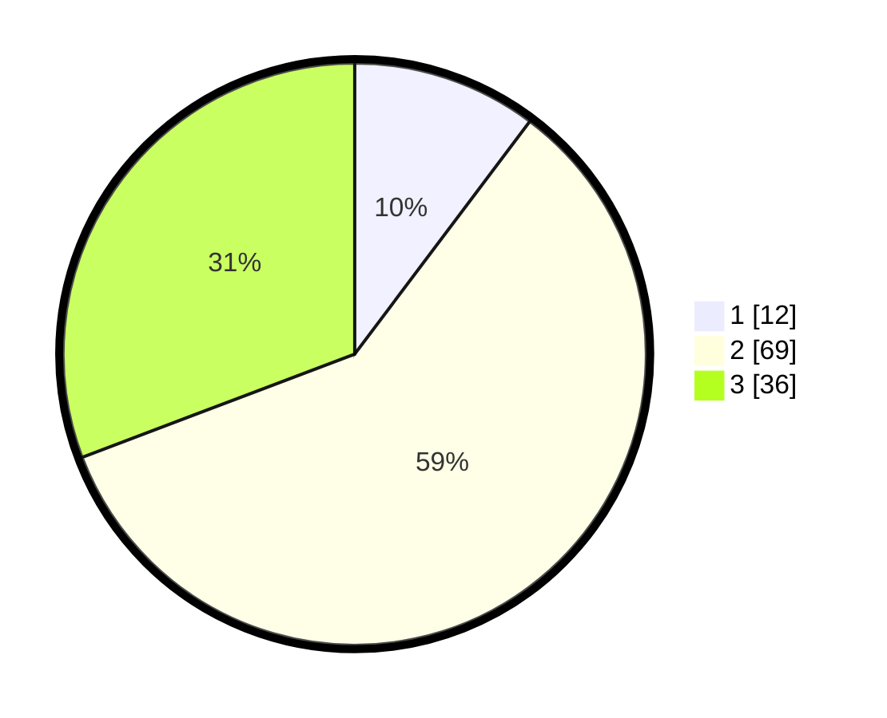

# Hasil

## Grafik

## Tabel

| No. | Nama Paslon    | Suara | Suara (raw) | Persentase |
|:--- |:-------------- | -----:| -----------:| ----------:|
| 1   | ANIES MUHAIMIN | 12    | [12][p-1]   | 10,26      |
| 2   | PRABOWO GIBRAN | 69    | [69][p-2]   | 58,97      |
| 3   | GANJAR MAHFUD  | 36    | [36][p-3]   | 30,77      |

[p-1]: https://github.com/gigit-pemilu/pemilu-2024-33-jawa-tengah/blob/main/pilpres/hitung-suara/sub/33-jawa-tengah/sub/04-banjarnegara/sub/12-punggelan/sub/2013-petuguran/sub/020-tps/sub/paslon-1.txt
[p-2]: https://github.com/gigit-pemilu/pemilu-2024-33-jawa-tengah/blob/main/pilpres/hitung-suara/sub/33-jawa-tengah/sub/04-banjarnegara/sub/12-punggelan/sub/2013-petuguran/sub/020-tps/sub/paslon-2.txt
[p-3]: https://github.com/gigit-pemilu/pemilu-2024-33-jawa-tengah/blob/main/pilpres/hitung-suara/sub/33-jawa-tengah/sub/04-banjarnegara/sub/12-punggelan/sub/2013-petuguran/sub/020-tps/sub/paslon-3.txt

## Foto C Plano

https://sirekap-obj-formc.kpu.go.id/f5f6/pemilu/ppwp/33/04/12/20/13/3304122013020-20240214-141115--be87a0e7-9f50-4fa7-bc99-8541ce1c1c0b.jpg

https://sirekap-obj-formc.kpu.go.id/f5f6/pemilu/ppwp/33/04/12/20/13/3304122013020-20240214-141251--2484229a-2f0c-480a-ae4f-8a03798e46af.jpg

https://sirekap-obj-formc.kpu.go.id/f5f6/pemilu/ppwp/33/04/12/20/13/3304122013020-20240214-141352--8e3efba2-acc6-4667-80ec-952c8cd591ed.jpg

## Metadata

| Key        | Value               |
| ---------- | ------------------- |
| Time Stamp | 2024-02-15 00:46:45 |

