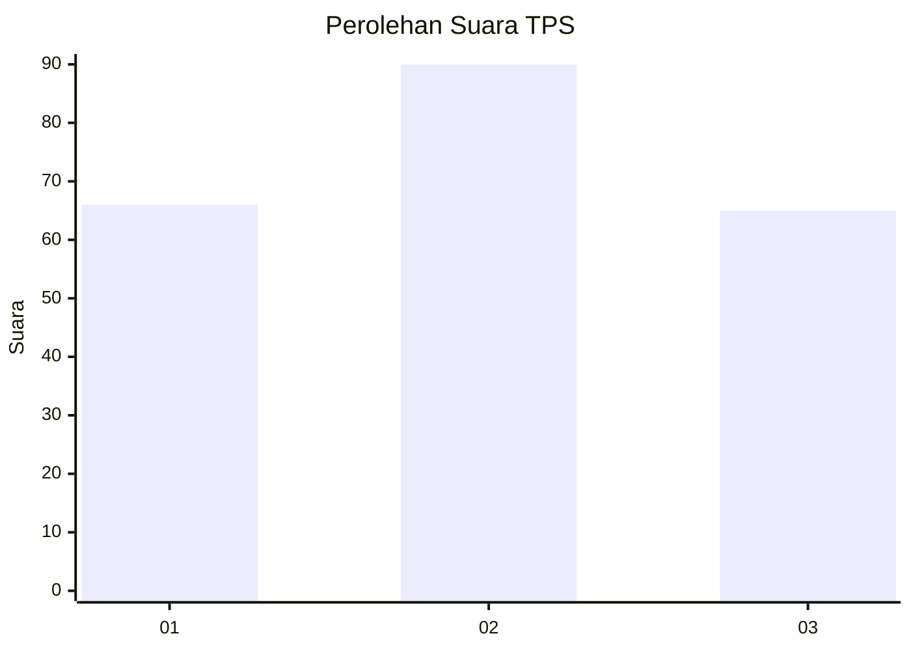
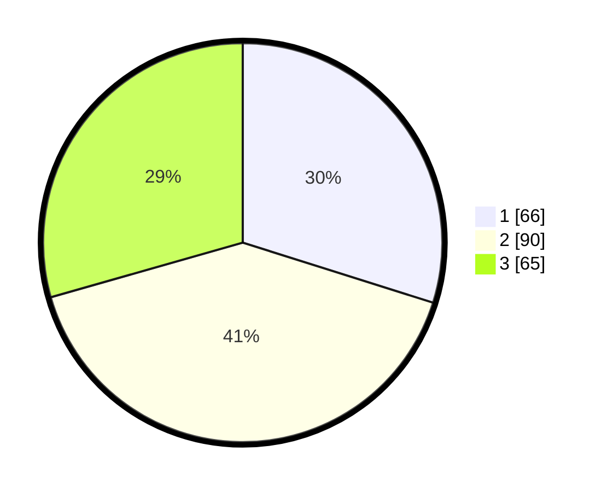

# Hasil

## Grafik

## Tabel

| No. | Nama Paslon    | Suara | Suara (raw) | Persentase |
|:--- |:-------------- | -----:| -----------:| ----------:|
| 1   | ANIES MUHAIMIN | 66    | [66][p-1]   | 29,86      |
| 2   | PRABOWO GIBRAN | 90    | [90][p-2]   | 40,72      |
| 3   | GANJAR MAHFUD  | 65    | [65][p-3]   | 29,41      |

[p-1]: https://github.com/gigit-pemilu/pemilu-2024/blob/main/pilpres/hitung-suara/sub/33-jawa-tengah/sub/04-banjarnegara/sub/12-punggelan/sub/2014-bondolharjo/sub/003-tps/sub/paslon-1.txt
[p-2]: https://github.com/gigit-pemilu/pemilu-2024/blob/main/pilpres/hitung-suara/sub/33-jawa-tengah/sub/04-banjarnegara/sub/12-punggelan/sub/2014-bondolharjo/sub/003-tps/sub/paslon-2.txt
[p-3]: https://github.com/gigit-pemilu/pemilu-2024/blob/main/pilpres/hitung-suara/sub/33-jawa-tengah/sub/04-banjarnegara/sub/12-punggelan/sub/2014-bondolharjo/sub/003-tps/sub/paslon-3.txt

## Foto C Plano

https://sirekap-obj-formc.kpu.go.id/04bb/pemilu/ppwp/33/04/12/20/14/3304122014003-20240216-154200--a2e62cc5-569b-461d-8bd1-c80280140310.jpg

https://sirekap-obj-formc.kpu.go.id/04bb/pemilu/ppwp/33/04/12/20/14/3304122014003-20240215-070707--85325be1-8264-44aa-988e-9eacba4c31f5.jpg

https://sirekap-obj-formc.kpu.go.id/04bb/pemilu/ppwp/33/04/12/20/14/3304122014003-20240215-070842--c7c99cbf-4459-44b2-b12e-fd27ed4d96d6.jpg

## Metadata

| Key        | Value               |
| ---------- | ------------------- |
| Time Stamp | 2024-02-16 16:25:10 |

