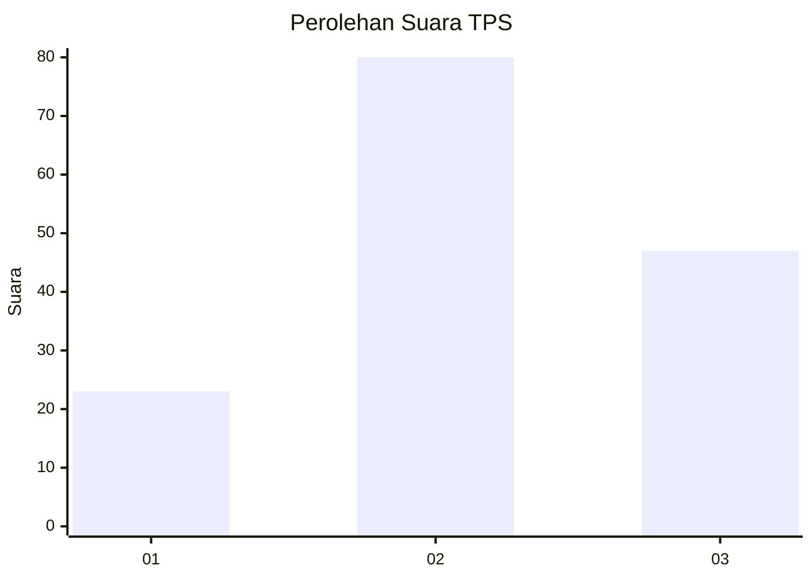
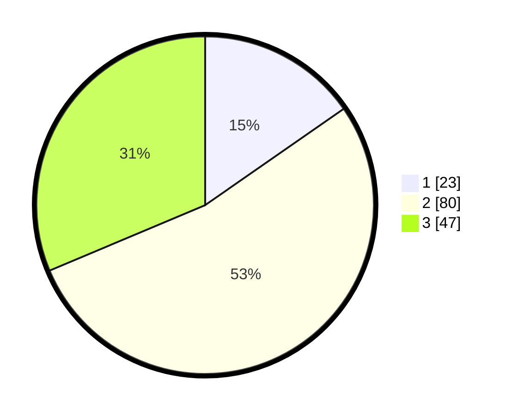

# Hasil

## Grafik

## Tabel

| No. | Nama Paslon    | Suara | Suara (raw) | Persentase |
|:--- |:-------------- | -----:| -----------:| ----------:|
| 1   | ANIES MUHAIMIN | 23    | [23][p-1]   | 15,33      |
| 2   | PRABOWO GIBRAN | 80    | [80][p-2]   | 53,33      |
| 3   | GANJAR MAHFUD  | 47    | [47][p-3]   | 31,33      |

[p-1]: https://github.com/gigit-pemilu/pemilu-2024/blob/main/pilpres/hitung-suara/sub/33-jawa-tengah/sub/04-banjarnegara/sub/12-punggelan/sub/2014-bondolharjo/sub/004-tps/sub/paslon-1.txt
[p-2]: https://github.com/gigit-pemilu/pemilu-2024/blob/main/pilpres/hitung-suara/sub/33-jawa-tengah/sub/04-banjarnegara/sub/12-punggelan/sub/2014-bondolharjo/sub/004-tps/sub/paslon-2.txt
[p-3]: https://github.com/gigit-pemilu/pemilu-2024/blob/main/pilpres/hitung-suara/sub/33-jawa-tengah/sub/04-banjarnegara/sub/12-punggelan/sub/2014-bondolharjo/sub/004-tps/sub/paslon-3.txt

## Foto C Plano

https://sirekap-obj-formc.kpu.go.id/8e6f/pemilu/ppwp/33/04/12/20/14/3304122014004-20240214-231734--71b91efb-d866-4635-a78c-8a62f5d3bec8.jpg

https://sirekap-obj-formc.kpu.go.id/8e6f/pemilu/ppwp/33/04/12/20/14/3304122014004-20240214-231811--8dc3c689-a7a2-4cf8-9d10-a214c05f0b2b.jpg

https://sirekap-obj-formc.kpu.go.id/8e6f/pemilu/ppwp/33/04/12/20/14/3304122014004-20240214-231843--5be9691f-08ec-43e1-8434-3049979c5f3d.jpg

## Metadata

| Key        | Value               |
| ---------- | ------------------- |
| Time Stamp | 2024-02-15 22:40:13 |

