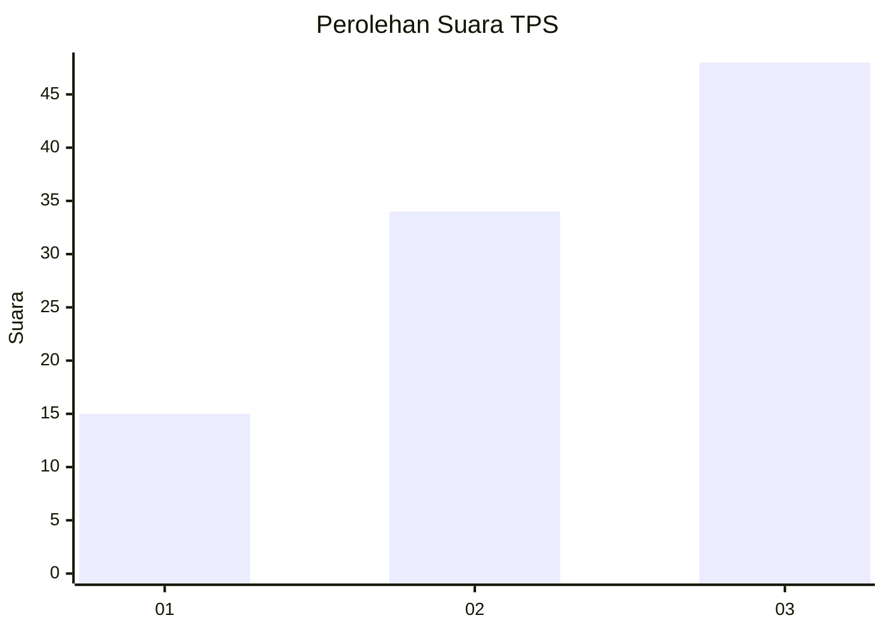
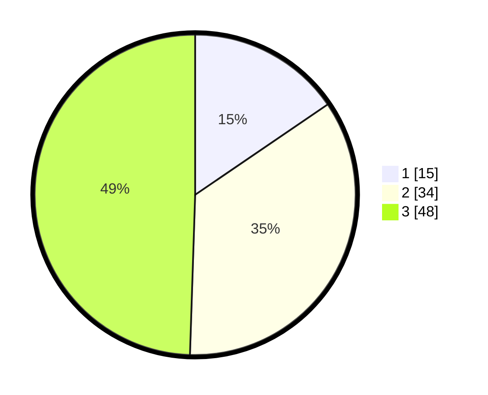

# Hasil

## Grafik

## Tabel

| No. | Nama Paslon    | Suara | Suara (raw) | Persentase |
|:--- |:-------------- | -----:| -----------:| ----------:|
| 1   | ANIES MUHAIMIN | 15    | [15][p-1]   | 15,46      |
| 2   | PRABOWO GIBRAN | 34    | [34][p-2]   | 35,05      |
| 3   | GANJAR MAHFUD  | 48    | [48][p-3]   | 49,48      |

[p-1]: https://github.com/gigit-pemilu/pemilu-2024/blob/main/pilpres/hitung-suara/sub/33-jawa-tengah/sub/04-banjarnegara/sub/12-punggelan/sub/2014-bondolharjo/sub/012-tps/sub/paslon-1.txt
[p-2]: https://github.com/gigit-pemilu/pemilu-2024/blob/main/pilpres/hitung-suara/sub/33-jawa-tengah/sub/04-banjarnegara/sub/12-punggelan/sub/2014-bondolharjo/sub/012-tps/sub/paslon-2.txt
[p-3]: https://github.com/gigit-pemilu/pemilu-2024/blob/main/pilpres/hitung-suara/sub/33-jawa-tengah/sub/04-banjarnegara/sub/12-punggelan/sub/2014-bondolharjo/sub/012-tps/sub/paslon-3.txt

## Foto C Plano

https://sirekap-obj-formc.kpu.go.id/c632/pemilu/ppwp/33/04/12/20/14/3304122014012-20240215-022329--bd1dbeff-ae76-4122-8fc8-fcec75284de9.jpg

https://sirekap-obj-formc.kpu.go.id/c632/pemilu/ppwp/33/04/12/20/14/3304122014012-20240214-141625--96d31af8-eae2-4c56-84ac-97df1b4d4026.jpg

https://sirekap-obj-formc.kpu.go.id/c632/pemilu/ppwp/33/04/12/20/14/3304122014012-20240214-141502--f122a1f2-bbad-4cd7-a481-fa6c93a16711.jpg

## Metadata

| Key        | Value               |
| ---------- | ------------------- |
| Time Stamp | 2024-02-15 22:40:13 |

