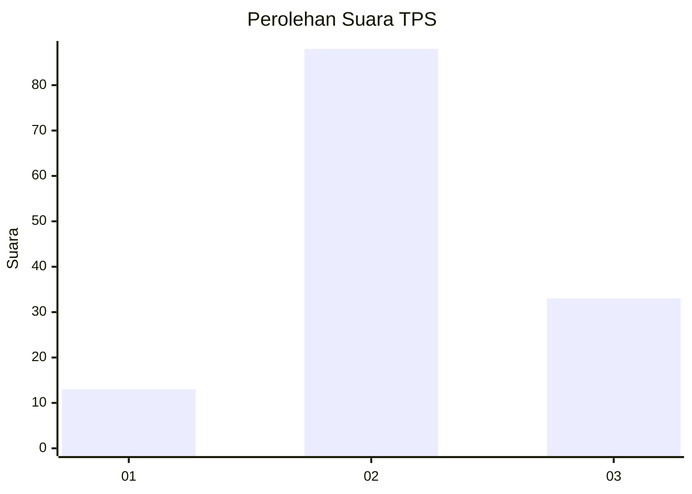
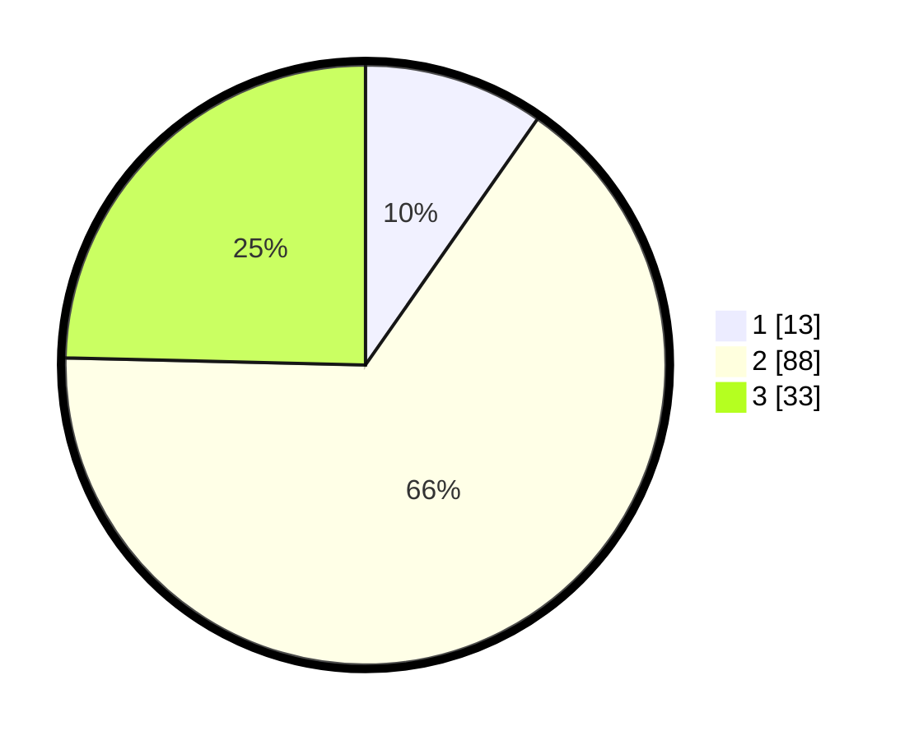

# Hasil

## Grafik

## Tabel

| No. | Nama Paslon    | Suara | Suara (raw) | Persentase |
|:--- |:-------------- | -----:| -----------:| ----------:|
| 1   | ANIES MUHAIMIN | 13    | [13][p-1]   | 9,70       |
| 2   | PRABOWO GIBRAN | 88    | [88][p-2]   | 65,67      |
| 3   | GANJAR MAHFUD  | 33    | [33][p-3]   | 24,63      |

[p-1]: https://github.com/gigit-pemilu/pemilu-2024-33-jawa-tengah/blob/main/pilpres/hitung-suara/sub/33-jawa-tengah/sub/04-banjarnegara/sub/13-karangkobar/sub/2007-pasuruhan/sub/004-tps/sub/paslon-1.txt
[p-2]: https://github.com/gigit-pemilu/pemilu-2024-33-jawa-tengah/blob/main/pilpres/hitung-suara/sub/33-jawa-tengah/sub/04-banjarnegara/sub/13-karangkobar/sub/2007-pasuruhan/sub/004-tps/sub/paslon-2.txt
[p-3]: https://github.com/gigit-pemilu/pemilu-2024-33-jawa-tengah/blob/main/pilpres/hitung-suara/sub/33-jawa-tengah/sub/04-banjarnegara/sub/13-karangkobar/sub/2007-pasuruhan/sub/004-tps/sub/paslon-3.txt

## Foto C Plano

https://sirekap-obj-formc.kpu.go.id/b368/pemilu/ppwp/33/04/13/20/07/3304132007004-20240215-054453--c913e5e0-8c34-4f1a-8bc0-6c2f3b6c6e26.jpg

https://sirekap-obj-formc.kpu.go.id/b368/pemilu/ppwp/33/04/13/20/07/3304132007004-20240214-234735--49967042-135a-4823-9c81-2d2cf912da81.jpg

https://sirekap-obj-formc.kpu.go.id/b368/pemilu/ppwp/33/04/13/20/07/3304132007004-20240215-054715--1fe84a87-c68a-489a-b29f-568f2d7fde04.jpg

## Metadata

| Key        | Value               |
| ---------- | ------------------- |
| Time Stamp | 2024-02-15 23:29:50 |

