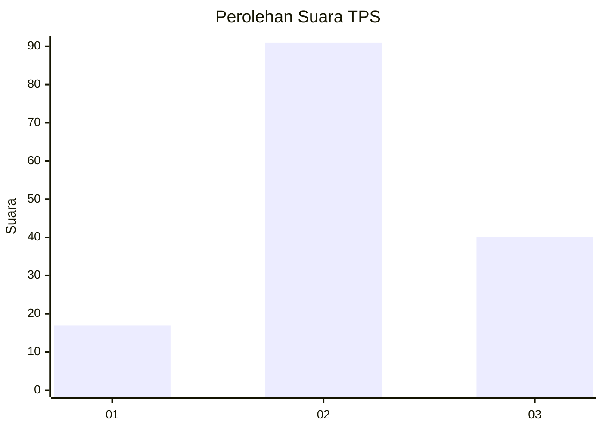
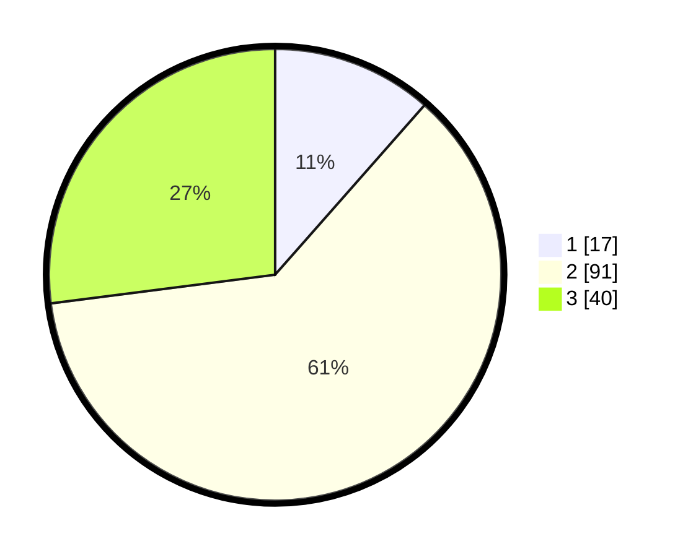

# Hasil

## Grafik

## Tabel

| No. | Nama Paslon    | Suara | Suara (raw) | Persentase |
|:--- |:-------------- | -----:| -----------:| ----------:|
| 1   | ANIES MUHAIMIN | 17    | [17][p-1]   | 11,49      |
| 2   | PRABOWO GIBRAN | 91    | [91][p-2]   | 61,49      |
| 3   | GANJAR MAHFUD  | 40    | [40][p-3]   | 27,03      |

[p-1]: https://github.com/gigit-pemilu/pemilu-2024/blob/main/pilpres/hitung-suara/sub/33-jawa-tengah/sub/04-banjarnegara/sub/13-karangkobar/sub/2007-pasuruhan/sub/005-tps/sub/paslon-1.txt
[p-2]: https://github.com/gigit-pemilu/pemilu-2024/blob/main/pilpres/hitung-suara/sub/33-jawa-tengah/sub/04-banjarnegara/sub/13-karangkobar/sub/2007-pasuruhan/sub/005-tps/sub/paslon-2.txt
[p-3]: https://github.com/gigit-pemilu/pemilu-2024/blob/main/pilpres/hitung-suara/sub/33-jawa-tengah/sub/04-banjarnegara/sub/13-karangkobar/sub/2007-pasuruhan/sub/005-tps/sub/paslon-3.txt

## Foto C Plano

https://sirekap-obj-formc.kpu.go.id/8fc4/pemilu/ppwp/33/04/13/20/07/3304132007005-20240215-044534--9dfce1b0-cb95-47d4-8837-78a9bfb9d30e.jpg

https://sirekap-obj-formc.kpu.go.id/8fc4/pemilu/ppwp/33/04/13/20/07/3304132007005-20240214-235508--ebfa6ced-a2ab-44ea-9d25-981afcc252f2.jpg

https://sirekap-obj-formc.kpu.go.id/8fc4/pemilu/ppwp/33/04/13/20/07/3304132007005-20240214-235526--02dcae0c-20bd-4079-b9e8-9af2a1a93b86.jpg

## Metadata

| Key        | Value               |
| ---------- | ------------------- |
| Time Stamp | 2024-02-15 23:29:50 |

