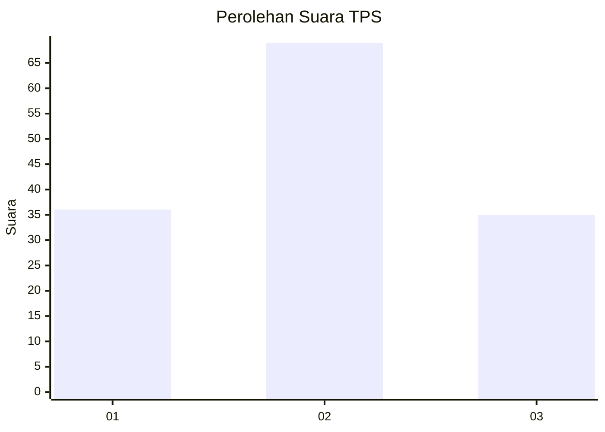
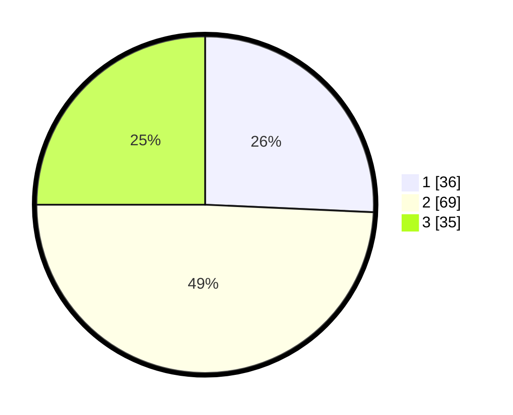

# Hasil

## Grafik

## Tabel

| No. | Nama Paslon    | Suara | Suara (raw) | Persentase |
|:--- |:-------------- | -----:| -----------:| ----------:|
| 1   | ANIES MUHAIMIN | 36    | [36][p-1]   | 25,71      |
| 2   | PRABOWO GIBRAN | 69    | [69][p-2]   | 49,29      |
| 3   | GANJAR MAHFUD  | 35    | [35][p-3]   | 25,00      |

[p-1]: https://github.com/gigit-pemilu/pemilu-2024/blob/main/pilpres/hitung-suara/sub/33-jawa-tengah/sub/04-banjarnegara/sub/13-karangkobar/sub/2010-ambal/sub/010-tps/sub/paslon-1.txt
[p-2]: https://github.com/gigit-pemilu/pemilu-2024/blob/main/pilpres/hitung-suara/sub/33-jawa-tengah/sub/04-banjarnegara/sub/13-karangkobar/sub/2010-ambal/sub/010-tps/sub/paslon-2.txt
[p-3]: https://github.com/gigit-pemilu/pemilu-2024/blob/main/pilpres/hitung-suara/sub/33-jawa-tengah/sub/04-banjarnegara/sub/13-karangkobar/sub/2010-ambal/sub/010-tps/sub/paslon-3.txt

## Foto C Plano

https://sirekap-obj-formc.kpu.go.id/2d5d/pemilu/ppwp/33/04/13/20/10/3304132010010-20240214-141439--aed16c87-2a2b-4b36-9e85-d7dcdf474a0b.jpg

https://sirekap-obj-formc.kpu.go.id/2d5d/pemilu/ppwp/33/04/13/20/10/3304132010010-20240214-141858--1fbbc992-c69c-498d-b233-a2fcd2e2fb21.jpg

https://sirekap-obj-formc.kpu.go.id/2d5d/pemilu/ppwp/33/04/13/20/10/3304132010010-20240214-215917--3f2f0066-de97-43f0-8fa3-2a1538c3b015.jpg

## Metadata

| Key        | Value               |
| ---------- | ------------------- |
| Time Stamp | 2024-02-15 00:41:44 |

