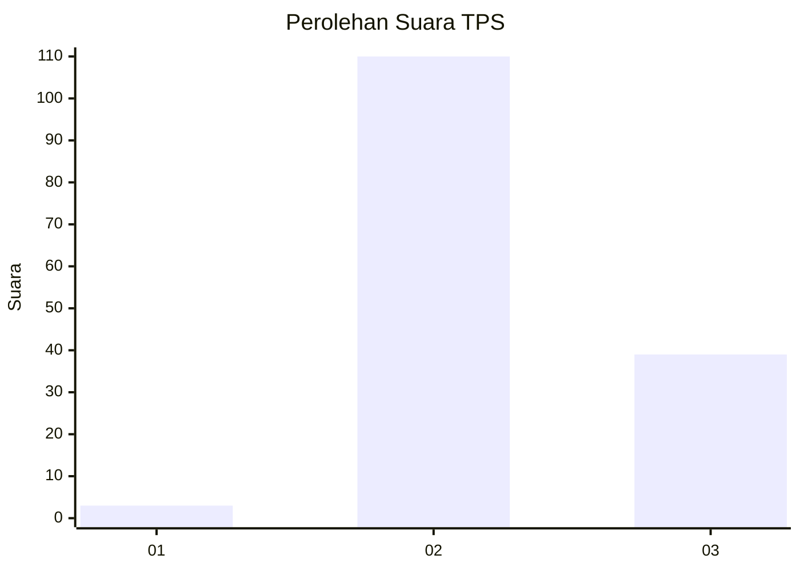
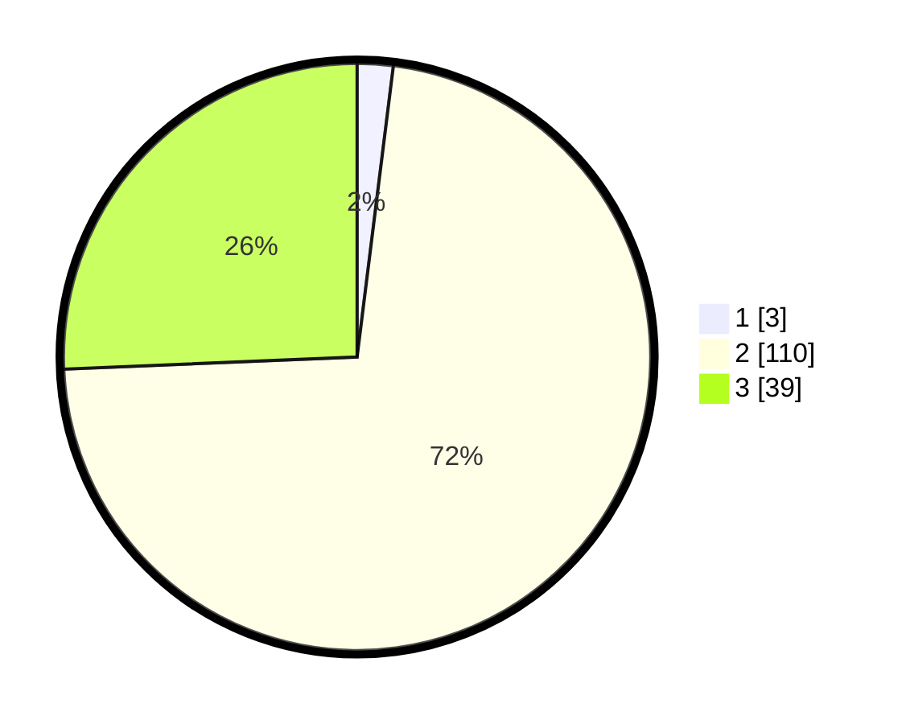

# Hasil

## Grafik

## Tabel

| No. | Nama Paslon    | Suara | Suara (raw) | Persentase |
|:--- |:-------------- | -----:| -----------:| ----------:|
| 1   | ANIES MUHAIMIN | 3     | [3][p-1]    | 1,97       |
| 2   | PRABOWO GIBRAN | 110   | [110][p-2]  | 72,37      |
| 3   | GANJAR MAHFUD  | 39    | [39][p-3]   | 25,66      |

[p-1]: https://github.com/gigit-pemilu/pemilu-2024-33-jawa-tengah/blob/main/pilpres/hitung-suara/sub/33-jawa-tengah/sub/04-banjarnegara/sub/13-karangkobar/sub/2011-binangun/sub/005-tps/sub/paslon-1.txt
[p-2]: https://github.com/gigit-pemilu/pemilu-2024-33-jawa-tengah/blob/main/pilpres/hitung-suara/sub/33-jawa-tengah/sub/04-banjarnegara/sub/13-karangkobar/sub/2011-binangun/sub/005-tps/sub/paslon-2.txt
[p-3]: https://github.com/gigit-pemilu/pemilu-2024-33-jawa-tengah/blob/main/pilpres/hitung-suara/sub/33-jawa-tengah/sub/04-banjarnegara/sub/13-karangkobar/sub/2011-binangun/sub/005-tps/sub/paslon-3.txt

## Foto C Plano

https://sirekap-obj-formc.kpu.go.id/040d/pemilu/ppwp/33/04/13/20/11/3304132011005-20240214-230151--39972aec-b314-415e-a4be-87c825265b86.jpg

https://sirekap-obj-formc.kpu.go.id/040d/pemilu/ppwp/33/04/13/20/11/3304132011005-20240214-230216--9570e1d4-02d2-4e22-9d74-ab399a3d228f.jpg

https://sirekap-obj-formc.kpu.go.id/040d/pemilu/ppwp/33/04/13/20/11/3304132011005-20240214-230446--c56f5a27-6822-4ac2-8ed7-a072de772f7b.jpg

## Metadata

| Key        | Value               |
| ---------- | ------------------- |
| Time Stamp | 2024-02-15 18:00:26 |

