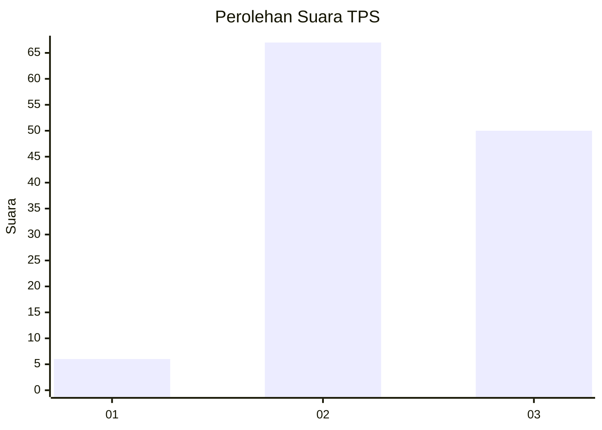
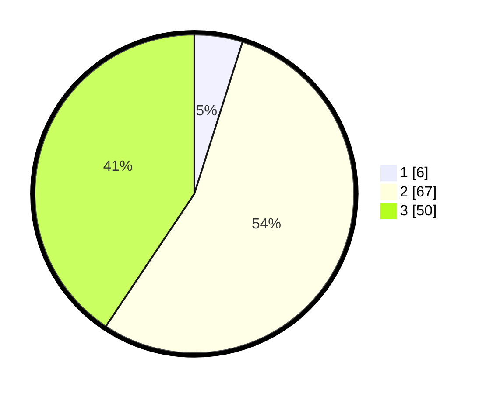

# Hasil

## Grafik

## Tabel

| No. | Nama Paslon    | Suara | Suara (raw) | Persentase |
|:--- |:-------------- | -----:| -----------:| ----------:|
| 1   | ANIES MUHAIMIN | 6     | [6][p-1]    | 4,88       |
| 2   | PRABOWO GIBRAN | 67    | [67][p-2]   | 54,47      |
| 3   | GANJAR MAHFUD  | 50    | [50][p-3]   | 40,65      |

[p-1]: https://github.com/gigit-pemilu/pemilu-2024/blob/main/pilpres/hitung-suara/sub/33-jawa-tengah/sub/04-banjarnegara/sub/14-pagentan/sub/2002-karangnangka/sub/007-tps/sub/paslon-1.txt
[p-2]: https://github.com/gigit-pemilu/pemilu-2024/blob/main/pilpres/hitung-suara/sub/33-jawa-tengah/sub/04-banjarnegara/sub/14-pagentan/sub/2002-karangnangka/sub/007-tps/sub/paslon-2.txt
[p-3]: https://github.com/gigit-pemilu/pemilu-2024/blob/main/pilpres/hitung-suara/sub/33-jawa-tengah/sub/04-banjarnegara/sub/14-pagentan/sub/2002-karangnangka/sub/007-tps/sub/paslon-3.txt

## Foto C Plano

https://sirekap-obj-formc.kpu.go.id/d1ee/pemilu/ppwp/33/04/14/20/02/3304142002007-20240215-031122--fd249289-b614-46d9-9c44-2ffab2924f6a.jpg

https://sirekap-obj-formc.kpu.go.id/d1ee/pemilu/ppwp/33/04/14/20/02/3304142002007-20240215-031220--cf25131d-7f6c-4cda-b342-af3bf24b7692.jpg

https://sirekap-obj-formc.kpu.go.id/d1ee/pemilu/ppwp/33/04/14/20/02/3304142002007-20240215-031432--c72eef18-3b4d-4830-bb7a-13dc906c8d45.jpg

## Metadata

| Key        | Value               |
| ---------- | ------------------- |
| Time Stamp | 2024-02-15 17:30:25 |

