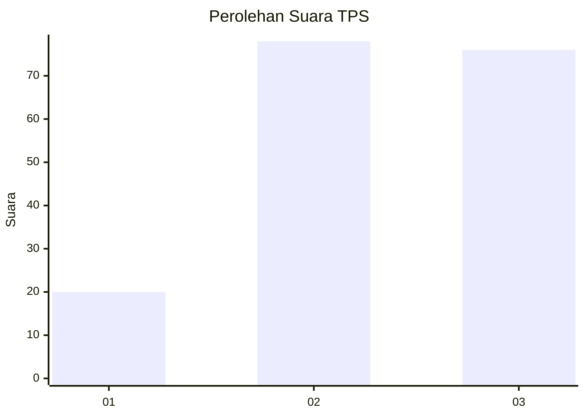
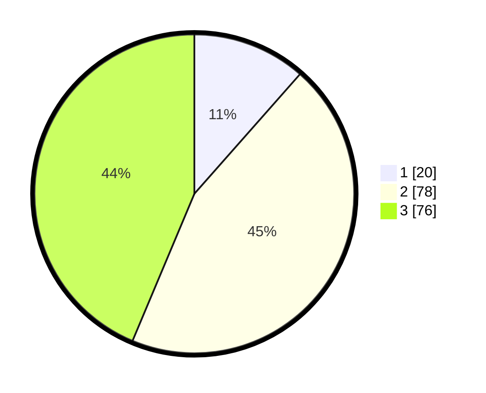

# Hasil

## Grafik

## Tabel

| No. | Nama Paslon    | Suara | Suara (raw) | Persentase |
|:--- |:-------------- | -----:| -----------:| ----------:|
| 1   | ANIES MUHAIMIN | 20    | [20][p-1]   | 11,49      |
| 2   | PRABOWO GIBRAN | 78    | [78][p-2]   | 44,83      |
| 3   | GANJAR MAHFUD  | 76    | [76][p-3]   | 43,68      |

[p-1]: https://github.com/gigit-pemilu/pemilu-2024-33-jawa-tengah/blob/main/pilpres/hitung-suara/sub/33-jawa-tengah/sub/04-banjarnegara/sub/14-pagentan/sub/2006-sokaraja/sub/006-tps/sub/paslon-1.txt
[p-2]: https://github.com/gigit-pemilu/pemilu-2024-33-jawa-tengah/blob/main/pilpres/hitung-suara/sub/33-jawa-tengah/sub/04-banjarnegara/sub/14-pagentan/sub/2006-sokaraja/sub/006-tps/sub/paslon-2.txt
[p-3]: https://github.com/gigit-pemilu/pemilu-2024-33-jawa-tengah/blob/main/pilpres/hitung-suara/sub/33-jawa-tengah/sub/04-banjarnegara/sub/14-pagentan/sub/2006-sokaraja/sub/006-tps/sub/paslon-3.txt

## Foto C Plano

https://sirekap-obj-formc.kpu.go.id/284c/pemilu/ppwp/33/04/14/20/06/3304142006006-20240214-225904--01f25c3e-c468-478f-8b8f-ebd650e0bd01.jpg

https://sirekap-obj-formc.kpu.go.id/284c/pemilu/ppwp/33/04/14/20/06/3304142006006-20240214-230016--9aa5e7b5-34d1-49c2-b846-249f09cf8de5.jpg

https://sirekap-obj-formc.kpu.go.id/284c/pemilu/ppwp/33/04/14/20/06/3304142006006-20240214-234355--98a1c13f-0b92-4c26-bdee-7d1b90a66f51.jpg

## Metadata

| Key        | Value               |
| ---------- | ------------------- |
| Time Stamp | 2024-02-15 12:00:28 |

