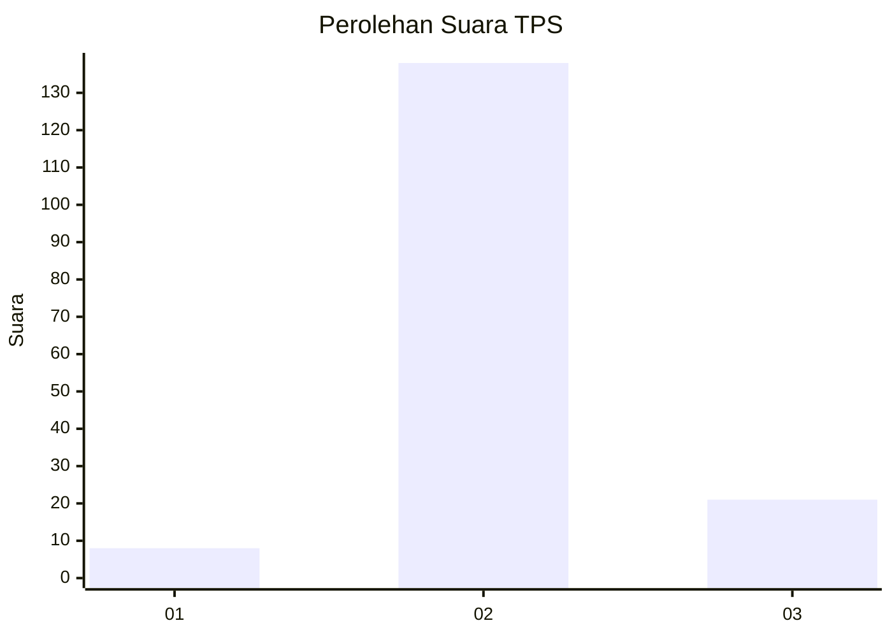
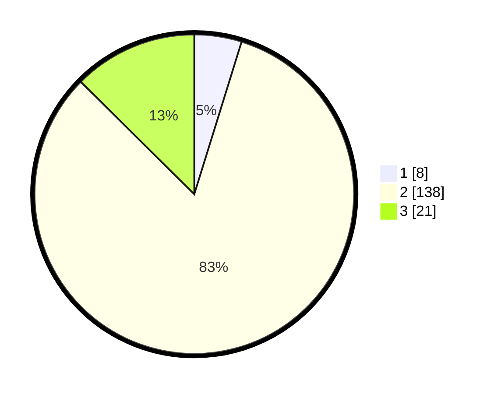

# Hasil

## Grafik

## Tabel

| No. | Nama Paslon    | Suara | Suara (raw) | Persentase |
|:--- |:-------------- | -----:| -----------:| ----------:|
| 1   | ANIES MUHAIMIN | 8     | [8][p-1]    | 4,79       |
| 2   | PRABOWO GIBRAN | 138   | [138][p-2]  | 82,63      |
| 3   | GANJAR MAHFUD  | 21    | [21][p-3]   | 12,57      |

[p-1]: https://github.com/gigit-pemilu/pemilu-2024/blob/main/pilpres/hitung-suara/sub/33-jawa-tengah/sub/04-banjarnegara/sub/14-pagentan/sub/2010-karekan/sub/002-tps/sub/paslon-1.txt
[p-2]: https://github.com/gigit-pemilu/pemilu-2024/blob/main/pilpres/hitung-suara/sub/33-jawa-tengah/sub/04-banjarnegara/sub/14-pagentan/sub/2010-karekan/sub/002-tps/sub/paslon-2.txt
[p-3]: https://github.com/gigit-pemilu/pemilu-2024/blob/main/pilpres/hitung-suara/sub/33-jawa-tengah/sub/04-banjarnegara/sub/14-pagentan/sub/2010-karekan/sub/002-tps/sub/paslon-3.txt

## Foto C Plano

https://sirekap-obj-formc.kpu.go.id/4013/pemilu/ppwp/33/04/14/20/10/3304142010002-20240214-230657--41c64bbd-bfb0-4324-bda7-95c16ede38ab.jpg

https://sirekap-obj-formc.kpu.go.id/4013/pemilu/ppwp/33/04/14/20/10/3304142010002-20240215-114138--f807b311-d844-4e23-88b2-a9eb77733011.jpg

https://sirekap-obj-formc.kpu.go.id/4013/pemilu/ppwp/33/04/14/20/10/3304142010002-20240214-230736--10b7a4f5-e7db-4626-b05c-9587efa185a4.jpg

## Metadata

| Key        | Value               |
| ---------- | ------------------- |
| Time Stamp | 2024-02-15 12:00:28 |

