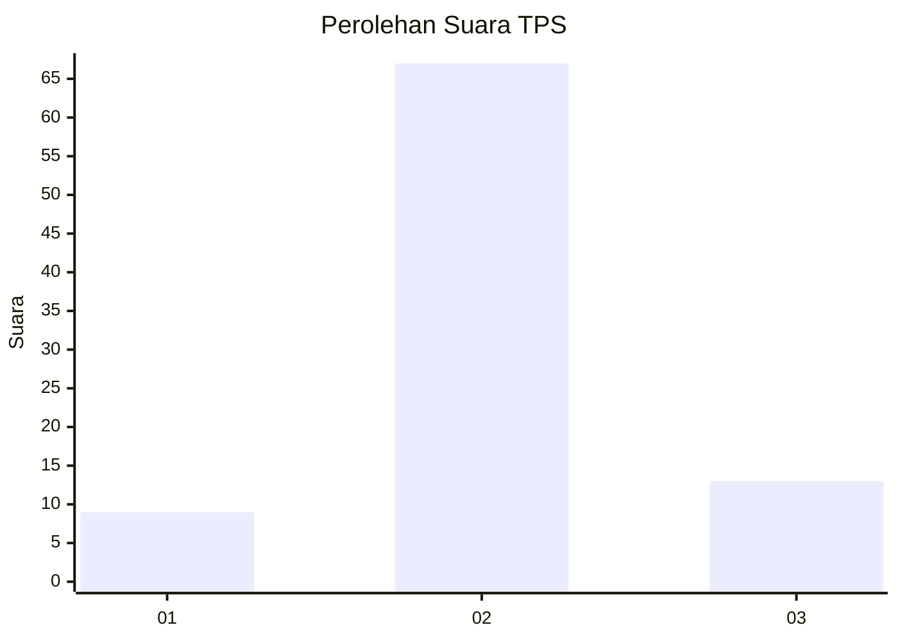
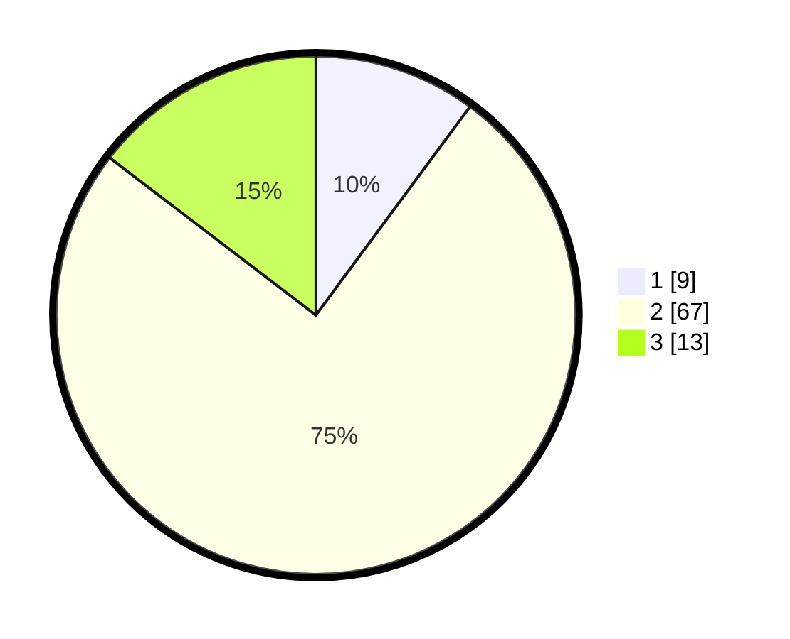

# Hasil

## Grafik

## Tabel

| No. | Nama Paslon    | Suara | Suara (raw) | Persentase |
|:--- |:-------------- | -----:| -----------:| ----------:|
| 1   | ANIES MUHAIMIN | 9     | [9][p-1]    | 10,11      |
| 2   | PRABOWO GIBRAN | 67    | [67][p-2]   | 75,28      |
| 3   | GANJAR MAHFUD  | 13    | [13][p-3]   | 14,61      |

[p-1]: https://github.com/gigit-pemilu/pemilu-2024/blob/main/pilpres/hitung-suara/sub/33-jawa-tengah/sub/04-banjarnegara/sub/14-pagentan/sub/2011-plumbungan/sub/007-tps/sub/paslon-1.txt
[p-2]: https://github.com/gigit-pemilu/pemilu-2024/blob/main/pilpres/hitung-suara/sub/33-jawa-tengah/sub/04-banjarnegara/sub/14-pagentan/sub/2011-plumbungan/sub/007-tps/sub/paslon-2.txt
[p-3]: https://github.com/gigit-pemilu/pemilu-2024/blob/main/pilpres/hitung-suara/sub/33-jawa-tengah/sub/04-banjarnegara/sub/14-pagentan/sub/2011-plumbungan/sub/007-tps/sub/paslon-3.txt

## Foto C Plano

https://sirekap-obj-formc.kpu.go.id/556d/pemilu/ppwp/33/04/14/20/11/3304142011007-20240215-022231--c0ed653f-9458-48e2-b896-e86bc18ed0fd.jpg

https://sirekap-obj-formc.kpu.go.id/556d/pemilu/ppwp/33/04/14/20/11/3304142011007-20240215-022520--a9242375-44d9-4acf-b278-d9122e842c7b.jpg

https://sirekap-obj-formc.kpu.go.id/556d/pemilu/ppwp/33/04/14/20/11/3304142011007-20240215-022558--cb303d0c-6c7c-4338-8def-6cab4394457e.jpg

## Metadata

| Key        | Value               |
| ---------- | ------------------- |
| Time Stamp | 2024-02-15 16:30:25 |

