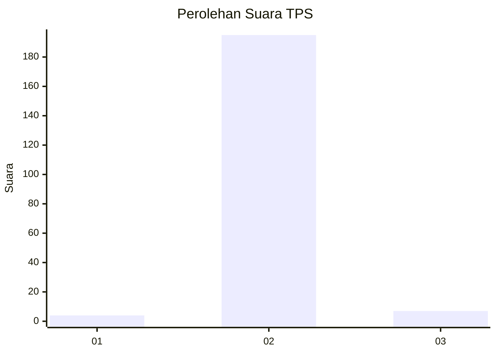
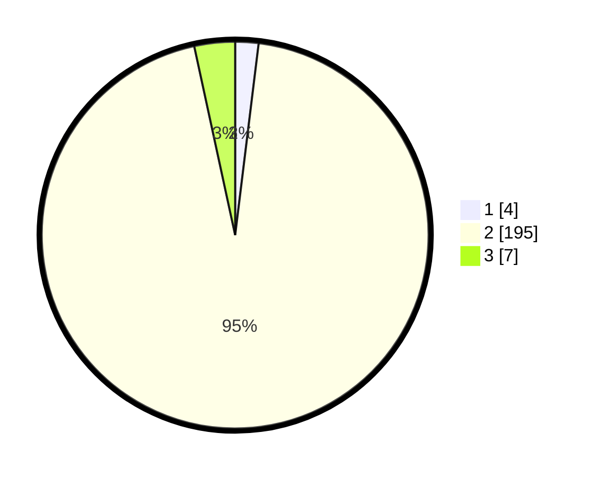

# Hasil

## Grafik

## Tabel

| No. | Nama Paslon    | Suara | Suara (raw) | Persentase |
|:--- |:-------------- | -----:| -----------:| ----------:|
| 1   | ANIES MUHAIMIN | 4     | [4][p-1]    | 1,94       |
| 2   | PRABOWO GIBRAN | 195   | [195][p-2]  | 94,66      |
| 3   | GANJAR MAHFUD  | 7     | [7][p-3]    | 3,40       |

[p-1]: https://github.com/gigit-pemilu/pemilu-2024/blob/main/pilpres/hitung-suara/sub/33-jawa-tengah/sub/04-banjarnegara/sub/14-pagentan/sub/2015-babadan/sub/001-tps/sub/paslon-1.txt
[p-2]: https://github.com/gigit-pemilu/pemilu-2024/blob/main/pilpres/hitung-suara/sub/33-jawa-tengah/sub/04-banjarnegara/sub/14-pagentan/sub/2015-babadan/sub/001-tps/sub/paslon-2.txt
[p-3]: https://github.com/gigit-pemilu/pemilu-2024/blob/main/pilpres/hitung-suara/sub/33-jawa-tengah/sub/04-banjarnegara/sub/14-pagentan/sub/2015-babadan/sub/001-tps/sub/paslon-3.txt

## Foto C Plano

https://sirekap-obj-formc.kpu.go.id/7fae/pemilu/ppwp/33/04/14/20/15/3304142015001-20240215-024101--90e005aa-fa30-44c8-86ce-4ccc78cf0b41.jpg

https://sirekap-obj-formc.kpu.go.id/7fae/pemilu/ppwp/33/04/14/20/15/3304142015001-20240215-024328--150be2b6-3486-48f8-ac8e-5ba23aa4bccb.jpg

https://sirekap-obj-formc.kpu.go.id/7fae/pemilu/ppwp/33/04/14/20/15/3304142015001-20240215-024628--ae6a5c18-9996-42ad-afb9-80750d91ed27.jpg

## Metadata

| Key        | Value               |
| ---------- | ------------------- |
| Time Stamp | 2024-02-15 12:00:28 |

