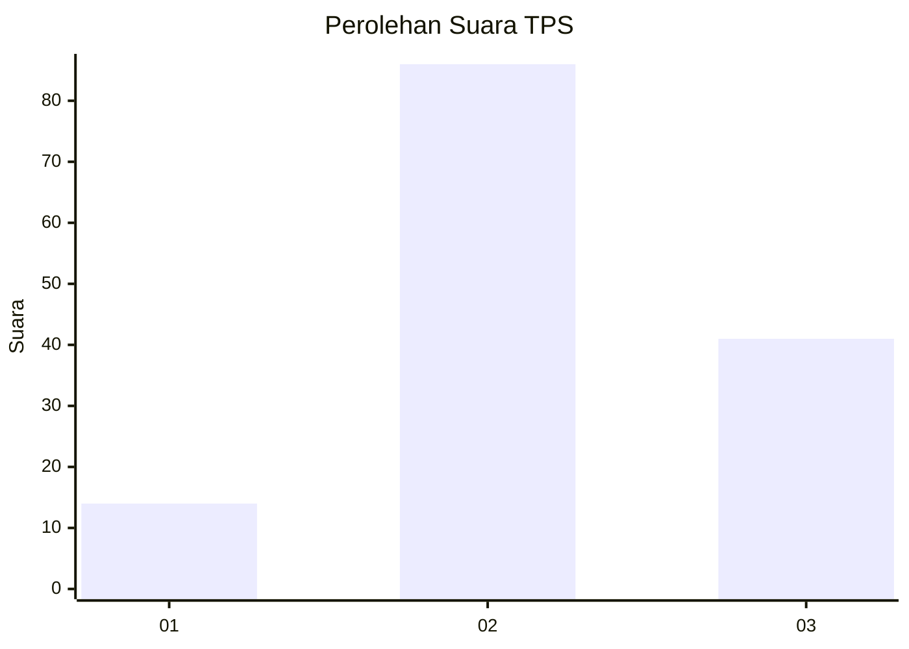
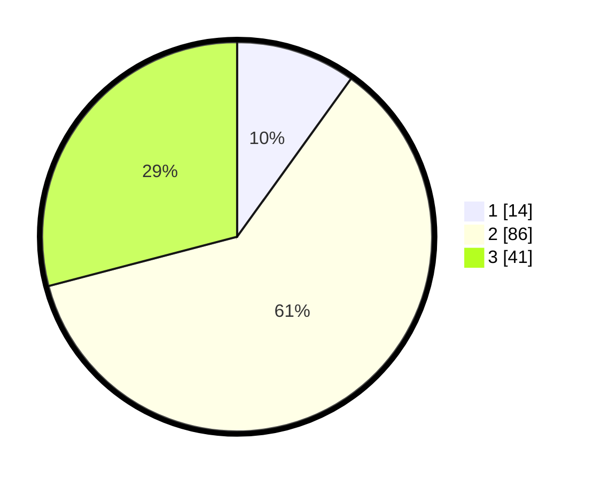

# Hasil

## Grafik

## Tabel

| No. | Nama Paslon    | Suara | Suara (raw) | Persentase |
|:--- |:-------------- | -----:| -----------:| ----------:|
| 1   | ANIES MUHAIMIN | 14    | [14][p-1]   | 9,93       |
| 2   | PRABOWO GIBRAN | 86    | [86][p-2]   | 60,99      |
| 3   | GANJAR MAHFUD  | 41    | [41][p-3]   | 29,08      |

[p-1]: https://github.com/gigit-pemilu/pemilu-2024-33-jawa-tengah/blob/main/pilpres/hitung-suara/sub/33-jawa-tengah/sub/04-banjarnegara/sub/15-pejawaran/sub/2001-kalilunjar/sub/004-tps/sub/paslon-1.txt
[p-2]: https://github.com/gigit-pemilu/pemilu-2024-33-jawa-tengah/blob/main/pilpres/hitung-suara/sub/33-jawa-tengah/sub/04-banjarnegara/sub/15-pejawaran/sub/2001-kalilunjar/sub/004-tps/sub/paslon-2.txt
[p-3]: https://github.com/gigit-pemilu/pemilu-2024-33-jawa-tengah/blob/main/pilpres/hitung-suara/sub/33-jawa-tengah/sub/04-banjarnegara/sub/15-pejawaran/sub/2001-kalilunjar/sub/004-tps/sub/paslon-3.txt

## Foto C Plano

https://sirekap-obj-formc.kpu.go.id/23b5/pemilu/ppwp/33/04/15/20/01/3304152001004-20240221-100415--ca61875d-1d0e-48c9-9a1b-404103478826.jpg

https://sirekap-obj-formc.kpu.go.id/23b5/pemilu/ppwp/33/04/15/20/01/3304152001004-20240221-100416--ded04fb6-1def-4245-a766-1e412b1cea4e.jpg

https://sirekap-obj-formc.kpu.go.id/23b5/pemilu/ppwp/33/04/15/20/01/3304152001004-20240221-100415--921955ad-4c42-4d4e-bf4a-1a0cca4e0a0a.jpg

## Metadata

| Key        | Value               |
| ---------- | ------------------- |
| Time Stamp | 2024-02-24 22:31:28 |

## DATA PEMILIH TETAP

Jumlah pemilih dalam DPT: **216**.
 * L: **112**.
 * P: **104**.

## DATA PENGGUNA HAK PILIH

Jumlah pengguna hak pilih dalam DPT: **216**.
 * L: **77**.
 * P: **88**.

Jumlah pengguna hak pilih dalam DPTb: **166**.
 * L: **77**.
 * P: **88**.

Jumlah pengguna hak pilih dalam DPK: **0**.
 * L: **0**.
 * P: **0**.

Jumlah pengguna hak pilih: **165**.
 * L: **77**.
 * P: **88**.

## JUMLAH SUARA SAH DAN TIDAK SAH

JUMLAH SELURUH SUARA SAH: **141**.

JUMLAH SUARA TIDAK SAH: **24**.

JUMLAH SELURUH SUARA SAH DAN SUARA TIDAK SAH: **165**.

