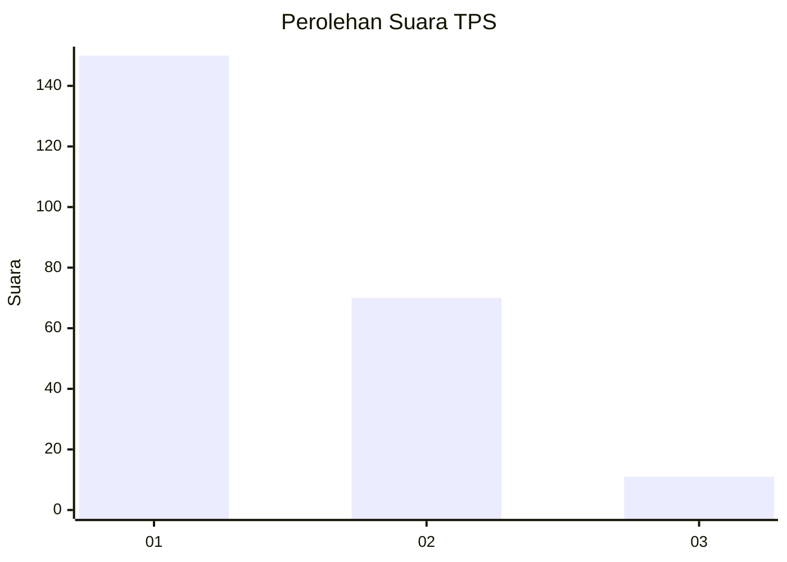
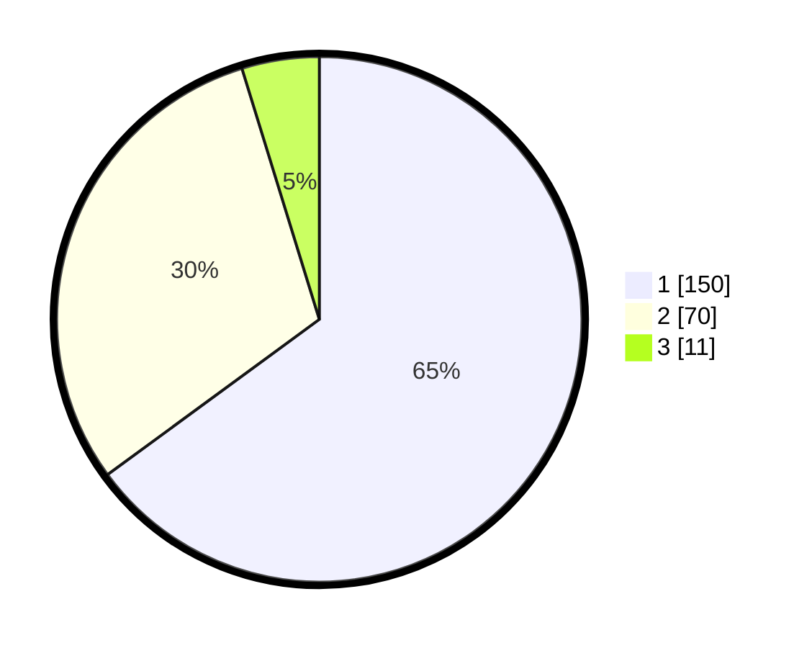

# Hasil

## Grafik

## Tabel

| No. | Nama Paslon    | Suara | Suara (raw) | Persentase |
|:--- |:-------------- | -----:| -----------:| ----------:|
| 1   | ANIES MUHAIMIN | 150   | [150][p-1]  | 64,94      |
| 2   | PRABOWO GIBRAN | 70    | [70][p-2]   | 30,30      |
| 3   | GANJAR MAHFUD  | 11    | [11][p-3]   | 4,76       |

[p-1]: https://github.com/gigit-pemilu/pemilu-2024/blob/main/pilpres/hitung-suara/sub/33-jawa-tengah/sub/04-banjarnegara/sub/16-batur/sub/2001-batur/sub/011-tps/sub/paslon-1.txt
[p-2]: https://github.com/gigit-pemilu/pemilu-2024/blob/main/pilpres/hitung-suara/sub/33-jawa-tengah/sub/04-banjarnegara/sub/16-batur/sub/2001-batur/sub/011-tps/sub/paslon-2.txt
[p-3]: https://github.com/gigit-pemilu/pemilu-2024/blob/main/pilpres/hitung-suara/sub/33-jawa-tengah/sub/04-banjarnegara/sub/16-batur/sub/2001-batur/sub/011-tps/sub/paslon-3.txt

## Foto C Plano

https://sirekap-obj-formc.kpu.go.id/e0c2/pemilu/ppwp/33/04/16/20/01/3304162001011-20240214-213307--f750e8af-30d3-4bde-ad70-c24801e111e3.jpg

https://sirekap-obj-formc.kpu.go.id/e0c2/pemilu/ppwp/33/04/16/20/01/3304162001011-20240214-215001--36982ce9-5324-483c-8102-40dc27404603.jpg

https://sirekap-obj-formc.kpu.go.id/e0c2/pemilu/ppwp/33/04/16/20/01/3304162001011-20240214-212814--3a3affd3-968b-40d8-a4ba-831c3c136cbc.jpg

## Metadata

| Key        | Value               |
| ---------- | ------------------- |
| Time Stamp | 2024-02-15 21:30:27 |

