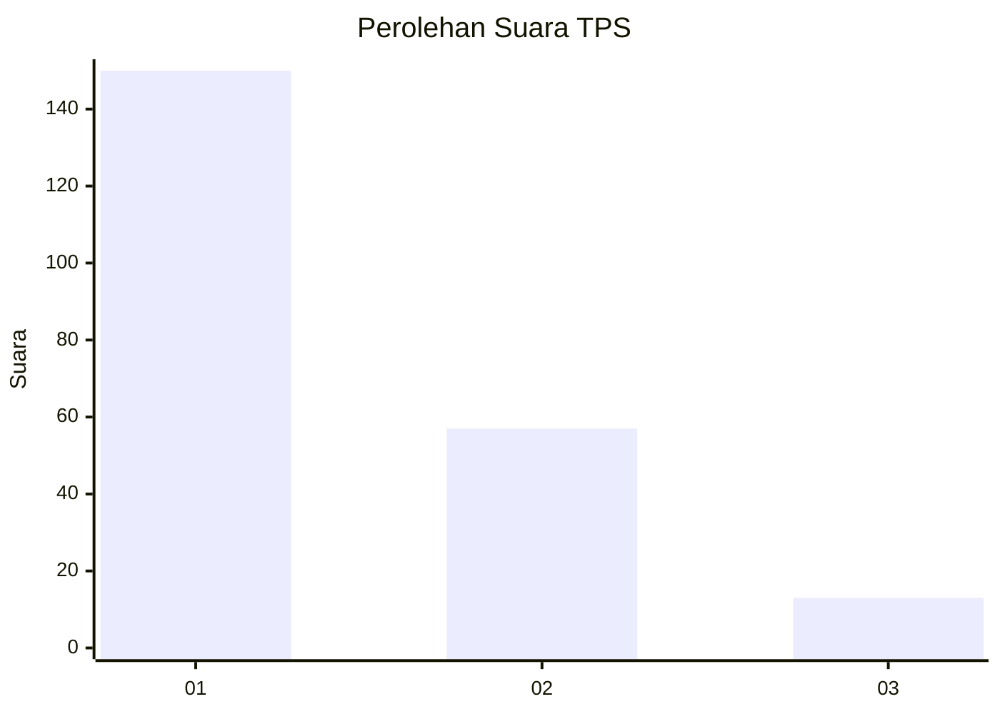
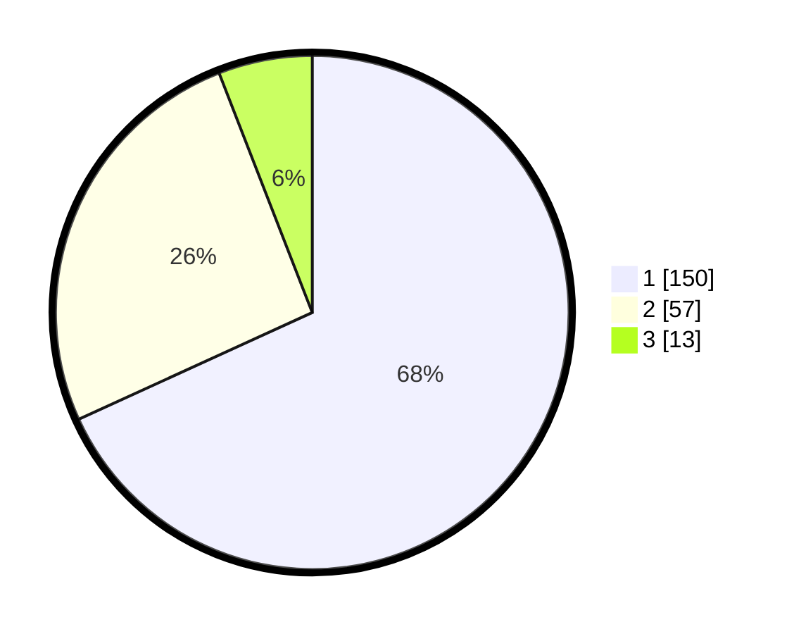

# Hasil

## Grafik

## Tabel

| No. | Nama Paslon    | Suara | Suara (raw) | Persentase |
|:--- |:-------------- | -----:| -----------:| ----------:|
| 1   | ANIES MUHAIMIN | 150   | [150][p-1]  | 68,18      |
| 2   | PRABOWO GIBRAN | 57    | [57][p-2]   | 25,91      |
| 3   | GANJAR MAHFUD  | 13    | [13][p-3]   | 5,91       |

[p-1]: https://github.com/gigit-pemilu/pemilu-2024/blob/main/pilpres/hitung-suara/sub/33-jawa-tengah/sub/04-banjarnegara/sub/16-batur/sub/2001-batur/sub/013-tps/sub/paslon-1.txt
[p-2]: https://github.com/gigit-pemilu/pemilu-2024/blob/main/pilpres/hitung-suara/sub/33-jawa-tengah/sub/04-banjarnegara/sub/16-batur/sub/2001-batur/sub/013-tps/sub/paslon-2.txt
[p-3]: https://github.com/gigit-pemilu/pemilu-2024/blob/main/pilpres/hitung-suara/sub/33-jawa-tengah/sub/04-banjarnegara/sub/16-batur/sub/2001-batur/sub/013-tps/sub/paslon-3.txt

## Foto C Plano

https://sirekap-obj-formc.kpu.go.id/663c/pemilu/ppwp/33/04/16/20/01/3304162001013-20240214-215606--0615f429-aa04-42f7-98fb-c067f7c1c77d.jpg

https://sirekap-obj-formc.kpu.go.id/663c/pemilu/ppwp/33/04/16/20/01/3304162001013-20240214-205834--ce24f65a-9d6d-46e3-8413-59f3d677f9d7.jpg

https://sirekap-obj-formc.kpu.go.id/663c/pemilu/ppwp/33/04/16/20/01/3304162001013-20240214-210012--32750a16-1f83-4c33-aba1-63835b975b4c.jpg

## Metadata

| Key        | Value               |
| ---------- | ------------------- |
| Time Stamp | 2024-02-15 03:06:03 |

