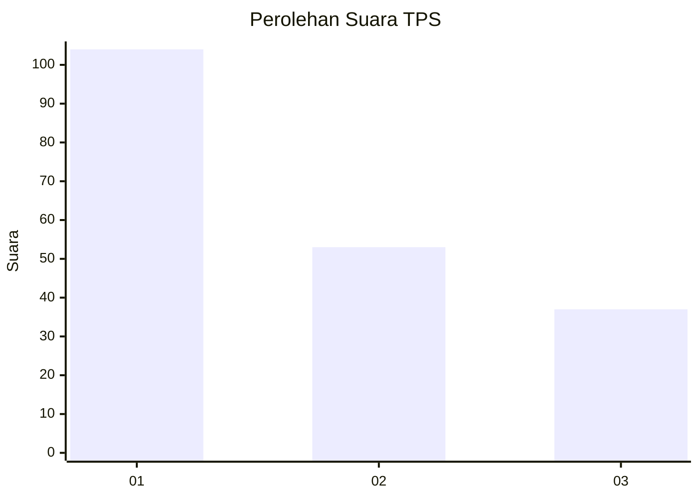
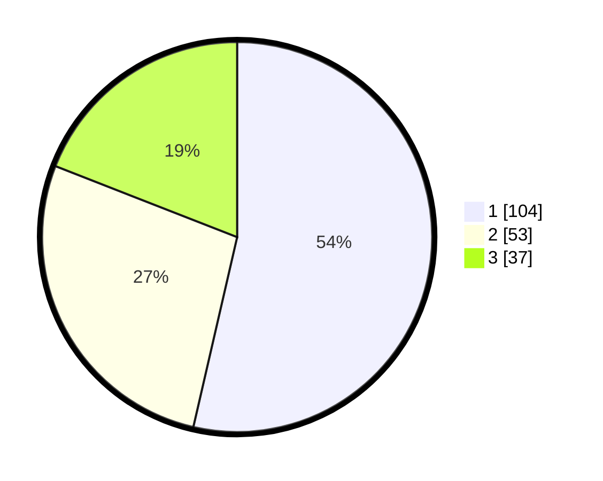

# Hasil

## Grafik

## Tabel

| No. | Nama Paslon    | Suara | Suara (raw) | Persentase |
|:--- |:-------------- | -----:| -----------:| ----------:|
| 1   | ANIES MUHAIMIN | 104   | [104][p-1]  | 53,61      |
| 2   | PRABOWO GIBRAN | 53    | [53][p-2]   | 27,32      |
| 3   | GANJAR MAHFUD  | 37    | [37][p-3]   | 19,07      |

[p-1]: https://github.com/gigit-pemilu/pemilu-2024-33-jawa-tengah/blob/main/pilpres/hitung-suara/sub/33-jawa-tengah/sub/04-banjarnegara/sub/16-batur/sub/2003-pasurenan/sub/002-tps/sub/paslon-1.txt
[p-2]: https://github.com/gigit-pemilu/pemilu-2024-33-jawa-tengah/blob/main/pilpres/hitung-suara/sub/33-jawa-tengah/sub/04-banjarnegara/sub/16-batur/sub/2003-pasurenan/sub/002-tps/sub/paslon-2.txt
[p-3]: https://github.com/gigit-pemilu/pemilu-2024-33-jawa-tengah/blob/main/pilpres/hitung-suara/sub/33-jawa-tengah/sub/04-banjarnegara/sub/16-batur/sub/2003-pasurenan/sub/002-tps/sub/paslon-3.txt

## Foto C Plano

https://sirekap-obj-formc.kpu.go.id/acde/pemilu/ppwp/33/04/16/20/03/3304162003002-20240214-184816--bbbe64f0-5b0e-4449-94f3-8adeacd0403c.jpg

https://sirekap-obj-formc.kpu.go.id/acde/pemilu/ppwp/33/04/16/20/03/3304162003002-20240215-013947--ca0b12b5-e59f-441a-964e-6b76a5d0c914.jpg

https://sirekap-obj-formc.kpu.go.id/acde/pemilu/ppwp/33/04/16/20/03/3304162003002-20240215-014055--89d71911-8353-4d9f-bb0e-877bda911ecc.jpg

## Metadata

| Key        | Value               |
| ---------- | ------------------- |
| Time Stamp | 2024-02-15 05:00:24 |

