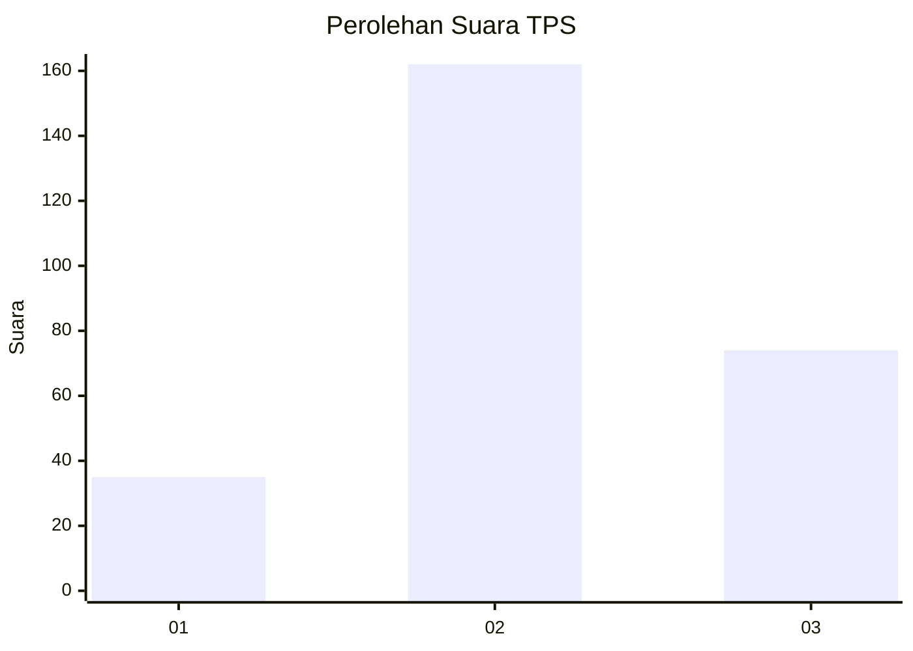
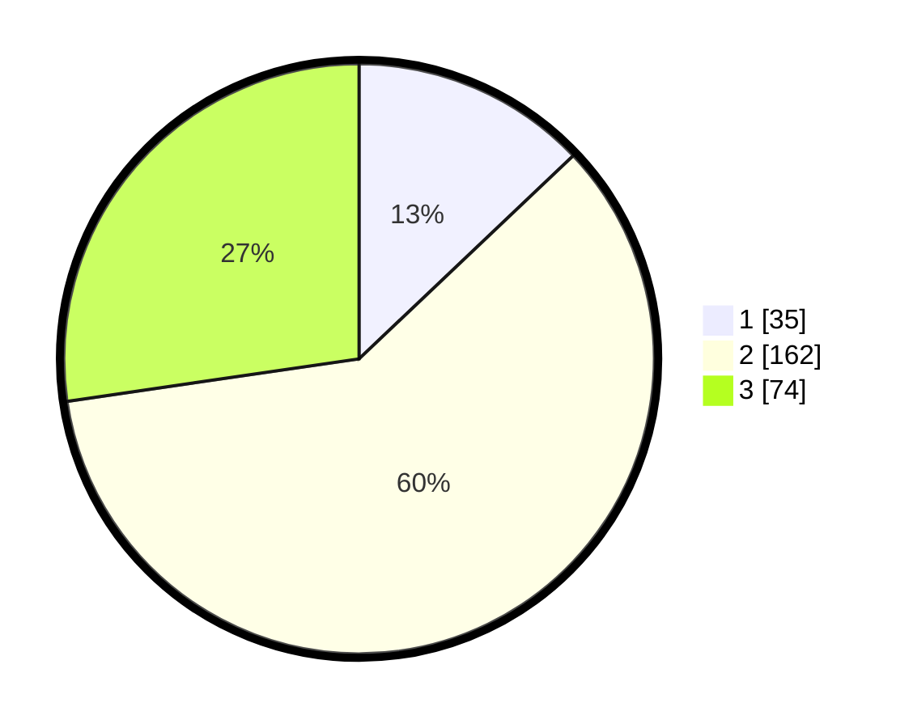

# Hasil

## Grafik

## Tabel

| No. | Nama Paslon    | Suara | Suara (raw) | Persentase |
|:--- |:-------------- | -----:| -----------:| ----------:|
| 1   | ANIES MUHAIMIN | 35    | [35][p-1]   | 12,92      |
| 2   | PRABOWO GIBRAN | 162   | [162][p-2]  | 59,78      |
| 3   | GANJAR MAHFUD  | 74    | [74][p-3]   | 27,31      |

[p-1]: https://github.com/gigit-pemilu/pemilu-2024/blob/main/pilpres/hitung-suara/sub/33-jawa-tengah/sub/04-banjarnegara/sub/16-batur/sub/2007-karangtengah/sub/010-tps/sub/paslon-1.txt
[p-2]: https://github.com/gigit-pemilu/pemilu-2024/blob/main/pilpres/hitung-suara/sub/33-jawa-tengah/sub/04-banjarnegara/sub/16-batur/sub/2007-karangtengah/sub/010-tps/sub/paslon-2.txt
[p-3]: https://github.com/gigit-pemilu/pemilu-2024/blob/main/pilpres/hitung-suara/sub/33-jawa-tengah/sub/04-banjarnegara/sub/16-batur/sub/2007-karangtengah/sub/010-tps/sub/paslon-3.txt

## Foto C Plano

https://sirekap-obj-formc.kpu.go.id/8ad1/pemilu/ppwp/33/04/16/20/07/3304162007010-20240214-202109--49b65fce-6b3c-47ec-b79d-12ce09fbe983.jpg

https://sirekap-obj-formc.kpu.go.id/8ad1/pemilu/ppwp/33/04/16/20/07/3304162007010-20240214-202121--f8a8f28e-c3b7-4644-935b-ff2243b23f07.jpg

https://sirekap-obj-formc.kpu.go.id/8ad1/pemilu/ppwp/33/04/16/20/07/3304162007010-20240214-202140--1922e9a2-4d31-4bb5-8cd5-fbaeec5d07d2.jpg

## Metadata

| Key        | Value               |
| ---------- | ------------------- |
| Time Stamp | 2024-02-15 09:00:24 |

