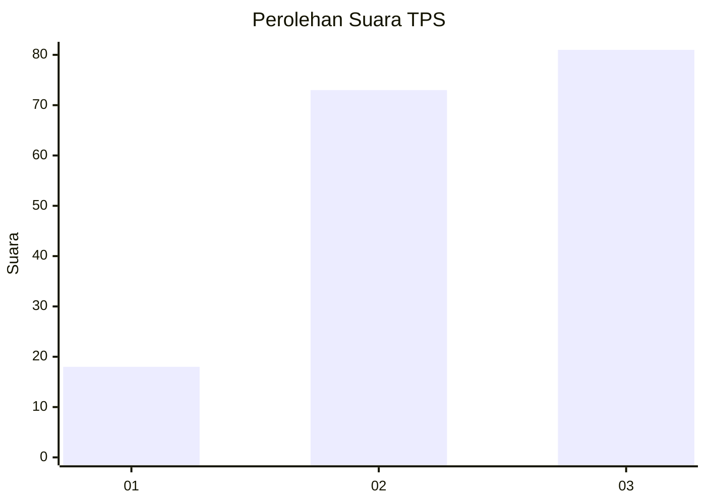
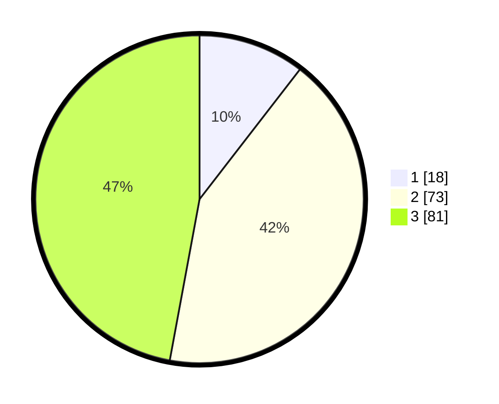

# Hasil

## Grafik

## Tabel

| No. | Nama Paslon    | Suara | Suara (raw) | Persentase |
|:--- |:-------------- | -----:| -----------:| ----------:|
| 1   | ANIES MUHAIMIN | 18    | [18][p-1]   | 10,47      |
| 2   | PRABOWO GIBRAN | 73    | [73][p-2]   | 42,44      |
| 3   | GANJAR MAHFUD  | 81    | [81][p-3]   | 47,09      |

[p-1]: https://github.com/gigit-pemilu/pemilu-2024/blob/main/pilpres/hitung-suara/sub/33-jawa-tengah/sub/04-banjarnegara/sub/16-batur/sub/2008-dieng-kulon/sub/002-tps/sub/paslon-1.txt
[p-2]: https://github.com/gigit-pemilu/pemilu-2024/blob/main/pilpres/hitung-suara/sub/33-jawa-tengah/sub/04-banjarnegara/sub/16-batur/sub/2008-dieng-kulon/sub/002-tps/sub/paslon-2.txt
[p-3]: https://github.com/gigit-pemilu/pemilu-2024/blob/main/pilpres/hitung-suara/sub/33-jawa-tengah/sub/04-banjarnegara/sub/16-batur/sub/2008-dieng-kulon/sub/002-tps/sub/paslon-3.txt

## Foto C Plano

https://sirekap-obj-formc.kpu.go.id/bde7/pemilu/ppwp/33/04/16/20/08/3304162008002-20240214-230136--eeb966b6-61cd-49ae-b134-f99255d829e3.jpg

https://sirekap-obj-formc.kpu.go.id/bde7/pemilu/ppwp/33/04/16/20/08/3304162008002-20240214-230245--2faca7b5-3c2b-452e-bee0-13fef35b1b03.jpg

https://sirekap-obj-formc.kpu.go.id/bde7/pemilu/ppwp/33/04/16/20/08/3304162008002-20240214-230401--a330411c-5b1d-4ea2-8f06-6ddbffe91788.jpg

## Metadata

| Key        | Value               |
| ---------- | ------------------- |
| Time Stamp | 2024-02-15 18:30:25 |

