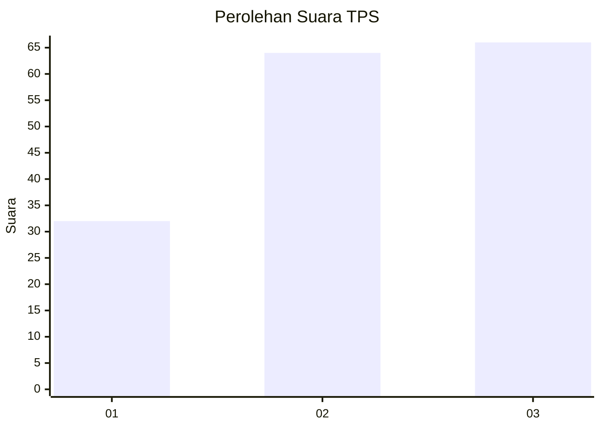
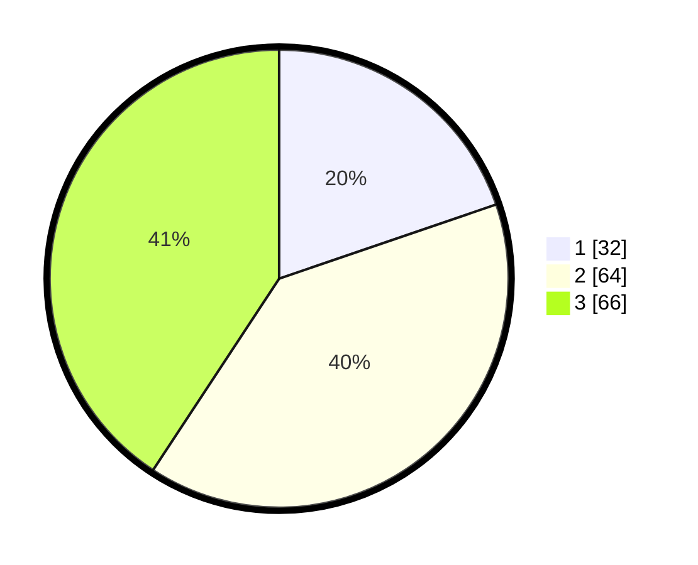

# Hasil

## Grafik

## Tabel

| No. | Nama Paslon    | Suara | Suara (raw) | Persentase |
|:--- |:-------------- | -----:| -----------:| ----------:|
| 1   | ANIES MUHAIMIN | 32    | [32][p-1]   | 19,75      |
| 2   | PRABOWO GIBRAN | 64    | [64][p-2]   | 39,51      |
| 3   | GANJAR MAHFUD  | 66    | [66][p-3]   | 40,74      |

[p-1]: https://github.com/gigit-pemilu/pemilu-2024-33-jawa-tengah/blob/main/pilpres/hitung-suara/sub/33-jawa-tengah/sub/04-banjarnegara/sub/16-batur/sub/2008-dieng-kulon/sub/006-tps/sub/paslon-1.txt
[p-2]: https://github.com/gigit-pemilu/pemilu-2024-33-jawa-tengah/blob/main/pilpres/hitung-suara/sub/33-jawa-tengah/sub/04-banjarnegara/sub/16-batur/sub/2008-dieng-kulon/sub/006-tps/sub/paslon-2.txt
[p-3]: https://github.com/gigit-pemilu/pemilu-2024-33-jawa-tengah/blob/main/pilpres/hitung-suara/sub/33-jawa-tengah/sub/04-banjarnegara/sub/16-batur/sub/2008-dieng-kulon/sub/006-tps/sub/paslon-3.txt

## Foto C Plano

https://sirekap-obj-formc.kpu.go.id/b46e/pemilu/ppwp/33/04/16/20/08/3304162008006-20240214-223818--4d53c75e-5c2c-4ab9-b9cb-630e938e1f36.jpg

https://sirekap-obj-formc.kpu.go.id/b46e/pemilu/ppwp/33/04/16/20/08/3304162008006-20240214-223840--78fd3a87-878f-4bf9-b3e4-d9c409a89dea.jpg

https://sirekap-obj-formc.kpu.go.id/b46e/pemilu/ppwp/33/04/16/20/08/3304162008006-20240214-223920--152868b7-e93e-4ef0-9fe0-cd01f1978add.jpg

## Metadata

| Key        | Value               |
| ---------- | ------------------- |
| Time Stamp | 2024-02-16 00:00:26 |

