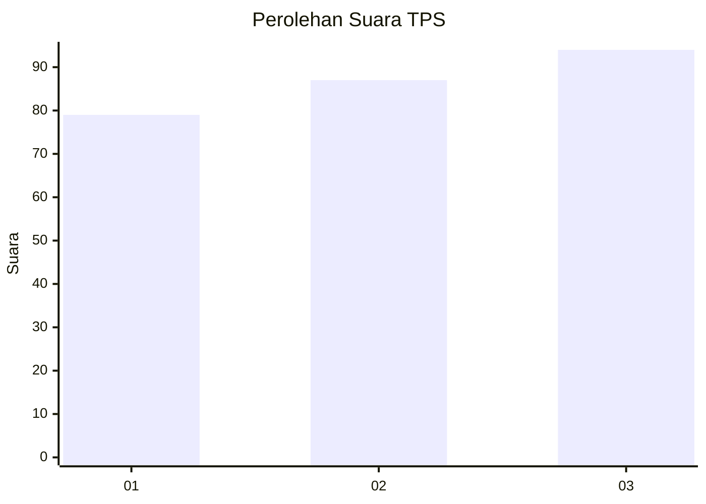
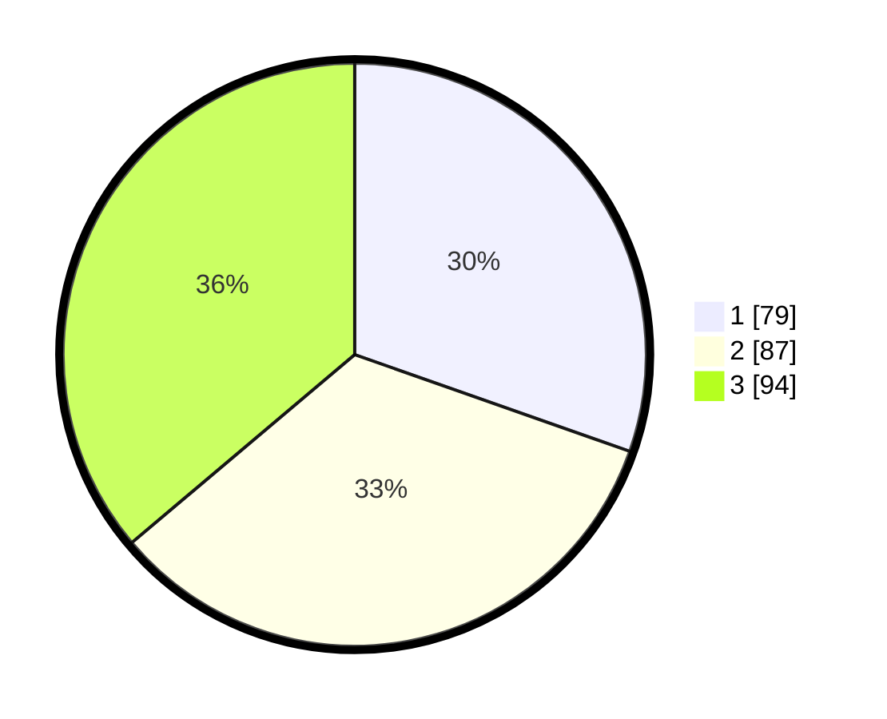

# Hasil

## Grafik

## Tabel

| No. | Nama Paslon    | Suara | Suara (raw) | Persentase |
|:--- |:-------------- | -----:| -----------:| ----------:|
| 1   | ANIES MUHAIMIN | 79    | [79][p-1]   | 30,38      |
| 2   | PRABOWO GIBRAN | 87    | [87][p-2]   | 33,46      |
| 3   | GANJAR MAHFUD  | 94    | [94][p-3]   | 36,15      |

[p-1]: https://github.com/gigit-pemilu/pemilu-2024-33-jawa-tengah/blob/main/pilpres/hitung-suara/sub/33-jawa-tengah/sub/04-banjarnegara/sub/17-wanayasa/sub/2013-wanaraja/sub/006-tps/sub/paslon-1.txt
[p-2]: https://github.com/gigit-pemilu/pemilu-2024-33-jawa-tengah/blob/main/pilpres/hitung-suara/sub/33-jawa-tengah/sub/04-banjarnegara/sub/17-wanayasa/sub/2013-wanaraja/sub/006-tps/sub/paslon-2.txt
[p-3]: https://github.com/gigit-pemilu/pemilu-2024-33-jawa-tengah/blob/main/pilpres/hitung-suara/sub/33-jawa-tengah/sub/04-banjarnegara/sub/17-wanayasa/sub/2013-wanaraja/sub/006-tps/sub/paslon-3.txt

## Foto C Plano

https://sirekap-obj-formc.kpu.go.id/1d41/pemilu/ppwp/33/04/17/20/13/3304172013006-20240215-022405--d0f5a666-eeb9-49b7-9351-e8710111eaa8.jpg

https://sirekap-obj-formc.kpu.go.id/1d41/pemilu/ppwp/33/04/17/20/13/3304172013006-20240215-022601--267a0d4a-777e-447f-a9bf-672055b2c6d1.jpg

https://sirekap-obj-formc.kpu.go.id/1d41/pemilu/ppwp/33/04/17/20/13/3304172013006-20240215-022720--5d9fc9e6-40a8-4964-89d4-212b25967cb7.jpg

## Metadata

| Key        | Value               |
| ---------- | ------------------- |
| Time Stamp | 2024-02-15 23:29:50 |

