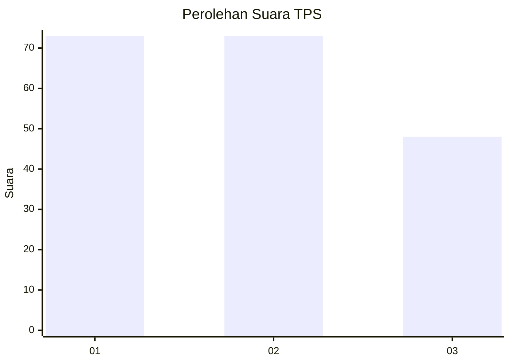
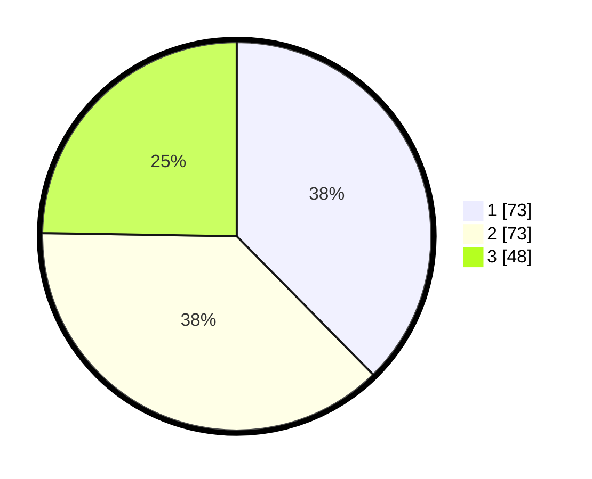

# Hasil

## Grafik

## Tabel

| No. | Nama Paslon    | Suara | Suara (raw) | Persentase |
|:--- |:-------------- | -----:| -----------:| ----------:|
| 1   | ANIES MUHAIMIN | 73    | [73][p-1]   | 37,63      |
| 2   | PRABOWO GIBRAN | 73    | [73][p-2]   | 37,63      |
| 3   | GANJAR MAHFUD  | 48    | [48][p-3]   | 24,74      |

[p-1]: https://github.com/gigit-pemilu/pemilu-2024-33-jawa-tengah/blob/main/pilpres/hitung-suara/sub/33-jawa-tengah/sub/04-banjarnegara/sub/17-wanayasa/sub/2014-jatilawang/sub/004-tps/sub/paslon-1.txt
[p-2]: https://github.com/gigit-pemilu/pemilu-2024-33-jawa-tengah/blob/main/pilpres/hitung-suara/sub/33-jawa-tengah/sub/04-banjarnegara/sub/17-wanayasa/sub/2014-jatilawang/sub/004-tps/sub/paslon-2.txt
[p-3]: https://github.com/gigit-pemilu/pemilu-2024-33-jawa-tengah/blob/main/pilpres/hitung-suara/sub/33-jawa-tengah/sub/04-banjarnegara/sub/17-wanayasa/sub/2014-jatilawang/sub/004-tps/sub/paslon-3.txt

## Foto C Plano

https://sirekap-obj-formc.kpu.go.id/1190/pemilu/ppwp/33/04/17/20/14/3304172014004-20240214-225131--18a04d8c-6b9c-480f-84f2-c0c1ef636742.jpg

https://sirekap-obj-formc.kpu.go.id/1190/pemilu/ppwp/33/04/17/20/14/3304172014004-20240214-225342--6d9b27a1-e78e-41a6-8c97-6de0b8548b1b.jpg

https://sirekap-obj-formc.kpu.go.id/1190/pemilu/ppwp/33/04/17/20/14/3304172014004-20240214-230745--25538f1b-0b5f-4bc4-9613-494bd87a8943.jpg

## Metadata

| Key        | Value               |
| ---------- | ------------------- |
| Time Stamp | 2024-02-15 23:29:50 |

