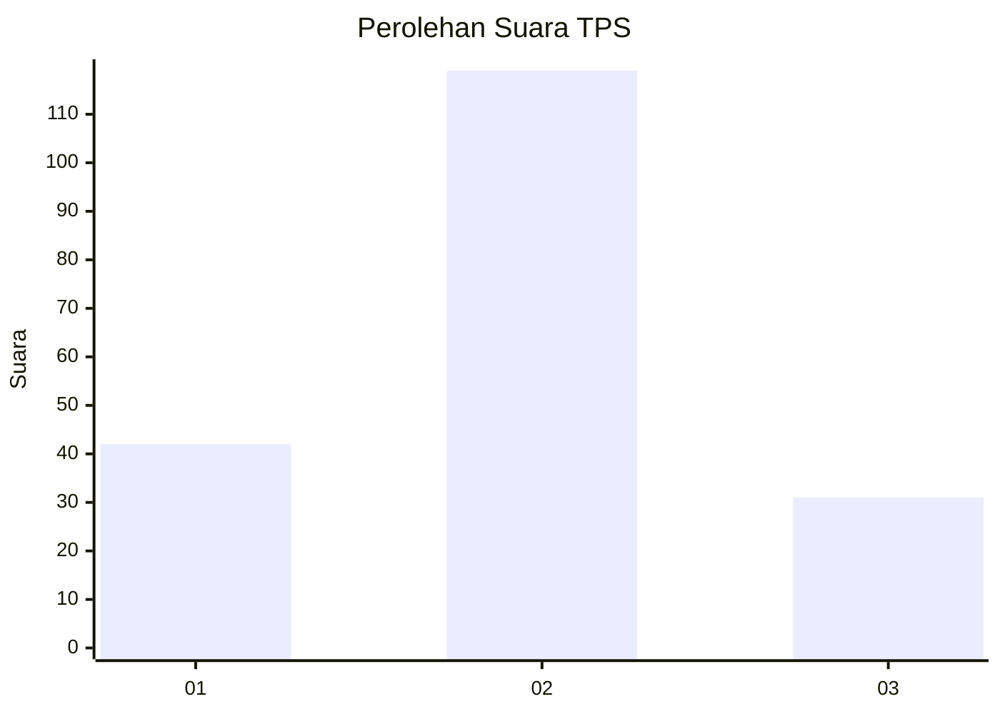

# Hasil

## Grafik

## Tabel

| No. | Nama Paslon    | Suara | Suara (raw) | Persentase |
|:--- |:-------------- | -----:| -----------:| ----------:|
| 1   | ANIES MUHAIMIN | 42    | [42][p-1]   | 21,88      |
| 2   | PRABOWO GIBRAN | 119   | [119][p-2]  | 61,98      |
| 3   | GANJAR MAHFUD  | 31    | [31][p-3]   | 16,15      |

[p-1]: https://github.com/gigit-pemilu/pemilu-2024/blob/main/pilpres/hitung-suara/sub/33-jawa-tengah/sub/04-banjarnegara/sub/18-kalibening/sub/2001-kalibening/sub/005-tps/sub/paslon-1.txt
[p-2]: https://github.com/gigit-pemilu/pemilu-2024/blob/main/pilpres/hitung-suara/sub/33-jawa-tengah/sub/04-banjarnegara/sub/18-kalibening/sub/2001-kalibening/sub/005-tps/sub/paslon-2.txt
[p-3]: https://github.com/gigit-pemilu/pemilu-2024/blob/main/pilpres/hitung-suara/sub/33-jawa-tengah/sub/04-banjarnegara/sub/18-kalibening/sub/2001-kalibening/sub/005-tps/sub/paslon-3.txt

## Foto C Plano

https://sirekap-obj-formc.kpu.go.id/30d7/pemilu/ppwp/33/04/18/20/01/3304182001005-20240214-213121--ec5e65ad-6bfe-432f-93f1-003e104d53c6.jpg

https://sirekap-obj-formc.kpu.go.id/30d7/pemilu/ppwp/33/04/18/20/01/3304182001005-20240214-213135--e2383e08-8b6b-4ee0-a0fd-7fecb0058b58.jpg

https://sirekap-obj-formc.kpu.go.id/30d7/pemilu/ppwp/33/04/18/20/01/3304182001005-20240214-213149--e827ba62-1c9e-42fb-bfa3-e62af38a6370.jpg

## Metadata

| Key        | Value               |
| ---------- | ------------------- |
| Time Stamp | 2024-02-15 21:30:27 |

