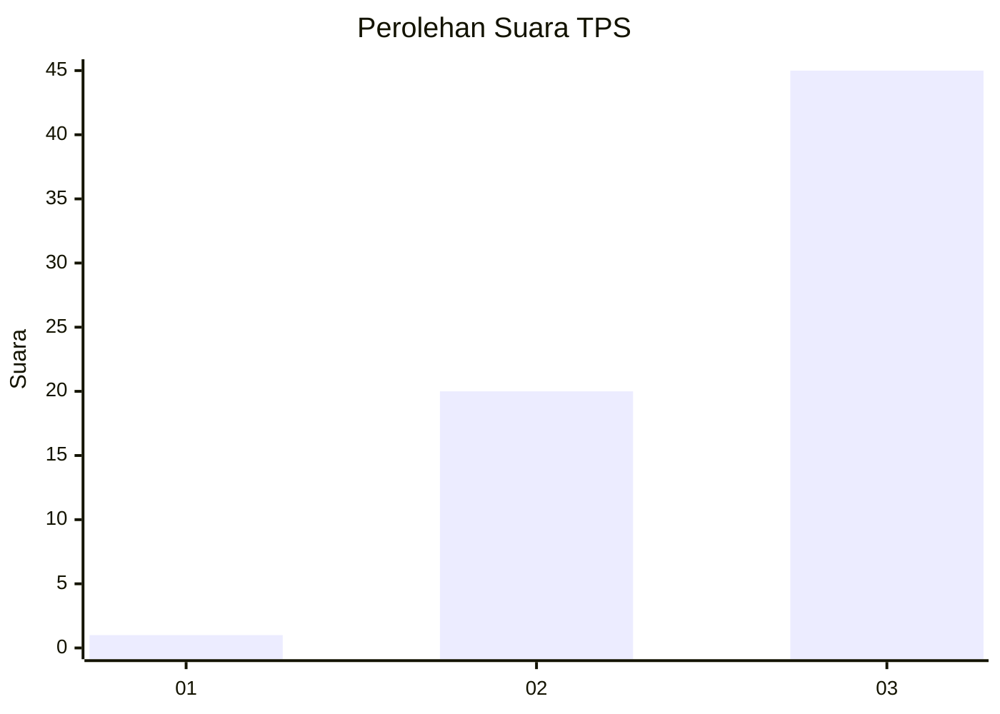
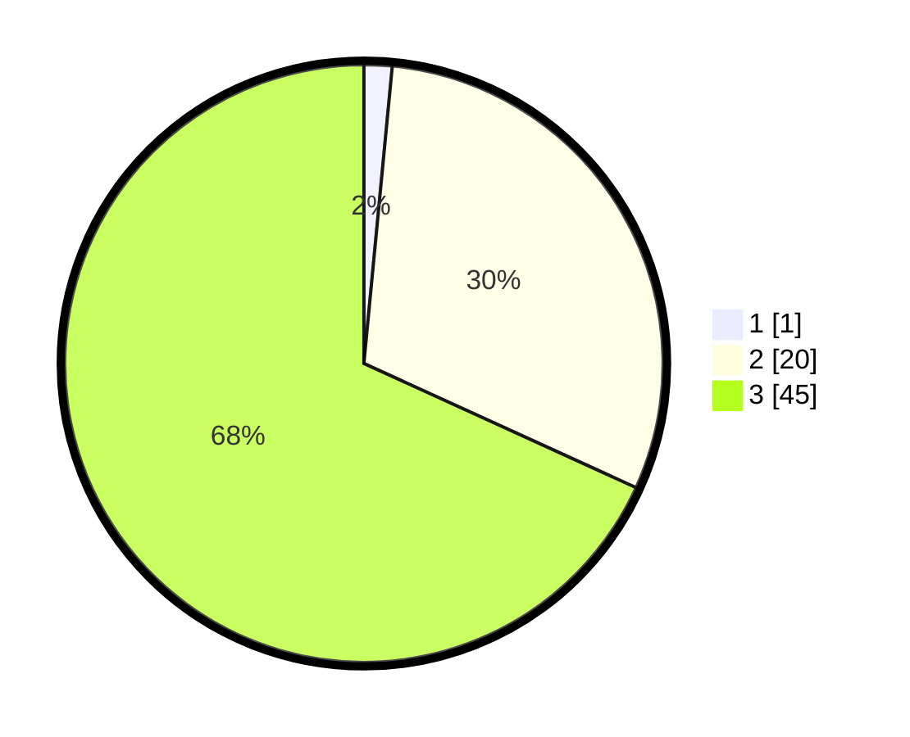

# Hasil

## Grafik

## Tabel

| No. | Nama Paslon    | Suara | Suara (raw) | Persentase |
|:--- |:-------------- | -----:| -----------:| ----------:|
| 1   | ANIES MUHAIMIN | 1     | [1][p-1]    | 1,52       |
| 2   | PRABOWO GIBRAN | 20    | [20][p-2]   | 30,30      |
| 3   | GANJAR MAHFUD  | 45    | [45][p-3]   | 68,18      |

[p-1]: https://github.com/gigit-pemilu/pemilu-2024/blob/main/pilpres/hitung-suara/sub/33-jawa-tengah/sub/04-banjarnegara/sub/18-kalibening/sub/2002-asinan/sub/004-tps/sub/paslon-1.txt
[p-2]: https://github.com/gigit-pemilu/pemilu-2024/blob/main/pilpres/hitung-suara/sub/33-jawa-tengah/sub/04-banjarnegara/sub/18-kalibening/sub/2002-asinan/sub/004-tps/sub/paslon-2.txt
[p-3]: https://github.com/gigit-pemilu/pemilu-2024/blob/main/pilpres/hitung-suara/sub/33-jawa-tengah/sub/04-banjarnegara/sub/18-kalibening/sub/2002-asinan/sub/004-tps/sub/paslon-3.txt

## Foto C Plano

https://sirekap-obj-formc.kpu.go.id/2f46/pemilu/ppwp/33/04/18/20/02/3304182002004-20240216-113537--ea95fc9d-c9cb-4e87-8fd8-8a929a6df84b.jpg

https://sirekap-obj-formc.kpu.go.id/2f46/pemilu/ppwp/33/04/18/20/02/3304182002004-20240216-113603--177005a0-ba95-4699-93ed-08babf7da264.jpg

## Metadata

| Key        | Value               |
| ---------- | ------------------- |
| Time Stamp | 2024-02-16 12:51:22 |

