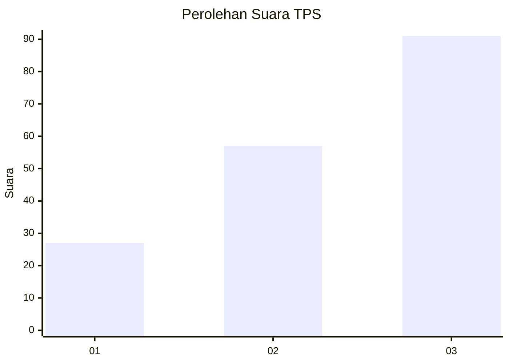
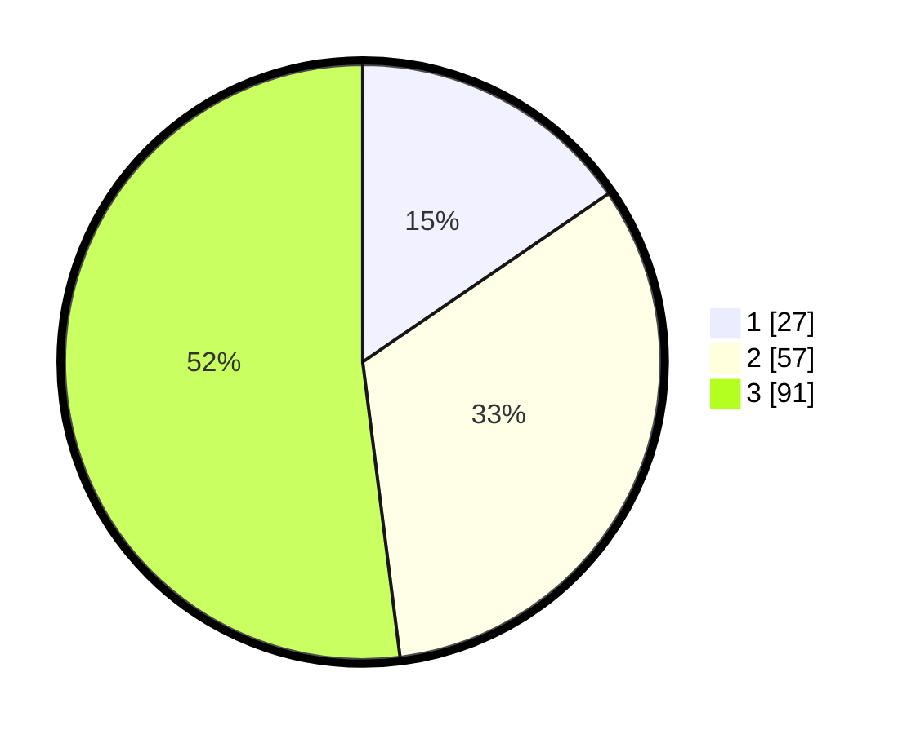

# Hasil

## Grafik

## Tabel

| No. | Nama Paslon    | Suara | Suara (raw) | Persentase |
|:--- |:-------------- | -----:| -----------:| ----------:|
| 1   | ANIES MUHAIMIN | 27    | [27][p-1]   | 15,43      |
| 2   | PRABOWO GIBRAN | 57    | [57][p-2]   | 32,57      |
| 3   | GANJAR MAHFUD  | 91    | [91][p-3]   | 52,00      |

[p-1]: https://github.com/gigit-pemilu/pemilu-2024-33-jawa-tengah/blob/main/pilpres/hitung-suara/sub/33-jawa-tengah/sub/04-banjarnegara/sub/18-kalibening/sub/2002-asinan/sub/006-tps/sub/paslon-1.txt
[p-2]: https://github.com/gigit-pemilu/pemilu-2024-33-jawa-tengah/blob/main/pilpres/hitung-suara/sub/33-jawa-tengah/sub/04-banjarnegara/sub/18-kalibening/sub/2002-asinan/sub/006-tps/sub/paslon-2.txt
[p-3]: https://github.com/gigit-pemilu/pemilu-2024-33-jawa-tengah/blob/main/pilpres/hitung-suara/sub/33-jawa-tengah/sub/04-banjarnegara/sub/18-kalibening/sub/2002-asinan/sub/006-tps/sub/paslon-3.txt

## Foto C Plano

https://sirekap-obj-formc.kpu.go.id/2aae/pemilu/ppwp/33/04/18/20/02/3304182002006-20240215-005820--dceca3e7-0293-4d72-8109-3994948f19fc.jpg

https://sirekap-obj-formc.kpu.go.id/2aae/pemilu/ppwp/33/04/18/20/02/3304182002006-20240215-015637--36f5b347-8f38-4a30-a9f1-02ddf1e05b89.jpg

https://sirekap-obj-formc.kpu.go.id/2aae/pemilu/ppwp/33/04/18/20/02/3304182002006-20240215-015742--bc1731e3-e0b1-4e76-b03a-d0bc23261653.jpg

## Metadata

| Key        | Value               |
| ---------- | ------------------- |
| Time Stamp | 2024-02-15 20:30:46 |

