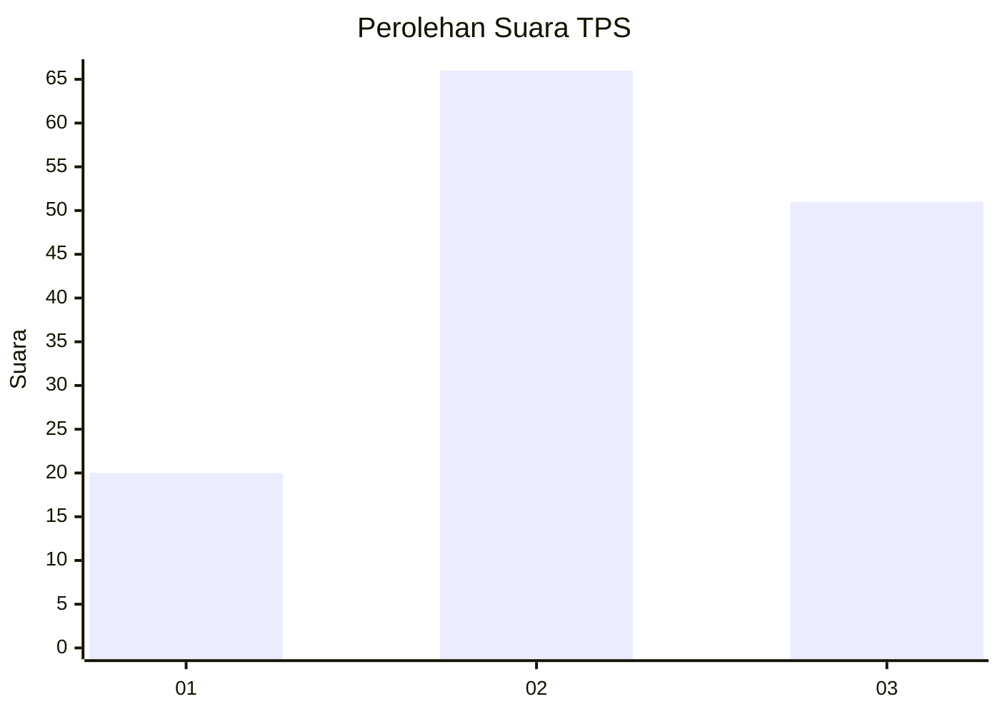
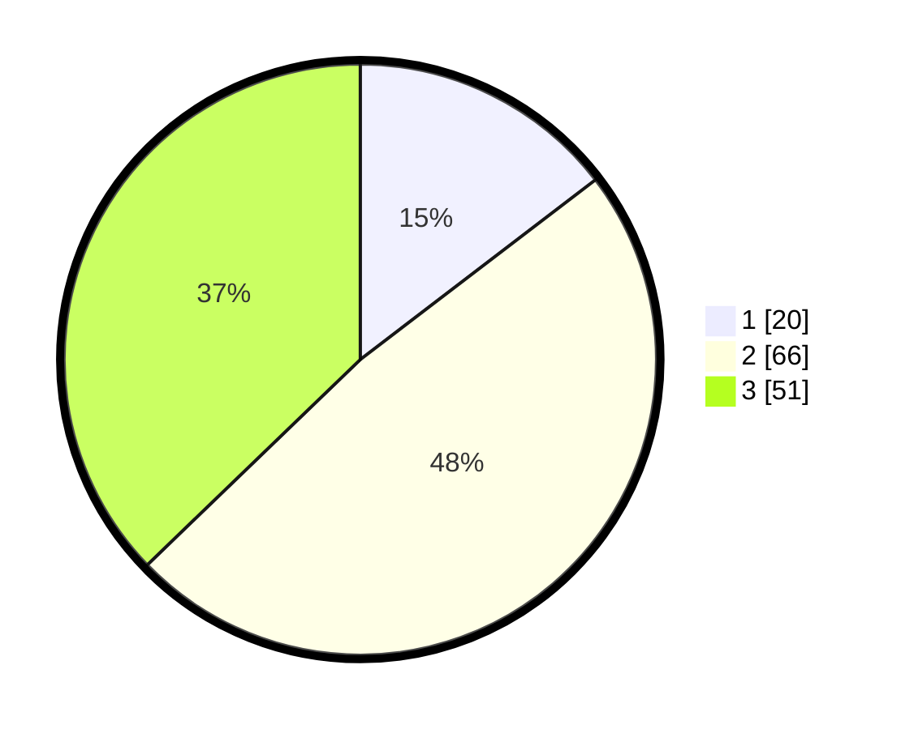

# Hasil

## Grafik

## Tabel

| No. | Nama Paslon    | Suara | Suara (raw) | Persentase |
|:--- |:-------------- | -----:| -----------:| ----------:|
| 1   | ANIES MUHAIMIN | 20    | [20][p-1]   | 14,60      |
| 2   | PRABOWO GIBRAN | 66    | [66][p-2]   | 48,18      |
| 3   | GANJAR MAHFUD  | 51    | [51][p-3]   | 37,23      |

[p-1]: https://github.com/gigit-pemilu/pemilu-2024/blob/main/pilpres/hitung-suara/sub/33-jawa-tengah/sub/04-banjarnegara/sub/18-kalibening/sub/2004-kalibombong/sub/006-tps/sub/paslon-1.txt
[p-2]: https://github.com/gigit-pemilu/pemilu-2024/blob/main/pilpres/hitung-suara/sub/33-jawa-tengah/sub/04-banjarnegara/sub/18-kalibening/sub/2004-kalibombong/sub/006-tps/sub/paslon-2.txt
[p-3]: https://github.com/gigit-pemilu/pemilu-2024/blob/main/pilpres/hitung-suara/sub/33-jawa-tengah/sub/04-banjarnegara/sub/18-kalibening/sub/2004-kalibombong/sub/006-tps/sub/paslon-3.txt

## Foto C Plano

https://sirekap-obj-formc.kpu.go.id/896d/pemilu/ppwp/33/04/18/20/04/3304182004006-20240215-011324--91d6e3b7-2e2d-4cac-93fb-8c607fbd3709.jpg

https://sirekap-obj-formc.kpu.go.id/896d/pemilu/ppwp/33/04/18/20/04/3304182004006-20240215-011410--159b932d-6049-4746-b4d3-8fefb656627d.jpg

https://sirekap-obj-formc.kpu.go.id/896d/pemilu/ppwp/33/04/18/20/04/3304182004006-20240215-011502--7279959f-166b-49cb-abc4-e8e2ff3fefbe.jpg

## Metadata

| Key        | Value               |
| ---------- | ------------------- |
| Time Stamp | 2024-02-15 21:30:27 |

