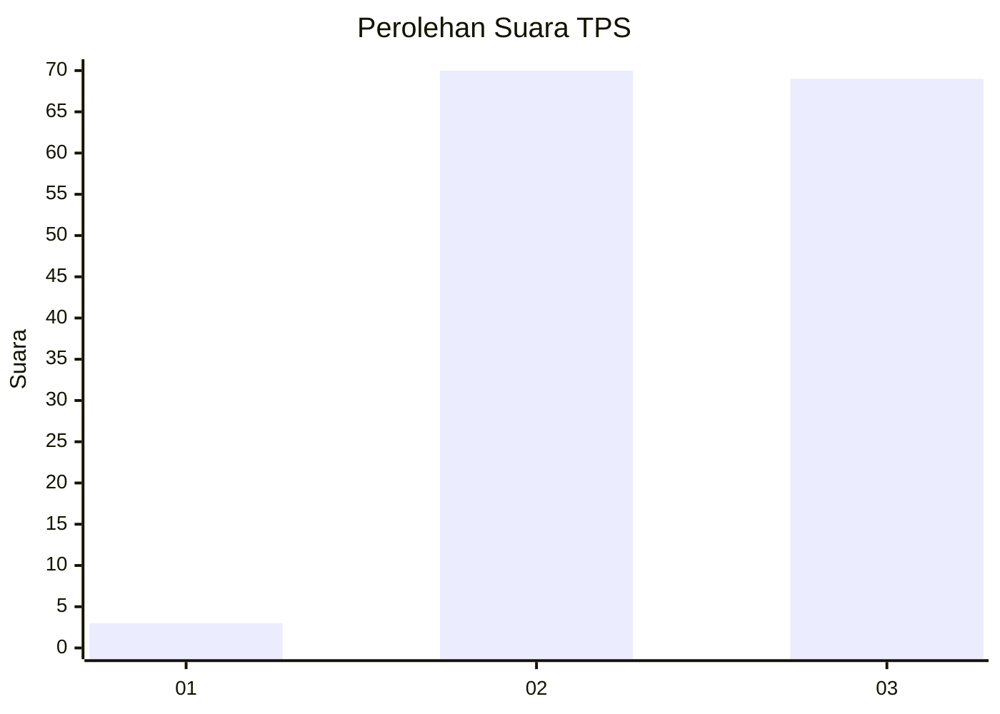
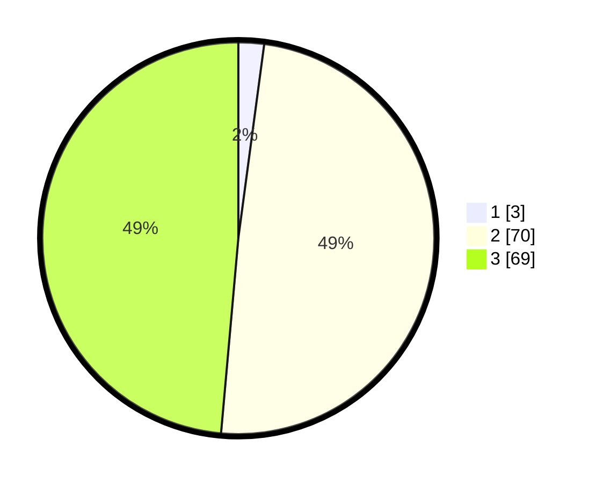

# Hasil

## Grafik

## Tabel

| No. | Nama Paslon    | Suara | Suara (raw) | Persentase |
|:--- |:-------------- | -----:| -----------:| ----------:|
| 1   | ANIES MUHAIMIN | 3     | [3][p-1]    | 2,11       |
| 2   | PRABOWO GIBRAN | 70    | [70][p-2]   | 49,30      |
| 3   | GANJAR MAHFUD  | 69    | [69][p-3]   | 48,59      |

[p-1]: https://github.com/gigit-pemilu/pemilu-2024-33-jawa-tengah/blob/main/pilpres/hitung-suara/sub/33-jawa-tengah/sub/04-banjarnegara/sub/18-kalibening/sub/2008-kertosari/sub/004-tps/sub/paslon-1.txt
[p-2]: https://github.com/gigit-pemilu/pemilu-2024-33-jawa-tengah/blob/main/pilpres/hitung-suara/sub/33-jawa-tengah/sub/04-banjarnegara/sub/18-kalibening/sub/2008-kertosari/sub/004-tps/sub/paslon-2.txt
[p-3]: https://github.com/gigit-pemilu/pemilu-2024-33-jawa-tengah/blob/main/pilpres/hitung-suara/sub/33-jawa-tengah/sub/04-banjarnegara/sub/18-kalibening/sub/2008-kertosari/sub/004-tps/sub/paslon-3.txt

## Foto C Plano

https://sirekap-obj-formc.kpu.go.id/7f99/pemilu/ppwp/33/04/18/20/08/3304182008004-20240215-033356--d0e3abde-b1b7-4e08-9bd5-2ea06f5945af.jpg

https://sirekap-obj-formc.kpu.go.id/7f99/pemilu/ppwp/33/04/18/20/08/3304182008004-20240215-033455--5f003c59-0a6a-4dd0-bf92-81b1a750f8db.jpg

https://sirekap-obj-formc.kpu.go.id/7f99/pemilu/ppwp/33/04/18/20/08/3304182008004-20240215-033542--76820081-8bba-42eb-afaf-7a3eda4f1d77.jpg

## Metadata

| Key        | Value               |
| ---------- | ------------------- |
| Time Stamp | 2024-02-15 22:00:27 |

