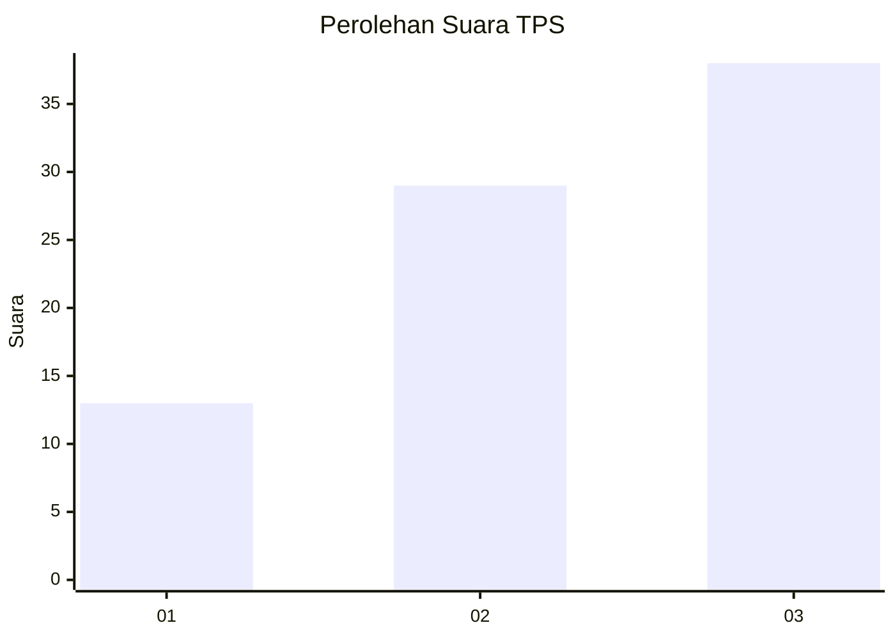
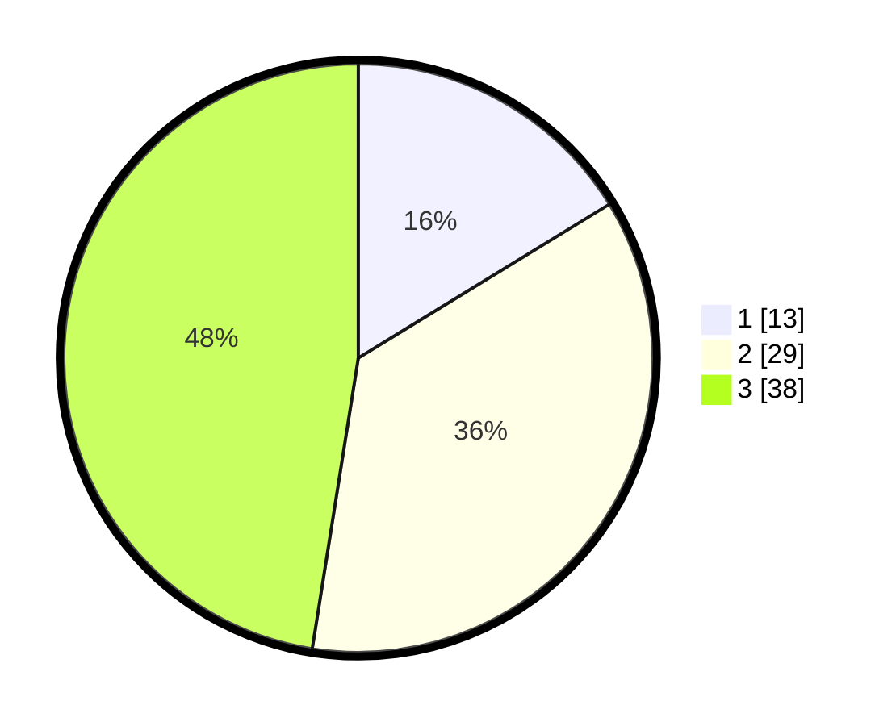

# Hasil

## Grafik

## Tabel

| No. | Nama Paslon    | Suara | Suara (raw) | Persentase |
|:--- |:-------------- | -----:| -----------:| ----------:|
| 1   | ANIES MUHAIMIN | 13    | [13][p-1]   | 16,25      |
| 2   | PRABOWO GIBRAN | 29    | [29][p-2]   | 36,25      |
| 3   | GANJAR MAHFUD  | 38    | [38][p-3]   | 47,50      |

[p-1]: https://github.com/gigit-pemilu/pemilu-2024-33-jawa-tengah/blob/main/pilpres/hitung-suara/sub/33-jawa-tengah/sub/04-banjarnegara/sub/18-kalibening/sub/2010-sikumpul/sub/002-tps/sub/paslon-1.txt
[p-2]: https://github.com/gigit-pemilu/pemilu-2024-33-jawa-tengah/blob/main/pilpres/hitung-suara/sub/33-jawa-tengah/sub/04-banjarnegara/sub/18-kalibening/sub/2010-sikumpul/sub/002-tps/sub/paslon-2.txt
[p-3]: https://github.com/gigit-pemilu/pemilu-2024-33-jawa-tengah/blob/main/pilpres/hitung-suara/sub/33-jawa-tengah/sub/04-banjarnegara/sub/18-kalibening/sub/2010-sikumpul/sub/002-tps/sub/paslon-3.txt

## Foto C Plano

https://sirekap-obj-formc.kpu.go.id/1298/pemilu/ppwp/33/04/18/20/10/3304182010002-20240214-231201--c24c8864-2abb-4b1d-961c-1e49304351af.jpg

https://sirekap-obj-formc.kpu.go.id/1298/pemilu/ppwp/33/04/18/20/10/3304182010002-20240214-231240--18af6557-36a1-407f-80ed-9a9130f05f03.jpg

https://sirekap-obj-formc.kpu.go.id/1298/pemilu/ppwp/33/04/18/20/10/3304182010002-20240214-231326--a1ae1955-f911-4910-b874-8265030bbc53.jpg

## Metadata

| Key        | Value               |
| ---------- | ------------------- |
| Time Stamp | 2024-02-15 21:30:27 |

