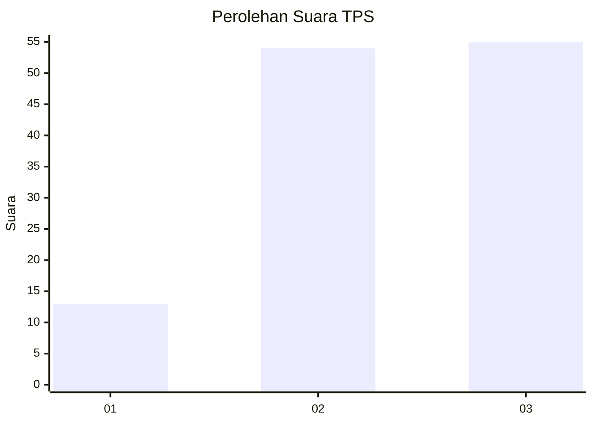
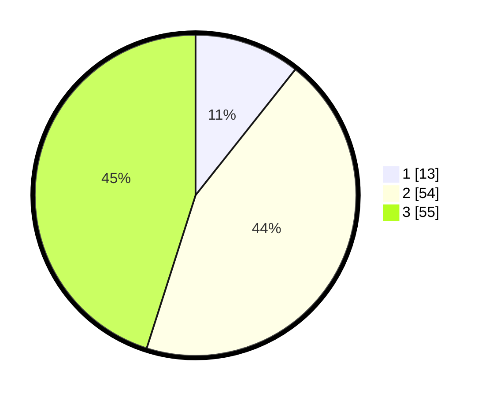

# Hasil

## Grafik

## Tabel

| No. | Nama Paslon    | Suara | Suara (raw) | Persentase |
|:--- |:-------------- | -----:| -----------:| ----------:|
| 1   | ANIES MUHAIMIN | 13    | [13][p-1]   | 10,66      |
| 2   | PRABOWO GIBRAN | 54    | [54][p-2]   | 44,26      |
| 3   | GANJAR MAHFUD  | 55    | [55][p-3]   | 45,08      |

[p-1]: https://github.com/gigit-pemilu/pemilu-2024-33-jawa-tengah/blob/main/pilpres/hitung-suara/sub/33-jawa-tengah/sub/04-banjarnegara/sub/18-kalibening/sub/2011-gununglangit/sub/004-tps/sub/paslon-1.txt
[p-2]: https://github.com/gigit-pemilu/pemilu-2024-33-jawa-tengah/blob/main/pilpres/hitung-suara/sub/33-jawa-tengah/sub/04-banjarnegara/sub/18-kalibening/sub/2011-gununglangit/sub/004-tps/sub/paslon-2.txt
[p-3]: https://github.com/gigit-pemilu/pemilu-2024-33-jawa-tengah/blob/main/pilpres/hitung-suara/sub/33-jawa-tengah/sub/04-banjarnegara/sub/18-kalibening/sub/2011-gununglangit/sub/004-tps/sub/paslon-3.txt

## Foto C Plano

https://sirekap-obj-formc.kpu.go.id/a357/pemilu/ppwp/33/04/18/20/11/3304182011004-20240215-012534--bf636c32-6ac7-477e-9d20-46f217f76942.jpg

https://sirekap-obj-formc.kpu.go.id/a357/pemilu/ppwp/33/04/18/20/11/3304182011004-20240215-012626--faada807-342f-47e4-92de-604138005886.jpg

https://sirekap-obj-formc.kpu.go.id/a357/pemilu/ppwp/33/04/18/20/11/3304182011004-20240215-012729--13945165-a6b7-40c4-a498-910fc5df6ecb.jpg

## Metadata

| Key        | Value               |
| ---------- | ------------------- |
| Time Stamp | 2024-02-15 04:00:24 |

