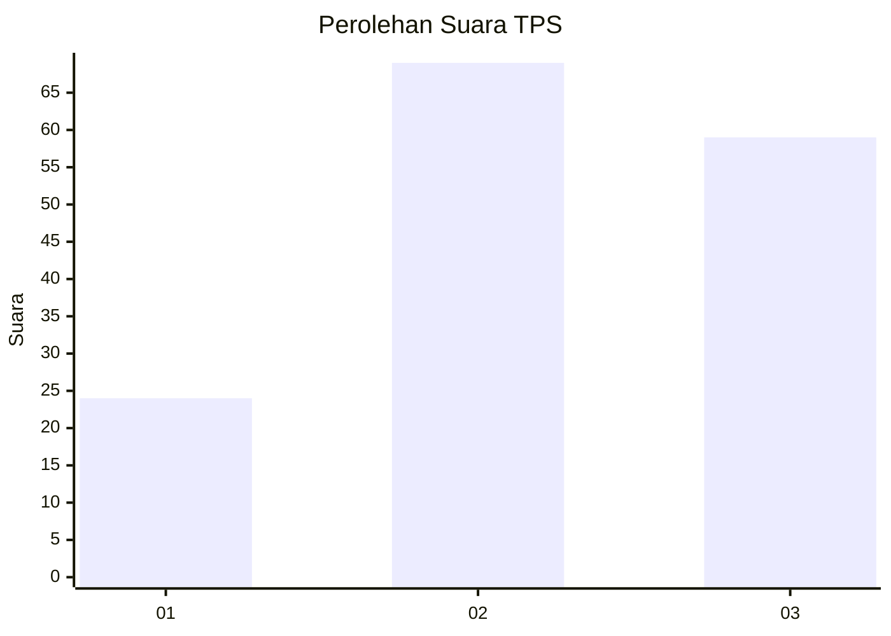
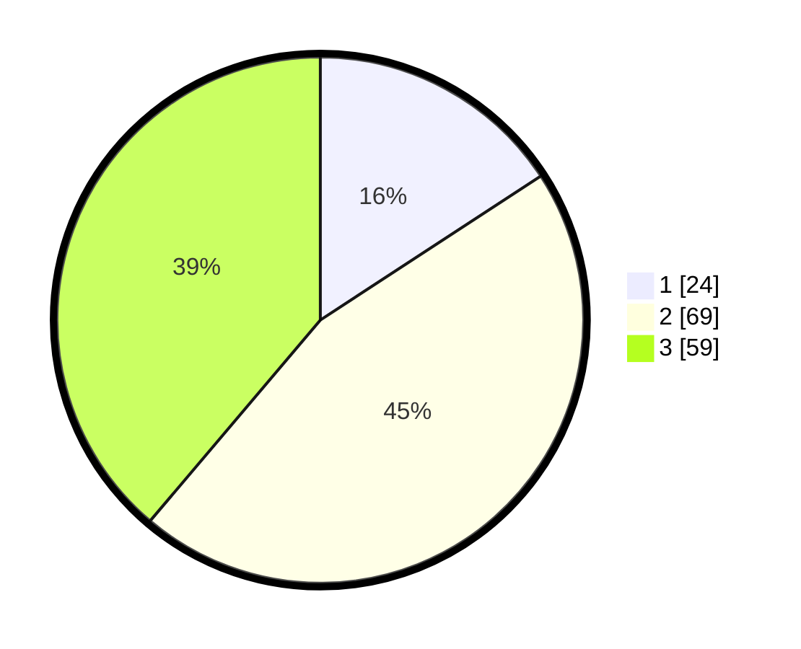

# Hasil

## Grafik

## Tabel

| No. | Nama Paslon    | Suara | Suara (raw) | Persentase |
|:--- |:-------------- | -----:| -----------:| ----------:|
| 1   | ANIES MUHAIMIN | 24    | [24][p-1]   | 15,79      |
| 2   | PRABOWO GIBRAN | 69    | [69][p-2]   | 45,39      |
| 3   | GANJAR MAHFUD  | 59    | [59][p-3]   | 38,82      |

[p-1]: https://github.com/gigit-pemilu/pemilu-2024-33-jawa-tengah/blob/main/pilpres/hitung-suara/sub/33-jawa-tengah/sub/04-banjarnegara/sub/18-kalibening/sub/2012-bedana/sub/002-tps/sub/paslon-1.txt
[p-2]: https://github.com/gigit-pemilu/pemilu-2024-33-jawa-tengah/blob/main/pilpres/hitung-suara/sub/33-jawa-tengah/sub/04-banjarnegara/sub/18-kalibening/sub/2012-bedana/sub/002-tps/sub/paslon-2.txt
[p-3]: https://github.com/gigit-pemilu/pemilu-2024-33-jawa-tengah/blob/main/pilpres/hitung-suara/sub/33-jawa-tengah/sub/04-banjarnegara/sub/18-kalibening/sub/2012-bedana/sub/002-tps/sub/paslon-3.txt

## Foto C Plano

https://sirekap-obj-formc.kpu.go.id/3dbf/pemilu/ppwp/33/04/18/20/12/3304182012002-20240215-014636--474b5518-ed05-4e66-95d5-6484e08cafc8.jpg

https://sirekap-obj-formc.kpu.go.id/3dbf/pemilu/ppwp/33/04/18/20/12/3304182012002-20240215-014833--2035f08e-5dda-49cc-96a7-5ce6020864f4.jpg

https://sirekap-obj-formc.kpu.go.id/3dbf/pemilu/ppwp/33/04/18/20/12/3304182012002-20240215-014459--85aeb0e3-cade-41dd-a6f6-103b17fa0384.jpg

## Metadata

| Key        | Value               |
| ---------- | ------------------- |
| Time Stamp | 2024-02-15 20:30:46 |

