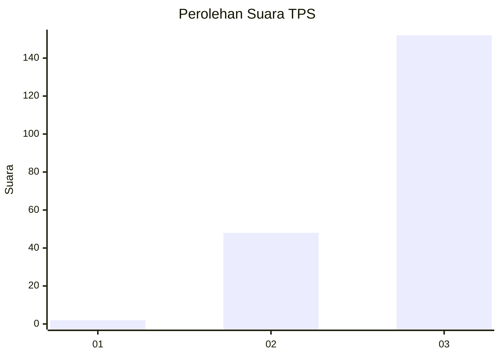
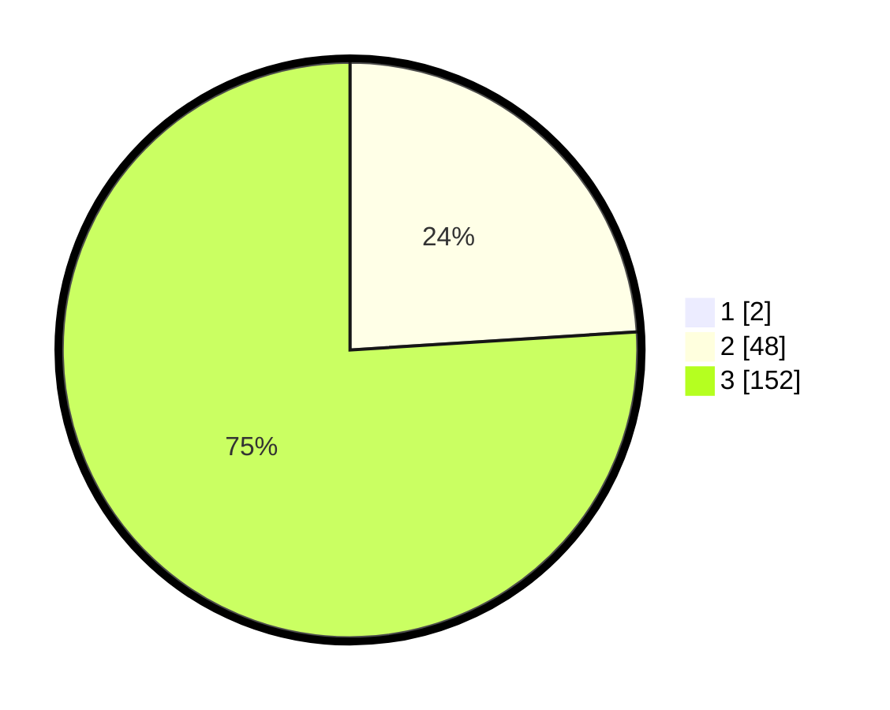

# Hasil

## Grafik

## Tabel

| No. | Nama Paslon    | Suara | Suara (raw) | Persentase |
|:--- |:-------------- | -----:| -----------:| ----------:|
| 1   | ANIES MUHAIMIN | 2     | [2][p-1]    | 0,99       |
| 2   | PRABOWO GIBRAN | 48    | [48][p-2]   | 23,76      |
| 3   | GANJAR MAHFUD  | 152   | [152][p-3]  | 75,25      |

[p-1]: https://github.com/gigit-pemilu/pemilu-2024/blob/main/pilpres/hitung-suara/sub/33-jawa-tengah/sub/04-banjarnegara/sub/18-kalibening/sub/2013-sirukun/sub/002-tps/sub/paslon-1.txt
[p-2]: https://github.com/gigit-pemilu/pemilu-2024/blob/main/pilpres/hitung-suara/sub/33-jawa-tengah/sub/04-banjarnegara/sub/18-kalibening/sub/2013-sirukun/sub/002-tps/sub/paslon-2.txt
[p-3]: https://github.com/gigit-pemilu/pemilu-2024/blob/main/pilpres/hitung-suara/sub/33-jawa-tengah/sub/04-banjarnegara/sub/18-kalibening/sub/2013-sirukun/sub/002-tps/sub/paslon-3.txt

## Foto C Plano

https://sirekap-obj-formc.kpu.go.id/8e45/pemilu/ppwp/33/04/18/20/13/3304182013002-20240215-001615--6ae6271e-e699-420b-8bfd-9c10dd54db2e.jpg

https://sirekap-obj-formc.kpu.go.id/8e45/pemilu/ppwp/33/04/18/20/13/3304182013002-20240214-212721--28ff9779-e4cb-4891-9860-307f642a7688.jpg

https://sirekap-obj-formc.kpu.go.id/8e45/pemilu/ppwp/33/04/18/20/13/3304182013002-20240215-000243--41e158c8-bbfb-4eaa-8b6e-30204901fe70.jpg

## Metadata

| Key        | Value               |
| ---------- | ------------------- |
| Time Stamp | 2024-02-15 20:30:46 |

