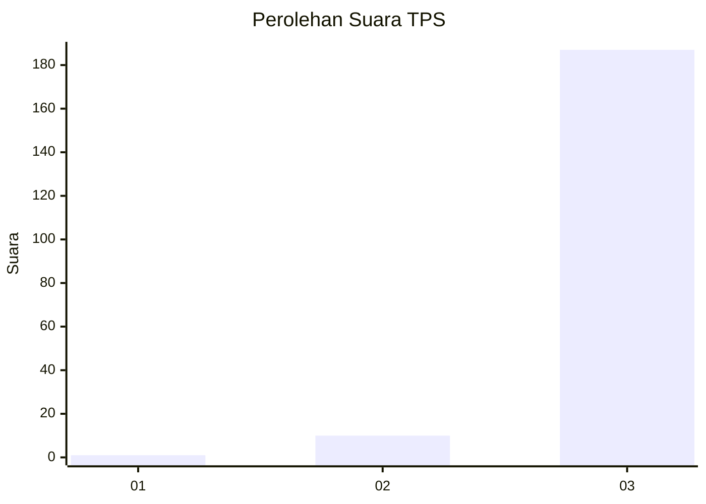
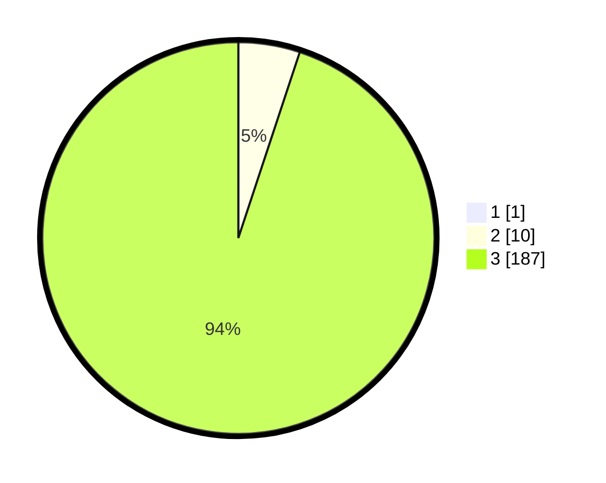

# Hasil

## Grafik

## Tabel

| No. | Nama Paslon    | Suara | Suara (raw) | Persentase |
|:--- |:-------------- | -----:| -----------:| ----------:|
| 1   | ANIES MUHAIMIN | 1     | [1][p-1]    | 0,51       |
| 2   | PRABOWO GIBRAN | 10    | [10][p-2]   | 5,05       |
| 3   | GANJAR MAHFUD  | 187   | [187][p-3]  | 94,44      |

[p-1]: https://github.com/gigit-pemilu/pemilu-2024/blob/main/pilpres/hitung-suara/sub/33-jawa-tengah/sub/04-banjarnegara/sub/18-kalibening/sub/2014-karanganyar/sub/010-tps/sub/paslon-1.txt
[p-2]: https://github.com/gigit-pemilu/pemilu-2024/blob/main/pilpres/hitung-suara/sub/33-jawa-tengah/sub/04-banjarnegara/sub/18-kalibening/sub/2014-karanganyar/sub/010-tps/sub/paslon-2.txt
[p-3]: https://github.com/gigit-pemilu/pemilu-2024/blob/main/pilpres/hitung-suara/sub/33-jawa-tengah/sub/04-banjarnegara/sub/18-kalibening/sub/2014-karanganyar/sub/010-tps/sub/paslon-3.txt

## Foto C Plano

https://sirekap-obj-formc.kpu.go.id/8395/pemilu/ppwp/33/04/18/20/14/3304182014010-20240214-225732--5b79ae67-96f1-4785-a129-c9c1feeeece2.jpg

https://sirekap-obj-formc.kpu.go.id/8395/pemilu/ppwp/33/04/18/20/14/3304182014010-20240215-004839--e6b35ea4-5066-435c-bfc1-d635176c3497.jpg

https://sirekap-obj-formc.kpu.go.id/8395/pemilu/ppwp/33/04/18/20/14/3304182014010-20240215-005303--9e2e4767-a8f7-46bd-be73-5478ba55f6d1.jpg

## Metadata

| Key        | Value               |
| ---------- | ------------------- |
| Time Stamp | 2024-02-15 19:00:26 |

