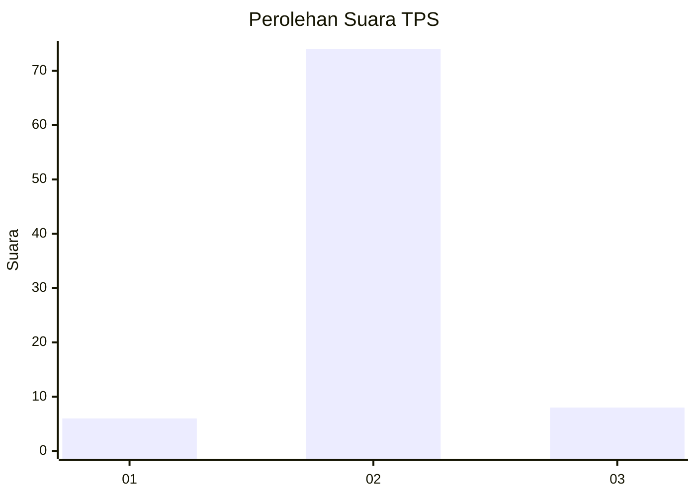
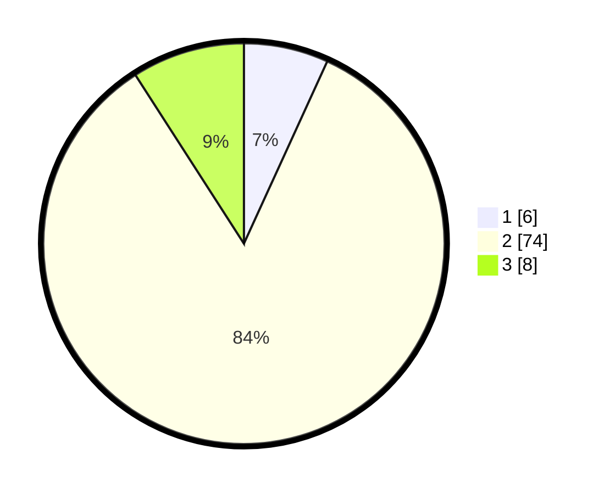

# Hasil

## Grafik

## Tabel

| No. | Nama Paslon    | Suara | Suara (raw) | Persentase |
|:--- |:-------------- | -----:| -----------:| ----------:|
| 1   | ANIES MUHAIMIN | 6     | [6][p-1]    | 6,82       |
| 2   | PRABOWO GIBRAN | 74    | [74][p-2]   | 84,09      |
| 3   | GANJAR MAHFUD  | 8     | [8][p-3]    | 9,09       |

[p-1]: https://github.com/gigit-pemilu/pemilu-2024/blob/main/pilpres/hitung-suara/sub/33-jawa-tengah/sub/04-banjarnegara/sub/18-kalibening/sub/2016-kasinoman/sub/002-tps/sub/paslon-1.txt
[p-2]: https://github.com/gigit-pemilu/pemilu-2024/blob/main/pilpres/hitung-suara/sub/33-jawa-tengah/sub/04-banjarnegara/sub/18-kalibening/sub/2016-kasinoman/sub/002-tps/sub/paslon-2.txt
[p-3]: https://github.com/gigit-pemilu/pemilu-2024/blob/main/pilpres/hitung-suara/sub/33-jawa-tengah/sub/04-banjarnegara/sub/18-kalibening/sub/2016-kasinoman/sub/002-tps/sub/paslon-3.txt

## Foto C Plano

https://sirekap-obj-formc.kpu.go.id/1026/pemilu/ppwp/33/04/18/20/16/3304182016002-20240214-232405--bf3ec94f-8ca8-45bd-9d8b-a7760372a660.jpg

https://sirekap-obj-formc.kpu.go.id/1026/pemilu/ppwp/33/04/18/20/16/3304182016002-20240214-232503--6472b585-7c96-4ba4-afee-7c615c83e386.jpg

## Metadata

| Key        | Value               |
| ---------- | ------------------- |
| Time Stamp | 2024-02-25 14:00:00 |

