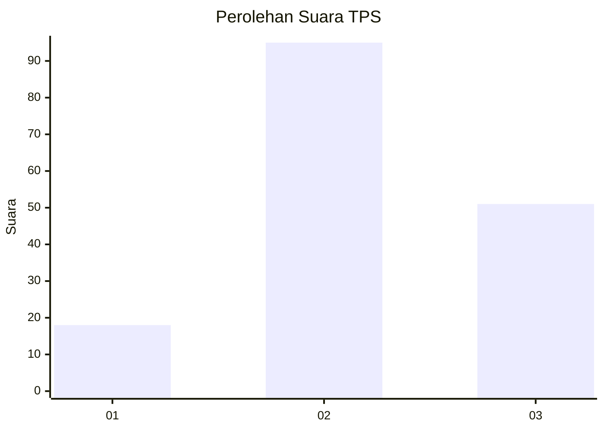
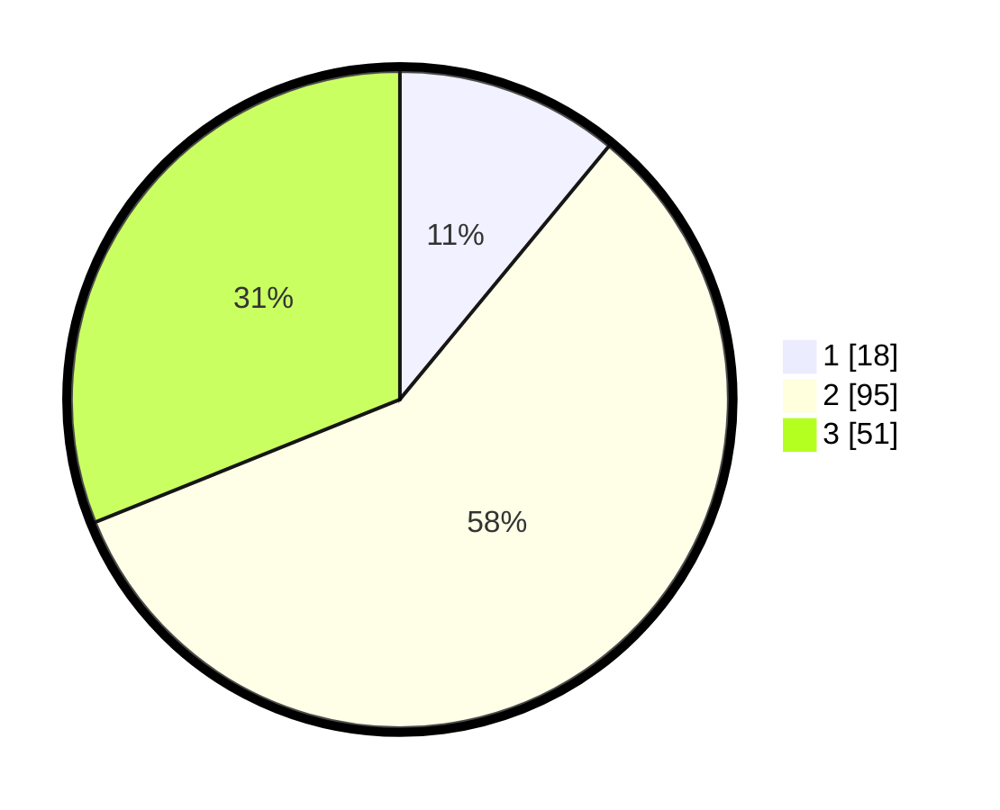

# Hasil

## Grafik

## Tabel

| No. | Nama Paslon    | Suara | Suara (raw) | Persentase |
|:--- |:-------------- | -----:| -----------:| ----------:|
| 1   | ANIES MUHAIMIN | 18    | [18][p-1]   | 10,98      |
| 2   | PRABOWO GIBRAN | 95    | [95][p-2]   | 57,93      |
| 3   | GANJAR MAHFUD  | 51    | [51][p-3]   | 31,10      |

[p-1]: https://github.com/gigit-pemilu/pemilu-2024/blob/main/pilpres/hitung-suara/sub/33-jawa-tengah/sub/04-banjarnegara/sub/20-pagedongan/sub/2001-pagedongan/sub/004-tps/sub/paslon-1.txt
[p-2]: https://github.com/gigit-pemilu/pemilu-2024/blob/main/pilpres/hitung-suara/sub/33-jawa-tengah/sub/04-banjarnegara/sub/20-pagedongan/sub/2001-pagedongan/sub/004-tps/sub/paslon-2.txt
[p-3]: https://github.com/gigit-pemilu/pemilu-2024/blob/main/pilpres/hitung-suara/sub/33-jawa-tengah/sub/04-banjarnegara/sub/20-pagedongan/sub/2001-pagedongan/sub/004-tps/sub/paslon-3.txt

## Foto C Plano

https://sirekap-obj-formc.kpu.go.id/f3f5/pemilu/ppwp/33/04/20/20/01/3304202001004-20240214-221236--ac7c2a2b-744a-4c14-b0b0-f1b12c37159c.jpg

https://sirekap-obj-formc.kpu.go.id/f3f5/pemilu/ppwp/33/04/20/20/01/3304202001004-20240215-004341--ea88fb52-02f2-4fa9-b2bd-3663d4f408b6.jpg

https://sirekap-obj-formc.kpu.go.id/f3f5/pemilu/ppwp/33/04/20/20/01/3304202001004-20240214-221700--492a19f6-a25e-47b5-b042-4fcaeebe5bbc.jpg

## Metadata

| Key        | Value               |
| ---------- | ------------------- |
| Time Stamp | 2024-02-15 16:00:26 |

