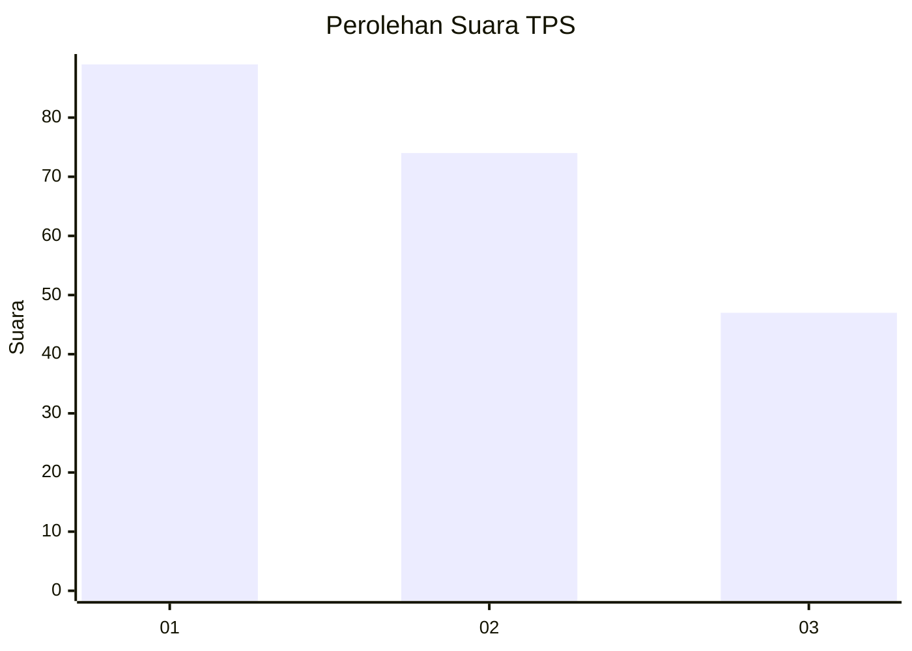
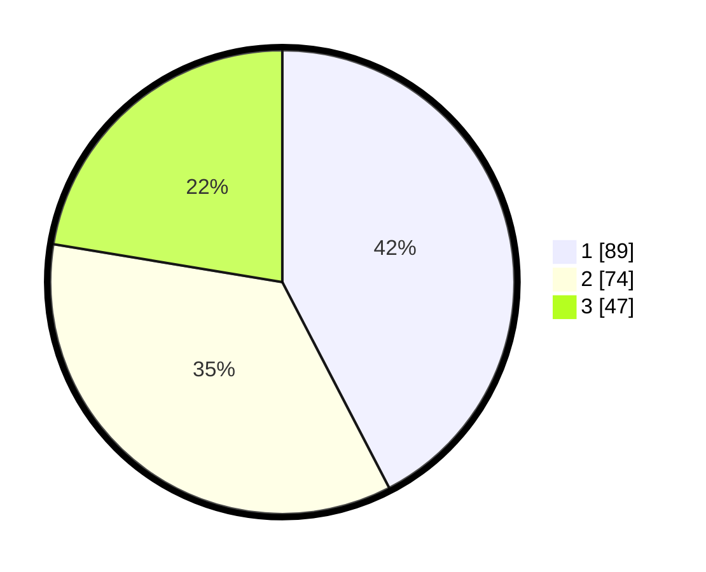

# Hasil

## Grafik

## Tabel

| No. | Nama Paslon    | Suara | Suara (raw) | Persentase |
|:--- |:-------------- | -----:| -----------:| ----------:|
| 1   | ANIES MUHAIMIN | 89    | [89][p-1]   | 42,38      |
| 2   | PRABOWO GIBRAN | 74    | [74][p-2]   | 35,24      |
| 3   | GANJAR MAHFUD  | 47    | [47][p-3]   | 22,38      |

[p-1]: https://github.com/gigit-pemilu/pemilu-2024-33-jawa-tengah/blob/main/pilpres/hitung-suara/sub/33-jawa-tengah/sub/04-banjarnegara/sub/20-pagedongan/sub/2001-pagedongan/sub/015-tps/sub/paslon-1.txt
[p-2]: https://github.com/gigit-pemilu/pemilu-2024-33-jawa-tengah/blob/main/pilpres/hitung-suara/sub/33-jawa-tengah/sub/04-banjarnegara/sub/20-pagedongan/sub/2001-pagedongan/sub/015-tps/sub/paslon-2.txt
[p-3]: https://github.com/gigit-pemilu/pemilu-2024-33-jawa-tengah/blob/main/pilpres/hitung-suara/sub/33-jawa-tengah/sub/04-banjarnegara/sub/20-pagedongan/sub/2001-pagedongan/sub/015-tps/sub/paslon-3.txt

## Foto C Plano

https://sirekap-obj-formc.kpu.go.id/a9d0/pemilu/ppwp/33/04/20/20/01/3304202001015-20240215-011707--bfea92ae-242e-4ea6-ac34-cbee9b1f75a8.jpg

https://sirekap-obj-formc.kpu.go.id/a9d0/pemilu/ppwp/33/04/20/20/01/3304202001015-20240215-012205--92fe2f97-01e4-401c-bc19-5ba7c713e749.jpg

https://sirekap-obj-formc.kpu.go.id/a9d0/pemilu/ppwp/33/04/20/20/01/3304202001015-20240215-012251--7a76ff1d-dc30-424d-beac-63725b30509c.jpg

## Metadata

| Key        | Value               |
| ---------- | ------------------- |
| Time Stamp | 2024-02-15 16:00:26 |

