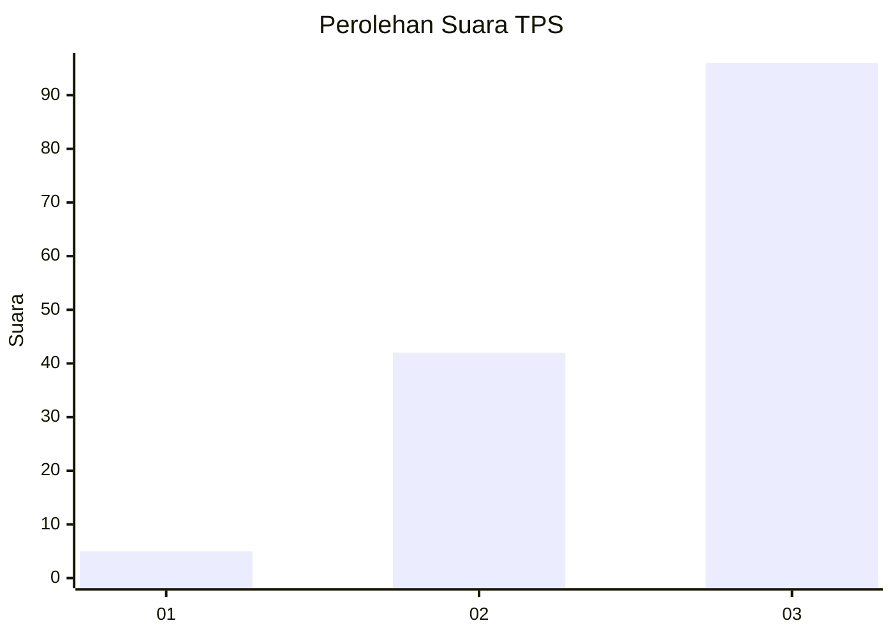
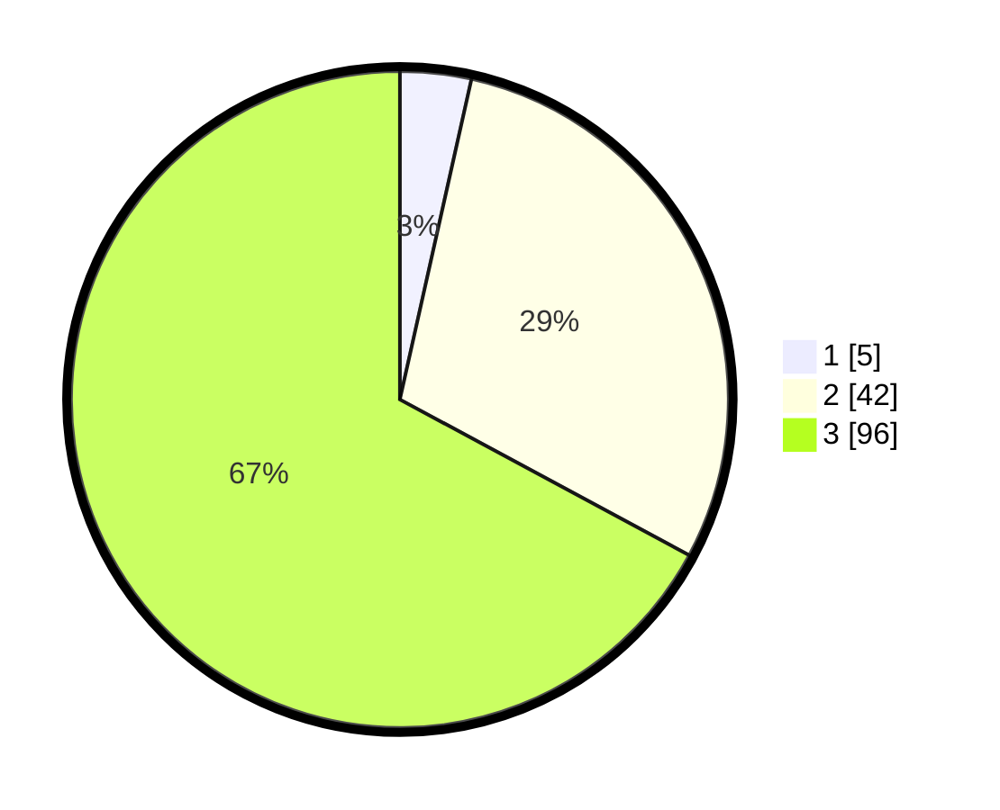

# Hasil

## Grafik

## Tabel

| No. | Nama Paslon    | Suara | Suara (raw) | Persentase |
|:--- |:-------------- | -----:| -----------:| ----------:|
| 1   | ANIES MUHAIMIN | 5     | [5][p-1]    | 3,50       |
| 2   | PRABOWO GIBRAN | 42    | [42][p-2]   | 29,37      |
| 3   | GANJAR MAHFUD  | 96    | [96][p-3]   | 67,13      |

[p-1]: https://github.com/gigit-pemilu/pemilu-2024/blob/main/pilpres/hitung-suara/sub/33-jawa-tengah/sub/04-banjarnegara/sub/20-pagedongan/sub/2004-kebutuhduwur/sub/014-tps/sub/paslon-1.txt
[p-2]: https://github.com/gigit-pemilu/pemilu-2024/blob/main/pilpres/hitung-suara/sub/33-jawa-tengah/sub/04-banjarnegara/sub/20-pagedongan/sub/2004-kebutuhduwur/sub/014-tps/sub/paslon-2.txt
[p-3]: https://github.com/gigit-pemilu/pemilu-2024/blob/main/pilpres/hitung-suara/sub/33-jawa-tengah/sub/04-banjarnegara/sub/20-pagedongan/sub/2004-kebutuhduwur/sub/014-tps/sub/paslon-3.txt

## Foto C Plano

https://sirekap-obj-formc.kpu.go.id/4df6/pemilu/ppwp/33/04/20/20/04/3304202004014-20240215-054845--f3f5ab61-4375-4dc6-b508-f7b7c1555d3c.jpg

https://sirekap-obj-formc.kpu.go.id/4df6/pemilu/ppwp/33/04/20/20/04/3304202004014-20240215-054851--187d469f-ca15-46cb-b1f3-59b162b25403.jpg

https://sirekap-obj-formc.kpu.go.id/4df6/pemilu/ppwp/33/04/20/20/04/3304202004014-20240215-054854--3ff7c9c5-694b-4be7-9ec4-ad0d95d7ea90.jpg

## Metadata

| Key        | Value               |
| ---------- | ------------------- |
| Time Stamp | 2024-02-15 16:00:26 |

