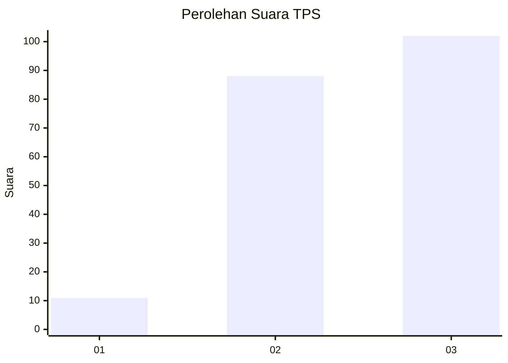
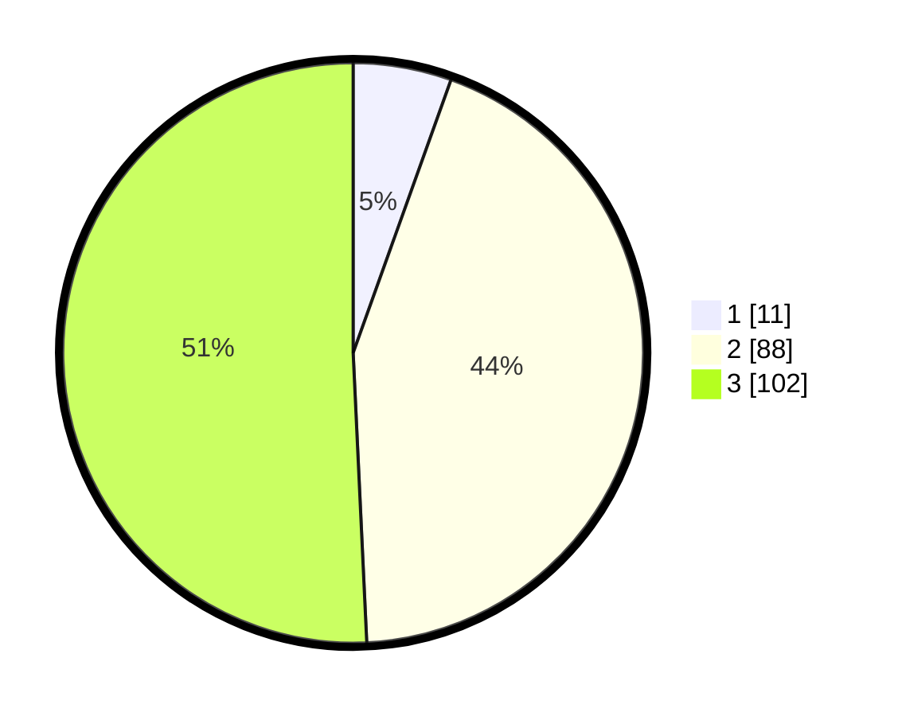

# Hasil

## Grafik

## Tabel

| No. | Nama Paslon    | Suara | Suara (raw) | Persentase |
|:--- |:-------------- | -----:| -----------:| ----------:|
| 1   | ANIES MUHAIMIN | 11    | [11][p-1]   | 5,47       |
| 2   | PRABOWO GIBRAN | 88    | [88][p-2]   | 43,78      |
| 3   | GANJAR MAHFUD  | 102   | [102][p-3]  | 50,75      |

[p-1]: https://github.com/gigit-pemilu/pemilu-2024/blob/main/pilpres/hitung-suara/sub/33-jawa-tengah/sub/04-banjarnegara/sub/20-pagedongan/sub/2005-kebutuhjurang/sub/003-tps/sub/paslon-1.txt
[p-2]: https://github.com/gigit-pemilu/pemilu-2024/blob/main/pilpres/hitung-suara/sub/33-jawa-tengah/sub/04-banjarnegara/sub/20-pagedongan/sub/2005-kebutuhjurang/sub/003-tps/sub/paslon-2.txt
[p-3]: https://github.com/gigit-pemilu/pemilu-2024/blob/main/pilpres/hitung-suara/sub/33-jawa-tengah/sub/04-banjarnegara/sub/20-pagedongan/sub/2005-kebutuhjurang/sub/003-tps/sub/paslon-3.txt

## Foto C Plano

https://sirekap-obj-formc.kpu.go.id/5757/pemilu/ppwp/33/04/20/20/05/3304202005003-20240215-020505--b3111b7a-b299-46ea-89f1-ca568a435016.jpg

https://sirekap-obj-formc.kpu.go.id/5757/pemilu/ppwp/33/04/20/20/05/3304202005003-20240215-020917--bb600932-be7e-426f-b60d-d7f8e57dd7d4.jpg

https://sirekap-obj-formc.kpu.go.id/5757/pemilu/ppwp/33/04/20/20/05/3304202005003-20240215-021000--84e535dc-9e6b-45c1-b040-9408b6763c05.jpg

## Metadata

| Key        | Value               |
| ---------- | ------------------- |
| Time Stamp | 2024-02-15 16:00:26 |

